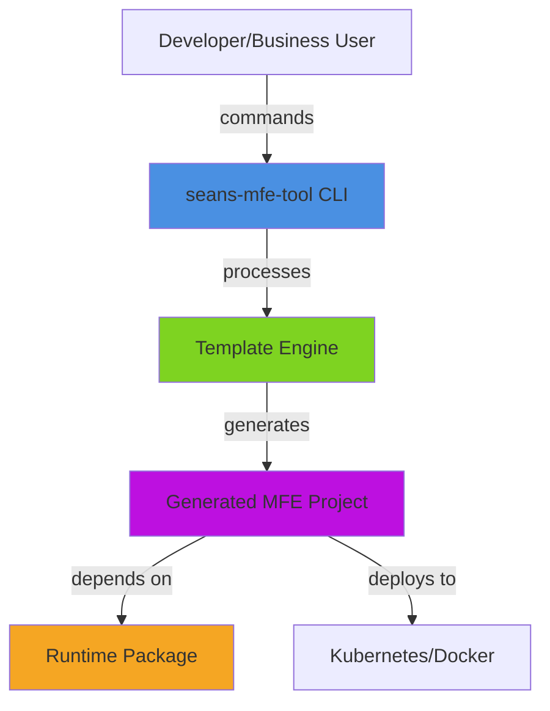
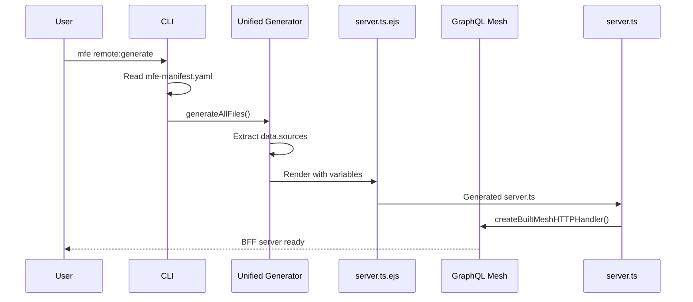
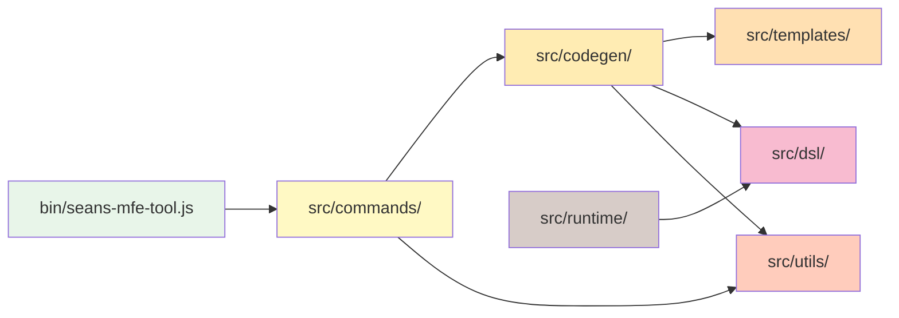
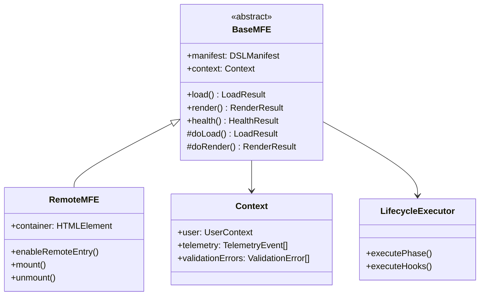
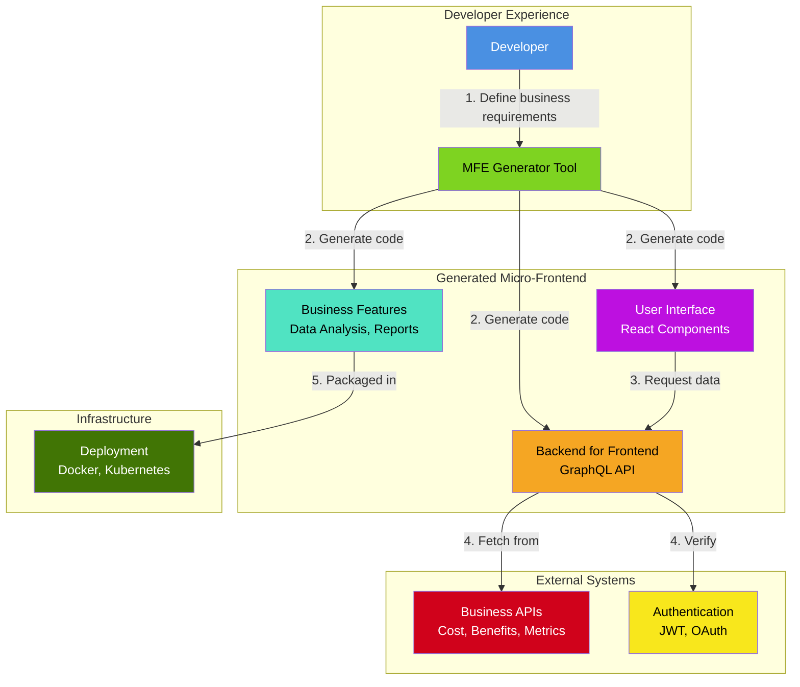

# Architecture Governance Agent

## Purpose

An AI-powered agent that maintains architectural governance, documents system interconnections, suggests refactorings, and generates business-friendly diagrams for the seans-mfe-tool project.

## Core Responsibilities

### 1. Architectural Documentation

- Track relationships between modules (runtime, codegen, templates, CLI)
- Document data flow patterns (DSL → Generator → Template → Output)
- Maintain ADR (Architecture Decision Record) compliance
- Identify architectural drift from documented patterns
- Generate architecture knowledge base (architecture.json, patterns.json)
- link all documents to main architecture docs referencing each subystem in the main.
- each system documentation should include a diagram generated by the agent showing the component relationships.
- each system documentation should include sequence diagrams if appropriate.

### 2. Interconnection Analysis

- Map dependencies between components
- Track template → codegen → example relationships
- Document API contracts (CLI commands, template variables, DSL schema)
- Identify circular dependencies and coupling issues

### 3. Refactoring Suggestions

- Detect code duplication across templates or generators
- Suggest consolidation opportunities
- Identify inconsistent patterns (e.g., different BFF implementations)
- Propose architectural improvements based on project goals

### 4. Diagram Generation

- System context diagrams (C4 model - Level 1)
- Container diagrams showing major components (C4 - Level 2)
- Component diagrams for detailed views (C4 - Level 3)
- Data flow diagrams (DSL → Templates → MFE)
- Deployment diagrams (Docker, K8s, local dev)

## Agent Workflow

### Phase 1: Analysis (Interactive)

```
User: "How does the BFF generation work?"

Agent:
1. Scans relevant files:
   - src/commands/bff.ts
   - src/codegen/templates/bff/
   - src/codegen/UnifiedGenerator/unified-generator.ts
   - examples/*/server.ts

2. Traces data flow:
   - DSL manifest.data → extractMeshConfig()
   - Mesh config → .meshrc.yaml generation
   - Template variables → server.ts.ejs rendering
   - Generated server.ts → Express + Mesh runtime

3. Documents dependencies:
   - GraphQL Mesh v0.100.x
   - Express.js with TypeScript
   - @whatwg-node/server (context handling)
   - OpenAPI specs (data sources)

4. Produces explanation + diagram
```

### Phase 2: Governance Checks (Automated)

```
Triggers:
- Pre-commit hook
- PR creation
- Manual invocation: `mfe arch:check`

Checks:
✓ All ADRs implemented correctly
✓ Template consistency across examples
✓ No architectural drift
✓ REQ-* requirements traceable
✓ No broken patterns (like old Mesh integration)

Output:
- Architecture health score
- List of violations
- Suggested fixes
```

### Phase 3: Refactoring Mode (Interactive)

```
User: "I think we have duplicate code in the template processors"

Agent:
1. Searches for duplication:
   - src/utils/templateProcessor.js
   - src/codegen/UnifiedGenerator/unified-generator.ts
   - Any other EJS processing logic

2. Analyzes differences:
   - Same functionality, different implementations?
   - Different use cases requiring different approaches?
   - Historical reasons (legacy vs new pattern)?

3. Proposes refactoring:
   Option A: Consolidate into single utility
   Option B: Create base class with specialized implementations
   Option C: Keep separate but document rationale

4. Shows impact:
   - Files affected: 12
   - Breaking changes: None
   - Risk level: Low
   - Estimated effort: 2-4 hours
```

### Phase 4: Diagram Generation (On-Demand)

```
Command: `mfe arch:diagram --type=c4-context`

Outputs:
- PNG/SVG diagrams
- Mermaid markdown (for docs)
- PlantUML source (for editing)
- Interactive HTML (for exploration)
```

## Implementation Approach

### Technology Stack

**Core Agent:**

- TypeScript/Node.js (consistent with project)
- LangChain or similar for LLM orchestration
- OpenAI GPT-4 or Claude for reasoning
- Vector database (Pinecone/Weaviate) for codebase embeddings

**Analysis Tools:**

- TypeScript Compiler API (AST analysis)
- madge (dependency graphs)
- eslint-plugin-boundaries (module boundaries)
- ts-morph (code manipulation)

**Diagram Generation:**

- Mermaid.js (Markdown-native diagrams)
- PlantUML (detailed UML diagrams)
- D3.js (interactive visualizations)
- Excalidraw (hand-drawn style for business users)

### File Structure

```
src/agents/
├── architecture-governance/
│   ├── agent.ts                    # Main agent orchestrator
│   ├── analyzers/
│   │   ├── module-analyzer.ts      # Scan modules and dependencies
│   │   ├── template-analyzer.ts    # Analyze template consistency
│   │   ├── adr-checker.ts          # Verify ADR compliance
│   │   └── duplication-finder.ts   # Find duplicate code
│   ├── generators/
│   │   ├── diagram-generator.ts    # Base diagram generator
│   │   ├── c4-diagrams.ts          # C4 model diagrams
│   │   ├── flow-diagrams.ts        # Data flow diagrams
│   │   └── deployment-diagrams.ts  # Deployment architecture
│   ├── refactoring/
│   │   ├── suggestion-engine.ts    # Generate refactoring suggestions
│   │   ├── impact-analyzer.ts      # Analyze refactoring impact
│   │   └── pattern-matcher.ts      # Match architectural patterns
│   ├── prompts/
│   │   ├── analysis.txt            # Prompts for analysis
│   │   ├── refactoring.txt         # Prompts for refactoring
│   │   └── explanation.txt         # Prompts for explanations
│   └── knowledge/
│       ├── architecture.json       # Current architecture state
│       ├── patterns.json           # Known patterns
│       └── history.json            # Change history
├── cli/
│   └── arch-commands.ts            # CLI commands for agent
└── __tests__/
    └── architecture-agent.test.ts
```

### CLI Commands

```bash
# Interactive analysis
mfe arch:ask "How does remote generation work?"
mfe arch:ask "Where is the BFF port calculated?"
mfe arch:ask "What would break if I changed the runtime package?"

# Governance checks
mfe arch:check                      # Full health check
mfe arch:check --adr=ADR-046       # Check specific ADR
mfe arch:check --module=runtime    # Check specific module

# Refactoring mode
mfe arch:suggest                   # General suggestions
mfe arch:suggest --target=templates # Focus on templates
mfe arch:suggest --pattern=duplication # Find duplicates

# Diagram generation
mfe arch:diagram --type=context         # System context
mfe arch:diagram --type=container       # Container diagram
mfe arch:diagram --type=component --module=runtime
mfe arch:diagram --type=flow --process=bff-generation
mfe arch:diagram --type=deployment --env=production

# Documentation
mfe arch:doc --generate              # Generate architecture docs
mfe arch:doc --update=ADR-046       # Update ADR documentation
mfe arch:doc --export=./docs/arch/  # Export all diagrams

# Maintenance
mfe arch:scan                       # Scan codebase, update knowledge
mfe arch:validate                   # Validate architecture consistency
mfe arch:report                     # Generate architecture report
```

## Diagram Examples

### 1. System Context (C4 Level 1)



### 2. BFF Generation Flow



### 3. Module Dependencies



### 4. Component Architecture (Runtime)



## Knowledge Base Structure

### architecture.json

```json
{
  "version": "1.0.0",
  "lastUpdated": "2025-12-08",
  "modules": {
    "cli": {
      "path": "bin/seans-mfe-tool.js",
      "purpose": "Command-line interface entry point",
      "dependencies": ["commands", "utils"],
      "adrs": ["ADR-001", "ADR-020"]
    },
    "runtime": {
      "path": "src/runtime/",
      "purpose": "MFE runtime execution platform",
      "dependencies": ["dsl"],
      "adrs": ["ADR-059", "ADR-060", "ADR-061"],
      "requirements": ["REQ-RUNTIME-001", "REQ-RUNTIME-002"],
      "publicAPI": {
        "exports": ["BaseMFE", "RemoteMFE", "Context"],
        "entry": "dist/runtime/index.js",
        "package": "@seans-mfe-tool/runtime"
      }
    },
    "codegen": {
      "path": "src/codegen/",
      "purpose": "Code generation from DSL manifests",
      "dependencies": ["templates", "dsl", "utils"],
      "adrs": ["ADR-048", "ADR-062"],
      "generators": {
        "unified": "UnifiedGenerator/unified-generator.ts",
        "api": "APIGenerator/",
        "controller": "ControllerGenerator/",
        "database": "DatabaseGenerator/"
      }
    }
  },
  "flows": {
    "remote-generation": {
      "steps": [
        "Parse mfe-manifest.yaml",
        "Validate DSL schema",
        "Extract capabilities",
        "Generate feature components",
        "Generate platform code",
        "Generate BFF server",
        "Generate config files"
      ],
      "files": [
        "src/commands/remote-generate.ts",
        "src/codegen/UnifiedGenerator/unified-generator.ts"
      ]
    },
    "bff-generation": {
      "steps": [
        "Extract data.sources from manifest",
        "Generate .meshrc.yaml",
        "Render server.ts template",
        "Install Mesh dependencies",
        "Run mesh build"
      ],
      "files": ["src/codegen/templates/bff/server.ts.ejs", "src/commands/bff.ts"]
    }
  },
  "patterns": {
    "template-processing": {
      "description": "EJS template rendering with variable substitution",
      "locations": [
        "src/utils/templateProcessor.js",
        "src/codegen/UnifiedGenerator/unified-generator.ts"
      ],
      "standard": "Use processTemplates() utility"
    },
    "mesh-integration": {
      "description": "GraphQL Mesh handler with context injection",
      "locations": ["src/codegen/templates/bff/server.ts.ejs"],
      "standard": "Use createBuiltMeshHTTPHandler with explicit context",
      "antipattern": "Don't use middleware with next()",
      "adr": "ADR-062"
    }
  }
}
```

### patterns.json

```json
{
  "architectural": [
    {
      "name": "DSL-Driven Code Generation",
      "description": "All code generated from declarative YAML manifests",
      "benefits": ["Consistency", "Versioning", "Automation"],
      "files": ["src/dsl/schema.ts", "src/codegen/**/*"],
      "adrs": ["ADR-013", "ADR-018", "ADR-048"]
    },
    {
      "name": "Hybrid Orchestration",
      "description": "Two-layer orchestration (service + shell runtime)",
      "benefits": ["Flexibility", "Browser-native", "Language-agnostic"],
      "files": ["src/runtime/", "docs/orchestration-requirements.md"],
      "adrs": ["ADR-009", "ADR-016", "ADR-017"]
    }
  ],
  "code": [
    {
      "name": "Template Variable Substitution",
      "pattern": "<%= variableName %>",
      "locations": ["src/templates/**/*.ejs"],
      "utility": "src/utils/templateProcessor.js"
    },
    {
      "name": "Module Federation Configuration",
      "pattern": "new ModuleFederationPlugin({ name, filename, exposes, shared })",
      "locations": ["src/codegen/templates/react/*/rspack.config.js.ejs"],
      "requirements": ["REQ-REMOTE-003"]
    }
  ]
}
```

## Agent Prompts

### Analysis Prompt Template

```
You are an architecture governance agent for the seans-mfe-tool project.

CONTEXT:
- Project: CLI tool for scaffolding Module Federation micro-frontends
- Tech: TypeScript, React, Module Federation, GraphQL Mesh
- Architecture: DSL-driven code generation with runtime platform

CURRENT QUESTION: {userQuestion}

RELEVANT FILES:
{relevantFiles}

ARCHITECTURE KNOWLEDGE:
{knowledgeBase}

TASK:
1. Analyze the question in the context of the overall architecture
2. Trace data/control flow through relevant components
3. Identify all interconnected modules
4. Explain how the pieces work together
5. Provide a clear, structured answer
6. Suggest a diagram if helpful

FORMAT:
## Answer
[Clear explanation]

## Architecture Flow
[Step-by-step flow]

## Related Components
[List with purposes]

## Diagram Suggestion
[Mermaid diagram if applicable]

## Follow-up Questions
[3-5 questions to deepen understanding]
```

### Refactoring Prompt Template

```
You are suggesting refactorings for the seans-mfe-tool project.

CONTEXT: {architectureContext}

ISSUE DETECTED:
{issueDescription}

AFFECTED FILES:
{affectedFiles}

TASK:
1. Analyze the issue (duplication, inconsistency, coupling, etc.)
2. Propose 2-3 refactoring options
3. For each option:
   - Describe the change
   - List pros/cons
   - Estimate effort (hours)
   - Identify risks
   - Show impact (files changed, breaking changes)
4. Recommend the best option with rationale

FORMAT:
## Issue Analysis
[What's wrong and why it matters]

## Option 1: [Name]
**Description:** [Details]
**Pros:** [Benefits]
**Cons:** [Drawbacks]
**Effort:** [Hours]
**Risk:** [Low/Medium/High]
**Impact:** [Files affected]

[Repeat for Option 2, 3]

## Recommendation
[Best option with rationale]

## Migration Plan
[Step-by-step implementation]
```

## Business-Friendly Diagram Guidelines

### Principles

1. **Simplicity**: Hide technical details, show business value
2. **Color Coding**: Consistent colors for component types
3. **Labels**: Business terms, not code terms
4. **Flow**: Show data flow, not technical dependencies
5. **Icons**: Use recognizable icons (cloud, database, user, etc.)

### Example: Business Context Diagram



## Implementation Phases

### Phase 1: Foundation (Week 1)

- [ ] Set up agent scaffolding
- [ ] Implement module analyzer
- [ ] Build knowledge base structure
- [ ] Create basic CLI commands (`arch:ask`, `arch:check`)
- [ ] Test with simple questions

### Phase 2: Analysis & Documentation (Week 2)

- [ ] Implement ADR compliance checker
- [ ] Build template consistency analyzer
- [ ] Add dependency graph generation
- [ ] Create architecture health scoring
- [ ] Generate initial architecture.json

### Phase 3: Diagram Generation (Week 3)

- [ ] Implement Mermaid diagram generator
- [ ] Create C4 model diagrams
- [ ] Build flow diagram generator
- [ ] Add interactive HTML output
- [ ] Business-friendly styling

### Phase 4: Refactoring Engine (Week 4)

- [ ] Implement duplication finder
- [ ] Build pattern matcher
- [ ] Create refactoring suggestion engine
- [ ] Add impact analysis
- [ ] Migration plan generator

### Phase 5: Integration & Polish (Week 5)

- [ ] Pre-commit hook integration
- [ ] CI/CD pipeline checks
- [ ] Documentation generation
- [ ] User feedback loop
- [ ] Performance optimization

## Success Metrics

1. **Coverage**: Agent can answer 90%+ of architectural questions
2. **Accuracy**: Suggestions align with project ADRs and patterns
3. **Usefulness**: Developers use diagrams in PRs and documentation
4. **Governance**: Catches architectural drift before merge
5. **Efficiency**: Reduces time to understand system by 50%

## Example Usage Scenarios

### Scenario 1: New Developer Onboarding

```bash
$ mfe arch:ask "How does the tool generate a complete MFE project?"

📐 Architecture Governance Agent

Analyzing: Code generation flow from DSL to output...

## Answer
The tool uses a DSL-driven approach where developers define their MFE in a
YAML manifest. The UnifiedGenerator reads this manifest, extracts capabilities
and configurations, then renders multiple EJS templates to generate a complete
project structure.

## Flow
1. Developer creates mfe-manifest.yaml with capabilities
2. CLI command `mfe remote:generate` invoked
3. UnifiedGenerator.generateAllFiles() orchestrates generation
4. Templates rendered: features, platform code, configs, BFF server
5. Package.json processed, dependencies installed
6. Build tools configured (rspack, TypeScript, Docker)

## Generated Artifacts
- Features: src/features/[CapabilityName]/
- Platform: src/platform/base-mfe/, src/platform/bff/
- Runtime: src/remote.tsx (Module Federation entry)
- Config: rspack.config.js, tsconfig.json, .meshrc.yaml
- Deployment: Dockerfile, docker-compose.yaml
- Documentation: README.md

[Diagram: BFF Generation Flow - shown above]

## Related Files
- src/commands/remote-generate.ts (Entry point)
- src/codegen/UnifiedGenerator/unified-generator.ts (Core generator)
- src/templates/react/remote/ (React templates)
- src/templates/bff/ (BFF server templates)

Would you like me to:
1. Show a diagram of the template structure?
2. Explain how capabilities map to code?
3. Deep-dive into the BFF generation?
```

### Scenario 2: Refactoring Suggestion

```bash
$ mfe arch:suggest --pattern=duplication

🔍 Scanning for architectural patterns...

## Duplication Detected: Template Processing

**Issue**: Two different approaches to EJS template rendering
**Severity**: Medium
**Impact**: Maintenance burden, inconsistent behavior

**Location 1**: src/utils/templateProcessor.js
- Recursive directory walking
- File-by-file EJS rendering
- Used by: legacy commands (create-shell, create-remote)

**Location 2**: src/codegen/UnifiedGenerator/unified-generator.ts
- In-memory template compilation
- Batch file generation
- Used by: remote:generate command

## Recommended Refactoring

**Option A: Consolidate into UnifiedGenerator**
- Migrate all commands to use UnifiedGenerator
- Deprecate templateProcessor.js
- Effort: 8-12 hours
- Risk: Medium (need to test all commands)
- Benefit: Single template processing path

**Option B: Extract common base**
- Create BaseTemplateProcessor abstract class
- Both implementations extend base
- Effort: 4-6 hours
- Risk: Low
- Benefit: Maintains backward compatibility

**Recommendation**: Option A
Rationale: UnifiedGenerator is more feature-rich and better tested.
Future direction is DSL-driven generation, not file-based commands.

## Migration Plan
1. Audit usage of templateProcessor.js (5 commands)
2. Create adapter layer for backward compatibility
3. Migrate commands one-by-one with tests
4. Deprecate old pattern in docs
5. Remove templateProcessor.js in v2.0

Proceed with refactoring? (y/n)
```

### Scenario 3: Diagram Generation

```bash
$ mfe arch:diagram --type=deployment --env=production

📊 Generating deployment architecture diagram...

Generated:
- docs/diagrams/deployment-production.png
- docs/diagrams/deployment-production.mmd (Mermaid source)
- docs/diagrams/deployment-production.html (Interactive)

[Opens browser with interactive diagram showing:
 - Kubernetes cluster
 - MFE pods with replicas
 - BFF services
 - External API integrations
 - Load balancers
 - Monitoring/logging
]
```

## Future Enhancements

1. **AI-Powered Code Review**: Agent reviews PRs for architectural compliance
2. **Automated Refactoring**: Agent can execute safe refactorings automatically
3. **Architecture Evolution**: Track how architecture changes over time
4. **Cost Analysis**: Estimate infrastructure costs from architecture
5. **Security Analysis**: Identify security implications of architectural decisions
6. **Performance Prediction**: Predict performance based on architecture
7. **Multi-Project Support**: Analyze multiple MFE projects together
8. **Natural Language Querying**: "Show me all components that use GraphQL Mesh"

---

**Status**: Design Complete - Ready for Implementation
**Priority**: High - Would significantly improve developer experience
**Estimated Effort**: 4-5 weeks full-time
**Prerequisites**:

- OpenAI/Anthropic API access
- Vector database setup (optional but recommended)
- Diagram rendering infrastructure
