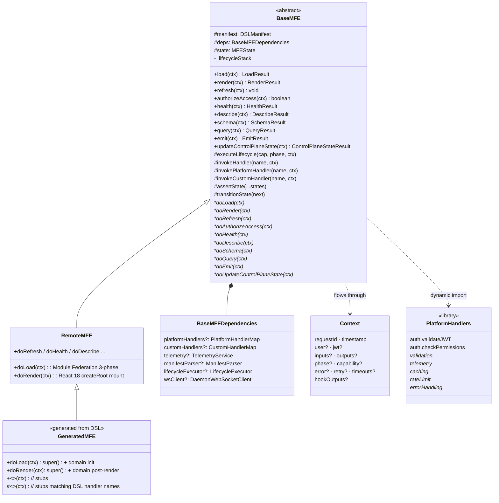
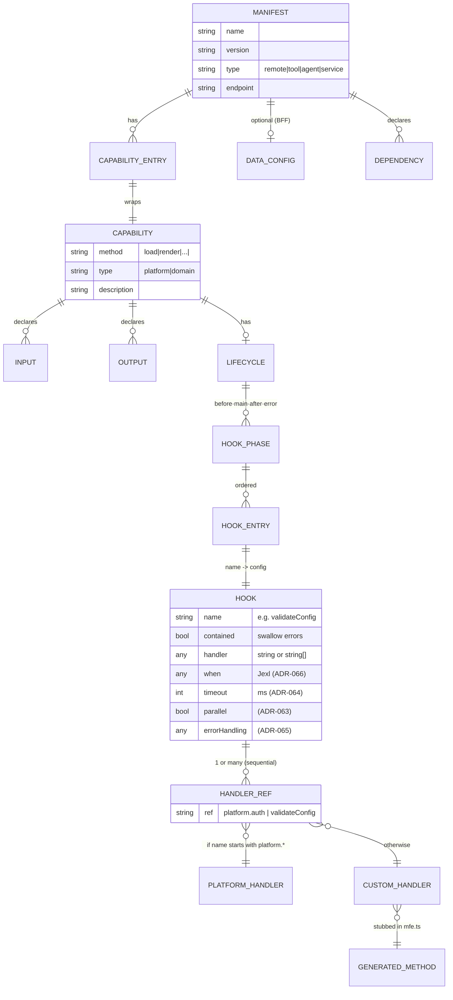
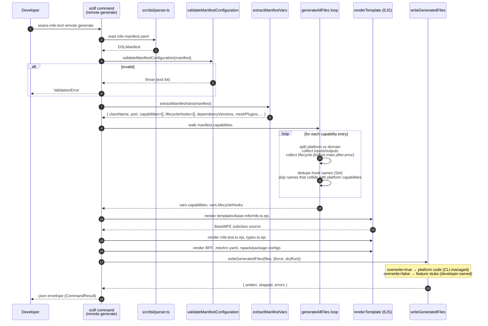
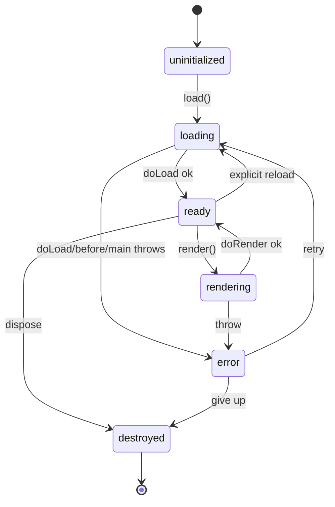
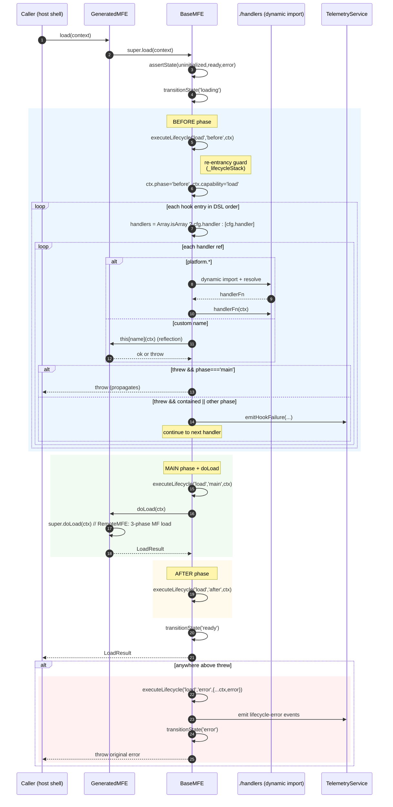

# Codegen ↔ BaseMFE Architecture

**Audience:** developers extending `seans-mfe-tool` or writing MFEs against the generated boilerplate.
**Scope:** how the DSL flows through codegen, what shape the generated subclass takes, and how the runtime executes capabilities, lifecycle phases, and platform handlers against it.

> Companion docs: `docs/architecture-runtime-platform.md` (runtime subsystem), `docs/lifecycle-engine-analysis.md` (lifecycle), `docs/requirements/REQ-057-base-mfe-boilerplate.md` (codegen acceptance), ADRs 058–067 (handler library, lifecycle enhancements).

---

## 1. The 30-second mental model

The DSL is the source of truth for **what an MFE does**. Codegen translates the DSL into a TypeScript subclass that **inherits its mechanics from the runtime**. At runtime, the platform calls `mfe.<capability>(context)`; the inherited `BaseMFE` orchestrates `before → main → after` (and `error` on failure), invoking platform handlers from a shared library and custom handlers as methods on the generated subclass.

```mermaid
flowchart LR
    subgraph Author["Authoring (developer)"]
        DSL[mfe-manifest.yaml<br/>capabilities + lifecycle]
    end

    subgraph Build["Codegen (CLI, build-time)"]
        Parser[DSL parser<br/>src/dsl/parser.ts]
        Vars[extractManifestVars<br/>aggregate capabilities &<br/>dedupe lifecycle hooks]
        EJS[EJS render<br/>src/codegen/templates/base-mfe/*.ejs]
        Writer[writeGeneratedFiles<br/>force/dry-run/skip]
    end

    subgraph Generated["Generated source (committed)"]
        SubMFE[src/platform/base-mfe/mfe.ts<br/>class MyMFE extends RemoteMFE]
        Types[types.ts]
        Tests[mfe.test.ts]
        BFF[src/platform/bff/*]
    end

    subgraph Runtime["Runtime (npm package @seans-mfe-tool/runtime)"]
        Base[BaseMFE<br/>state machine + lifecycle orchestrator]
        Remote[RemoteMFE<br/>Module Federation default doLoad/doRender]
        Handlers[(src/runtime/handlers/<br/>auth · validation · telemetry ·<br/>caching · rate-limiting · error-handling)]
        Ctx[(Context<br/>user · jwt · phase · capability ·<br/>inputs · outputs · retry · timeouts)]
    end

    DSL --> Parser --> Vars --> EJS --> Writer --> SubMFE
    Writer --> Types & Tests & BFF
    SubMFE -. extends .-> Remote -. extends .-> Base
    Base <-. invokes platform.* .-> Handlers
    Base <-. flows through .-> Ctx
```

Two boundaries to keep straight:

| Boundary                     | Decided when    | Lives where                            |
| ---------------------------- | --------------- | -------------------------------------- |
| Capability **structure**     | Code-gen time   | Generated `mfe.ts` (extends RemoteMFE) |
| Capability **behaviour**     | Runtime         | `BaseMFE.executeLifecycle()`           |
| Platform handler **library** | Built once      | `src/runtime/handlers/`                |
| Custom handlers              | Author-supplied | Methods on the generated subclass      |

---

## 2. Class hierarchy



**Why three layers?** `BaseMFE` owns the *contract* (state machine, phase ordering, error semantics). `RemoteMFE` owns the *type-specific defaults* (Module Federation, React mounting). The generated subclass owns the *DSL-specific surface* (domain capabilities, lifecycle hook stubs, JSDoc from descriptions). Authors only edit the third layer — and only inside `// TODO` markers.

---

## 3. DSL data model (ERD)

The DSL is the relational model the codegen consumes. This is what `extractManifestVars` walks.



Key invariants the codegen relies on:

- **Every capability listed must exist either as a platform method (the 10 baked into `BaseMFE`) or as a domain method.** Codegen splits them: known names produce `super`-calling overrides, unknown names produce blank stubs returning `{} as <CapName>Outputs`.
- **Hook names are unique per generated class.** `extractManifestVars` deduplicates hook names across phases via a `Set` so two phases referencing the same hook produce one method, not two (`unified-generator.ts:529`).
- **`platform.*` prefixes are reserved.** The runtime resolver short-circuits these to the handler library (`base-mfe.ts:400`); they are never generated as methods.

---

## 4. Codegen pipeline (sequence)

This is what `seans-mfe-tool remote generate` (or the unified entry) actually does, end-to-end.



Outputs of one run, grouped by ownership:

| Path                                  | Overwrite? | Owner          | Why                                                          |
| ------------------------------------- | ---------- | -------------- | ------------------------------------------------------------ |
| `src/platform/base-mfe/mfe.ts`        | ✅ yes     | CLI            | Regenerated whenever DSL changes; do not hand-edit           |
| `src/platform/base-mfe/types.ts`      | ✅ yes     | CLI            | Domain input/output TS types from DSL                        |
| `src/platform/base-mfe/mfe.test.ts`   | ✅ yes     | CLI            | Contract test suite                                          |
| `src/platform/bff/bff.ts`, `.meshrc.yaml` | ✅ yes | CLI            | BFF wiring                                                   |
| `src/features/<cap>/<cap>.tsx`        | ❌ no      | Developer      | Component implementation, written once and preserved         |
| `src/features/<cap>/<cap>.test.tsx`   | ❌ no      | Developer      | Component tests, preserved                                   |

This split is REQ-057 acceptance criterion #6/#7 ("Platform files are protected from manual modification; only updated via CLI runs… App/domain code and tests remain developer-managed.").

---

## 5. What the generated subclass actually looks like

Reduced excerpt of `templates/base-mfe/mfe.ts.ejs` after rendering for a hypothetical `csv-analyzer` MFE that declares an `analyze` domain capability and a `validateConfig` hook:

```ts
import { RemoteMFE, type Context, type LoadResult, type RenderResult }
  from '@seans-mfe-tool/runtime';
import type { AnalyzeOutputs } from './types';

export class CsvAnalyzerMFE extends RemoteMFE {
  constructor(manifest: any) { super(manifest); }

  // Platform overrides — call super to keep base behaviour
  protected async doLoad(context: Context): Promise<LoadResult> {
    const result = await super.doLoad(context);
    // TODO: domain init
    return result;
  }
  protected async doRender(context: Context): Promise<RenderResult> {
    const result = await super.doRender(context);
    // TODO: post-render analytics
    return result;
  }

  // Domain capability stub
  async analyze(context: Context): Promise<AnalyzeOutputs> {
    // TODO
    return {} as AnalyzeOutputs;
  }

  // Lifecycle hook stub — matches the handler name in the DSL
  protected async validateConfig(context: Context): Promise<void> {
    // TODO
  }
}
```

Three things to note:

1. **`extends RemoteMFE`, not `BaseMFE`.** Module Federation defaults are inherited; only override `do*` methods if you genuinely need domain logic before/after the platform default. See `src/runtime/remote-mfe.ts:30`.
2. **Lifecycle hook stubs are protected methods named exactly as in the DSL.** This is what makes the runtime's `invokeCustomHandler` (`base-mfe.ts:478`) work via reflection: `(this as any)[hookName]`. Renaming a stub or its DSL handler will break the binding.
3. **No platform-handler imports.** The generated class does **not** import from `src/runtime/handlers/`. Platform handlers are resolved at runtime (see §7).

---

## 6. Runtime model — capability, phases, state

### 6.1 Per-capability execution model (universal)

Every public method (`load`, `render`, `query`, …) follows the same skeleton. From `base-mfe.ts:556`:

```ts
public async load(context: Context): Promise<LoadResult> {
  this.assertState('uninitialized', 'ready', 'error');
  this.transitionState('loading');
  try {
    await this.executeLifecycle('load', 'before', context);
    await this.executeLifecycle('load', 'main',   context);
    const result = await this.doLoad(context);            // ← subclass impl
    await this.executeLifecycle('load', 'after',  context);
    this.transitionState('ready');
    return result;
  } catch (error) {
    await this.executeLifecycle('load', 'error', { ...context, error });
    this.transitionState('error');
    throw error;
  }
}
```

| Phase    | Caller error semantics              | Use for                                                   |
| -------- | ----------------------------------- | --------------------------------------------------------- |
| `before` | Continue on failure (logged)        | Auth, validation, cache lookup, rate-limit checks         |
| `main`   | **Throws** — fail fast              | Hooks that *must* succeed before the domain `do*` method  |
| `after`  | Continue on failure (logged)        | Telemetry, cache write, notifications                     |
| `error`  | Best-effort (every handler tried)   | Rollback, ops alert, retry orchestration                  |

`main` is the only phase whose hook failures are not swallowed. This is REQ-042 and is enforced at `base-mfe.ts:383`.

### 6.2 State machine



Transitions are guarded by `transitionState` against the `VALID_TRANSITIONS` map. Anything else throws — this is what catches "render before load" bugs in tests.

### 6.3 Capability ↔ allowed states

| Capability                  | Required state(s)                                      |
| --------------------------- | ------------------------------------------------------ |
| `load`                      | `uninitialized`, `ready`, `error` (re-load allowed)    |
| `render`                    | `ready`                                                |
| `refresh`, `authorizeAccess`, `schema`, `query` | `ready`                            |
| `health`, `describe`        | any except `destroyed`                                 |
| `emit`                      | any                                                    |
| `updateControlPlaneState`   | `ready` or `rendering` (mid-render push allowed)       |

---

## 7. Handler resolution — where platform handlers actually plug in

This is the most-asked question. The DSL writes a string (`platform.auth` or `validateConfig`); at runtime that string becomes one of three things.

```mermaid
flowchart TD
    Start([handler entry from DSL])
    StartArr{Array of handlers?}
    Start --> StartArr
    StartArr -- yes --> Loop[Iterate sequentially<br/>REQ-045]
    StartArr -- no --> Single[Single handler]
    Loop --> NameCheck
    Single --> NameCheck

    NameCheck{name starts<br/>with platform.* ?}
    NameCheck -- yes --> InjMap{deps.platformHandlers<br/>has entry?}
    InjMap -- yes --> InjFn[Call DI'd handler fn]
    InjMap -- no  --> Dyn[invokePlatformHandler:<br/>dynamic import './handlers'<br/>resolve category.fn or flat]
    Dyn --> Found{found?}
    Found -- yes --> Call1[await handlerFn ctx]
    Found -- no  --> Throw1[throw 'platform handler not implemented']

    NameCheck -- no --> Cust1{deps.customHandlers<br/>has full name?}
    Cust1 -- yes --> CallC1[await customHandler ctx]
    Cust1 -- no  --> Cust2{deps.customHandlers<br/>has last segment?}
    Cust2 -- yes --> CallC2[await customHandler ctx]
    Cust2 -- no  --> Refl[invokeCustomHandler:<br/>this[name] as method]
    Refl --> ReflFound{method exists?}
    ReflFound -- yes --> CallM[await method.call this, ctx]
    ReflFound -- no  --> Throw2[throw 'custom handler not found:<br/>implement private async name']

    InjFn --> Done([handler completed])
    Call1 --> Done
    CallC1 --> Done
    CallC2 --> Done
    CallM --> Done
```

The mapping in plain English:

- `platform.<name>` → 1) DI map override if provided (tests/mocks), else 2) dynamic import of `src/runtime/handlers/index.ts`, then `handlers[name]` or `handlers[category][fn]`.
- Anything else → 1) DI custom map, 2) DI custom map by last segment, 3) reflection on the generated subclass instance — i.e. the protected stub method that codegen emitted from your DSL hook name.

### 7.1 Phase × handler matrix

The standard library handlers (`src/runtime/handlers/{auth,validation,telemetry,caching,rate-limiting,error-handling}.ts`) can be dropped into any phase, but they have natural homes:

| Handler family    | `before`           | `main`             | `after`            | `error`           |
| ----------------- | ------------------ | ------------------ | ------------------ | ----------------- |
| `platform.auth`   | ✅ Common — verify JWT, gate access | ⚠️ Rare       | —                  | ⚠️ Audit failures  |
| `platform.validation` | ✅ Validate inputs, schema | ⚠️ Rare    | ✅ Validate outputs | —                 |
| `platform.caching` | ✅ Lookup / short-circuit | —             | ✅ Write back      | —                 |
| `platform.rateLimit` | ✅ Throttle      | —                  | —                  | —                 |
| `platform.telemetry` | ✅ Emit start    | —                  | ✅ Emit complete   | ✅ Emit failure    |
| `platform.errorHandling` | —          | —                  | —                  | ✅ Retry / fallback (ADR-065) |

Custom (developer-supplied) handlers can sit anywhere, but follow the same phase semantics:
- Put preconditions in `before` (cheap to fail).
- Put the irreplaceable work in `main` so its failure short-circuits the capability.
- Put fire-and-forget work (audit logs, side notifications) in `after` with `contained: true` if you don't want them to taint `error`.
- Put compensating actions in `error`.

---

## 8. Lifecycle execution sequence — `mfe.load(context)` end-to-end



Three subtle behaviors worth calling out:

- **Re-entrancy guard.** `_lifecycleStack` rejects a recursive `executeLifecycle` for the same `(capability, phase)` (`base-mfe.ts:289`). A handler that calls back into `mfe.load()` from inside `before` will *not* trigger an infinite loop; the inner call is logged and skipped.
- **Context mutation.** Phases share one `Context` object. Handlers mutate it (`ctx.user`, `ctx.cache`, `ctx.outputs`, `ctx.hookOutputs`) and downstream phases see the result. `ContextFactory.cloneForCapability` (in `context.ts:166`) is the right way to spawn a child context for a follow-on capability such as render-after-load.
- **Telemetry on every failure.** `emitHookFailure` emits a structured `lifecycle-error` event with `severity: 'error'` for `main` and `'warn'` elsewhere — even when the error is contained.

---

## 9. Putting it together: a worked DSL → generated → runtime trace

DSL slice (one capability, two handlers, both platform and custom):

```yaml
capabilities:
  - load:
      type: platform
      lifecycle:
        before:
          - authenticate:
              handler: platform.auth        # platform handler
          - validateConfig:
              handler: checkConfig          # custom — must exist on subclass
              contained: true               # don't fail load if config check fails
        main:
          - initRuntime:
              handler: setupRuntime         # custom — required for load
        after:
          - notifyReady:
              handler: platform.telemetry
```

After codegen, the subclass contains:

```ts
export class MyMFE extends RemoteMFE {
  protected async checkConfig(context: Context): Promise<void> { /* TODO */ }
  protected async setupRuntime(context: Context): Promise<void> { /* TODO */ }
  // notifyReady is platform.* → not generated
}
```

At runtime, `await mfe.load(ctx)` produces this call graph:

```
load()
├── assertState(uninitialized|ready|error)
├── transitionState('loading')
├── executeLifecycle('load','before',ctx)
│    ├── authenticate → platform.auth → handlers.auth.validateJWT(ctx)
│    │     (sets ctx.user; throws → falls through to error phase)
│    └── validateConfig → this.checkConfig(ctx)
│          (contained=true → errors emit warn telemetry, do not propagate)
├── executeLifecycle('load','main',ctx)
│    └── initRuntime → this.setupRuntime(ctx)
│          (main + contained=false ⇒ ANY throw propagates immediately)
├── doLoad(ctx)  // RemoteMFE: fetch remoteEntry.js, init container, enable render
├── executeLifecycle('load','after',ctx)
│    └── notifyReady → platform.telemetry
├── transitionState('ready')
└── return LoadResult
```

If `setupRuntime` throws, the `try/catch` in `load()` catches, fires `executeLifecycle('load','error',{...ctx,error})`, transitions to `error`, and rethrows. The caller sees the original error; ops sees `lifecycle-error` telemetry for both the failed `setupRuntime` (severity `error`) and any handler that fails inside the `error` phase (severity `warn`).

---

## 10. Lifecycle enhancements (ADR-063 → ADR-067) — how each augments the picture

These are specified in `docs/requirements/lifecycle-enhancements.md` and ADRs 063–067. They extend the **hook config**, not the phase model. The four-phase skeleton from §6.1 is unchanged.

| Enhancement                | Where it plugs in                                      | DSL field added            | Behaviour                                                                          |
| -------------------------- | ------------------------------------------------------ | -------------------------- | ---------------------------------------------------------------------------------- |
| Parallel exec (ADR-063)    | Inside one hook entry, before invoking handler array    | `parallel: true`, `maxConcurrency`, `failureStrategy` | Run handler refs concurrently, isolated context copies, merge outputs back        |
| Timeout (ADR-064)          | Wrapper around each handler call                       | `timeout: <ms>`, `onTimeout` | `Promise.race` with AbortController; precedence hook > handler > phase > global   |
| Conditional (ADR-066)      | Pre-check before invoking the hook                     | `when: <jexl>`             | Skip hook (telemetry-tracked) if expression is false against ctx/env/manifest      |
| Inter-hook IO (ADR-067)    | Around the hook, into `ctx.hookOutputs`                | `outputs: […]`, `inputs: [{from}]` | Codegen emits TypeScript interfaces; runtime validates outputs and wires inputs |
| Error classification (ADR-065) | Replaces simple `try/catch` for the handler        | `errorHandling.types: […]` | Typed retries with backoff/jitter, onRetry hook, fallback handler                  |

Two implications for codegen:

1. **ADR-067 is the only enhancement that emits new generated code** (typed `HookInputs`/`HookOutputs` interfaces in `types.ts`). The others are pure runtime config consumed by `executeLifecycle`.
2. The hook-name dedup in `extractManifestVars` (§3) still applies — only one stub per unique handler name, regardless of how many phases reference it.

---

## 11. Boundaries & rules of thumb

- **Edit only the `// TODO` regions of generated files.** Anything else gets clobbered next `remote generate`.
- **Stub method names = DSL handler names, exactly.** Reflection is name-based; rename in lockstep or add an alias in `deps.customHandlers`.
- **`platform.*` is reserved** — never name a custom handler `platform.foo`; the resolver short-circuits to the library and your stub will never run.
- **Don't `throw new Error()` in generated code.** Use the typed errors (`ValidationError`, `BusinessError`, `NetworkError`, …) from `@seans-mfe/contracts` so the JSON envelope and exit codes are correct (CLAUDE.md §"Typed errors").
- **`main` is fail-fast.** If a hook *must* succeed before `do<Capability>`, put it in `main` and leave `contained` false. Otherwise it's `before`.
- **`contained: true` is silence, not safety.** It suppresses propagation but every failure still emits telemetry — wire your dashboards to the `lifecycle-error` event before relying on it.
- **`updateControlPlaneState` is not telemetry.** Use `emit` for fire-and-forget observers; `updateControlPlaneState` mutates the daemon registry and may swap out the rendered MFE. They go to different daemon endpoints (`base-mfe.ts:727`).

---

## 12. References

| Topic                      | File                                                            |
| -------------------------- | --------------------------------------------------------------- |
| BaseMFE class              | `src/runtime/base-mfe.ts`                                       |
| RemoteMFE defaults         | `src/runtime/remote-mfe.ts`                                     |
| Context                    | `src/runtime/context.ts`                                        |
| Platform handler library   | `src/runtime/handlers/index.ts` and siblings                    |
| Codegen entry              | `src/codegen/UnifiedGenerator/unified-generator.ts`             |
| Generated class template   | `src/codegen/templates/base-mfe/mfe.ts.ejs`                     |
| DSL parser/schema          | `src/dsl/{parser.ts,schema.ts}`                                 |
| Example DSL                | `docs/DSL/dsl.yaml`, `docs/DSL/dsl-template.yaml`               |
| Codegen acceptance         | `docs/requirements/REQ-057-base-mfe-boilerplate.md` (issue #39) |
| Lifecycle semantics (REQ)  | `docs/requirements/lifecycle-enhancements.md`                   |
| Re-entrancy guard          | `docs/architecture-decisions/ADR-022-lifecycle-reentrancy-guard.md` |
| Platform handler library   | `docs/architecture-decisions/ADR-058-platform-handler-library.md` |
| Platform handler interface | `docs/architecture-decisions/ADR-059-platform-handler-interface.md` |
| Atomic load                | `docs/architecture-decisions/ADR-060-load-capability-atomic.md` |
| Parallel / timeout / errors / when / IO | `ADR-063` … `ADR-067`                              |
