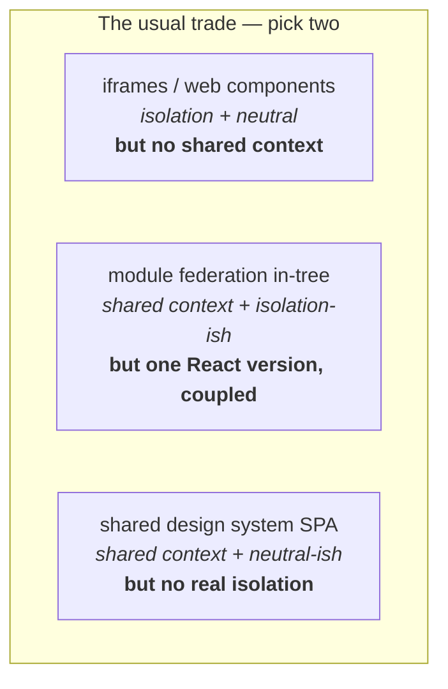
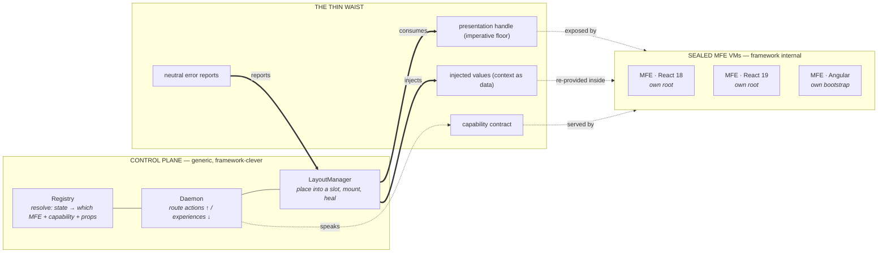
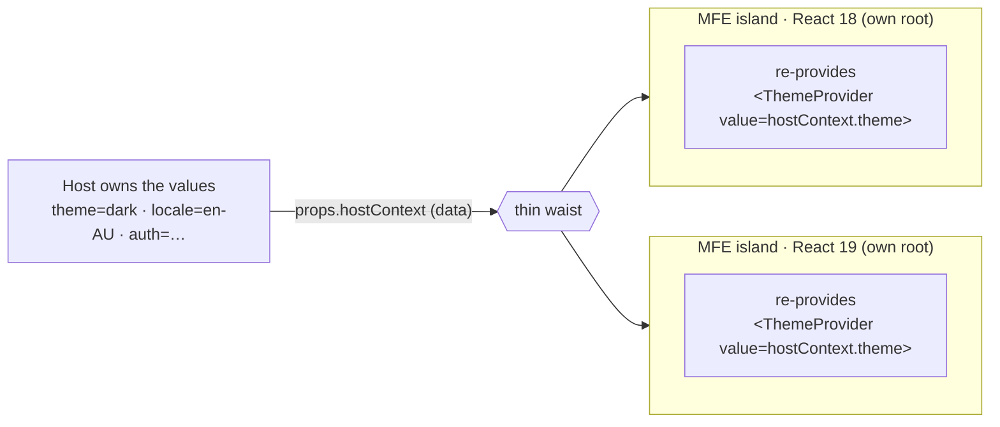
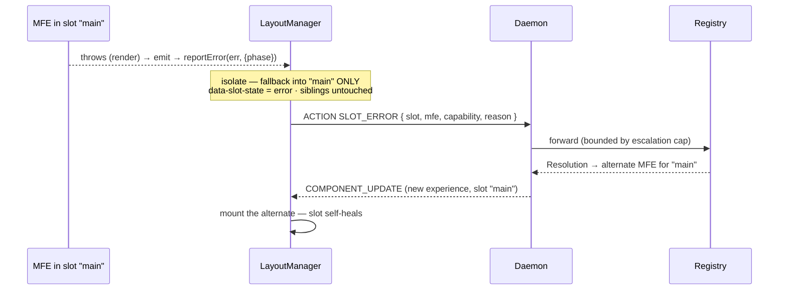

# Contextualized VM Composition — A Primer

> The one idea: **micro-frontends are sealed VMs; a generic control plane composes
> them; context crosses the boundary as *data*, and failures heal at the slot.**
> That single choice buys polyglot + multi-version + shared context + self-healing
> + a fully generic host — properties that normally fight each other.

This is the conceptual primer. For the wire-level detail see
[`architecture-runtime-platform.md`](./architecture-runtime-platform.md); for the
decision record see [ADR-060](./architecture-decisions/ADR-060-contextualized-vm-composition.md)
and its lineage (ADR-054–059).

---

## 1. The problem: you usually only get to pick two

Every micro-frontend platform is forced to trade among three things:

- **Isolation** — an MFE is a sealed unit; it can't corrupt or be corrupted by its
  neighbors, and it deploys and versions on its own cadence.
- **Shared context** — the host's theme, locale, auth, and routing reach the MFE,
  so it looks and behaves like part of one product.
- **Neutrality** — the composition engine and host don't care what framework (or
  framework *version*) an MFE is built with.

The common picks:

The trap is that "shared context" is almost always implemented by putting the MFE
**inside the host's framework tree** (one React reconciler). That delivers context
— and silently deletes isolation and neutrality: now every MFE shares one React
version, can crash the host, and can't be Angular.

**This platform refuses the trap.** It keeps all three by changing *how* context
crosses the boundary.

---

## 2. The mental model: pods and a scheduler

Borrow the Kubernetes shape. An MFE is a **pod** — a sealed container whose
internals (framework, version) are nobody else's business. The **control plane** is
the scheduler — it decides *which* pod runs *where*, for *whom*, but never reaches
inside one. They meet at a **thin, standard interface**.

The design test, every time: *would Kubernetes reach into the container to do this?*
If no, neither does the control plane. The host is a dumb cluster of slots; the
guests are sealed; the scheduler is the only thing that's clever.

---

## 3. The thin waist: exactly four things cross

The entire contract between host and MFE is four narrow things — nothing else:

| Crosses the waist | Direction | What it is |
|---|---|---|
| **Capability contract** | both | the 10 neutral lifecycle capabilities (load, authorize, render, health, query, emit, updateControlPlaneState, …) |
| **Presentation handle** | host ← MFE | the guaranteed `mount(element) → unmount` imperative floor; any host mounts any MFE as an isolated island |
| **Injected values** | host → MFE | theme, locale, auth, router state — as **data**, delivered as `props.hostContext` |
| **Error reports** | host ← MFE | a neutral `reportError(error, { phase })` the MFE routes to via `emit` |

No framework type, no DOM node the other side owns, no shared object identity ever
crosses. That's what keeps the guest a VM and the host generic.

---

## 4. The key move: context crosses as DATA, not as a shared tree

This is the hinge the whole architecture turns on.

**Wrong way (shared reconciler).** Render the MFE inside the host's React tree so it
*inherits* `<ThemeProvider>`. Context reaches it — but now it's the same React
instance, same version, same crash domain. Isolation and neutrality are gone.

**This platform (value-injection).** The host passes the provider *values* across
the waist as data; each MFE **re-provides its own context** from those values,
inside its own root.

Same outcome — every MFE themed, localized, authed, consistently — with **zero
shared reconciler**. And because each island is its own root with its own React,
**two React majors coexist in one shell**, and the host can be Angular or plain
HTML. Context *and* multi-version *and* isolation — the three that usually fight —
all at once.

> The thing that would have made shared context "easy" (one React tree) is exactly
> the thing that would have cost you everything else. Value-injection is the trade
> that keeps the cake.

---

## 5. Self-healing: error boundaries and Suspense, built from the lifecycle

Because every MFE already implements a lifecycle with an **`error` phase**, we get
React-grade resilience generically — no shared reconciler required.

Two failure classes, both already contained:

- **Lifecycle errors** (load/render/authorize reject) — the MFE's own `error` phase
  runs first (retry/backoff/telemetry); if unrecovered the rejection surfaces to the
  composition layer, which catches it.
- **Post-mount render errors** — caught by the island's *own* framework error
  boundary and **physically unable to cascade** (separate roots), then reported out
  through the neutral `reportError` sink.

The LayoutManager turns those into **slot policy**: fall back in *that slot only*,
mark its state, and — the powerful part — **escalate to the control plane so the
registry can re-resolve the slot to a different MFE.** Failure becomes a composition
input.

Blast radius is one slot — strictly *better* than a shared host reconciler, where an
uncaught throw tears down the whole tree. Suspense falls out of the same lifecycle:
slots carry `data-slot-state` (`pending → ready | error`) from the load/render
promises, so the host renders skeletons without React Suspense.

---

## 6. What you get (and the one honest cost)

| Property | Why it holds |
|---|---|
| **Polyglot** | React, Angular, HTML, JSON all compose through one neutral waist + imperative floor |
| **Multi-version React** | separate roots = separate React instances; React 17 and 19 coexist in one shell |
| **Shared context** | host values injected as data; each island re-provides — no shared tree |
| **Self-healing** | MFE `error` phase + slot-scoped fallback + control-plane re-resolution |
| **Generic host** | shell owns slots + adaptors only; imports no MFEs, hard-codes no frameworks |
| **Independent deploy** | no version coupling — an MFE bumps its own React major without breaking hosts |
| **Stronger fault isolation** | worst case is one slot, never the host tree |

**The deliberate residue.** You do *not* get sub-MFE **streaming** Suspense, nor a
single host error boundary wrapping multiple MFEs with shared context-object
identity — the two things that genuinely require one shared reconciler. They are
traded away on purpose: **that trade is exactly what buys multi-version + isolation.**
Slot granularity and data-injection cover the real composition use cases.

---

## 7. How the model maps to ADRs and code

| Concept | ADR | Where it lives |
|---|---|---|
| Control-plane wire protocol | ADR-054 | `packages/contracts/src/messages.ts` |
| Daemon-driven slot composition | ADR-055 | `src/runtime/layout-manager.ts` |
| Thin waist + imperative floor | ADR-056 | `packages/contracts/src/presentation.ts`, `src/runtime/imperative-handle.ts` |
| One socket, many slots | ADR-057 | `src/runtime/daemon-channel.ts` |
| MFE-provided layout | ADR-058 | `LayoutManager.provideSlot` |
| Swappable control plane | ADR-059 | `src/runtime/base-control-plane.ts` |
| **Value-injection** | ADR-060 | `LayoutManagerConfig.providerValues` → `props.hostContext` |
| **Slot self-healing** | ADR-060 | `AdaptorHelpers.reportError`, `renderSlotFallback`, `data-slot-state` |
| **Control-plane re-resolution** | ADR-060 | `SLOT_ERROR` action, `MAX_SLOT_ESCALATIONS` |
| MFE lifecycle + `error` phase | ADR-041/042 | `src/runtime/base-mfe.ts` |

The neutrality is **machine-checked**: `src/runtime/__tests__/boundary.test.ts`
fails if any neutral-core module imports a UI framework. Framework code is allowed
only inside the layer-5 abstracts (`RemoteMFE`, `AngularRemoteMFE`).

---

## 8. Walkthrough: ABC Kids

A concrete picture of the whole model working at once:

1. The shell (`examples/abc-kids/shell`) boots empty — a `LayoutManager`, one socket,
   no games imported. It injects `providerValues: { theme, locale }`.
2. The control plane resolves the launcher into the `main` slot. A child taps
   "Flappy"; the launcher emits `abc.play.flappy` up its slot channel.
3. The registry resolves Flappy (`PlayGame`); the LayoutManager loads the remote and
   mounts it as an **isolated island**. Flappy reads `props.hostContext` and themes
   itself — **shared context, no shared React**.
4. Flappy (React 18) and a sibling slot running a React 19 MFE run **side by side**;
   neither shares a reconciler with the other or the shell.
5. Flappy throws mid-render. Its island error boundary catches it; the LayoutManager
   shows a fallback **only in `main`** and emits `SLOT_ERROR`. The registry
   re-resolves `main` to a "game unavailable, try another" MFE. **The shell never
   noticed; the other slot kept playing.**

Generic host. Sealed guests. A smart, self-healing control plane. That's the whole
idea.

---

## See also

- [ADR-060 — Contextualized VM Composition](./architecture-decisions/ADR-060-contextualized-vm-composition.md) (the decision + the deliberate trade)
- [Runtime Platform Architecture](./architecture-runtime-platform.md) (the wire-level reference)
- [ADR index](./spec.md#adr-index) · ADR-054–059 (the composition lineage)
