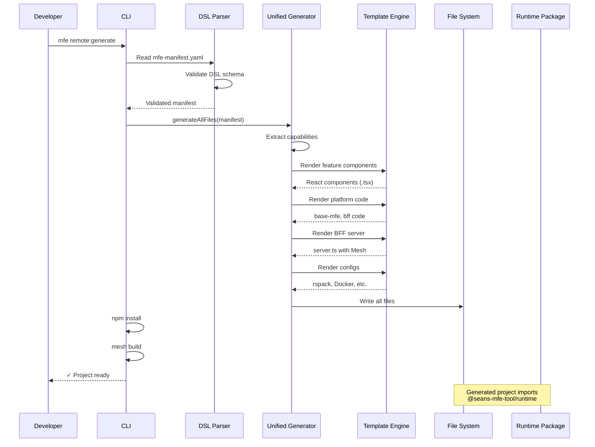
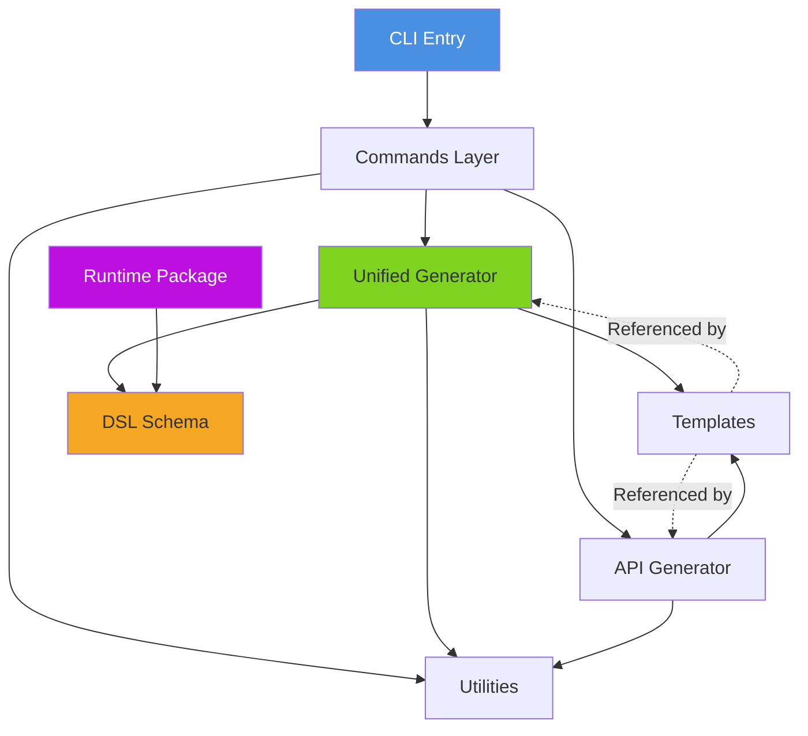

# seans-mfe-tool - Current Architecture (December 2025)

## Table of Contents

- [System Overview](#system-overview)
- [Subsystem Architectures](#subsystem-architectures)
- [Detailed Module Breakdown](#detailed-module-breakdown)
- [Data Flow Diagrams](#data-flow-mfe-generation)
- [Technology Stack](#technology-stack)
- [Key Architectural Patterns](#key-architectural-patterns)
- [Active Development Areas](#active-development-areas)

## Subsystem Architectures

This document provides the high-level system architecture. For detailed subsystem designs, see:

### 📐 **Runtime Platform**

**[→ Runtime Platform Architecture](./architecture-runtime-platform.md)**

The execution environment for all MFE types. Includes:

- BaseMFE abstract class and RemoteMFE implementation
- Context management (REQ-RUNTIME-002)
- Platform handlers (auth, telemetry, validation, error-handling, caching, rate-limiting)
- State machine and lifecycle execution
- Load capability atomic operation (REQ-RUNTIME-001)
- Dependency injection architecture

**Status**: 🟡 In Progress (Issues #47-59)

### 🔧 **Code Generation Engine**

**[→ Code Generation Architecture](./architecture-codegen.md)** _(Coming Soon)_

The DSL-driven code generation system. Will include:

- UnifiedGenerator orchestration flow
- Template processing system
- Feature component generation
- Platform code generation
- BFF server generation
- Configuration file generation

**Status**: ✅ Complete (documentation pending)

### 🎨 **DSL & Type System**

**[→ DSL Architecture](./architecture-dsl.md)** _(Coming Soon)_

The manifest schema and validation system. Will include:

- DSL schema design (capabilities, lifecycle hooks, data sources)
- Type system implementation
- Validation rules and error handling
- Parser implementation
- Manifest transformation pipeline

**Status**: ✅ Complete (documentation pending)

### 🌐 **BFF Layer**

**[→ BFF Architecture](./architecture-bff.md)** _(Coming Soon)_

GraphQL Mesh integration and BFF generation. Will include:

- Mesh configuration extraction from DSL
- Server generation (Express + Mesh)
- Context injection and JWT forwarding
- Health checks and error handling
- Static asset serving

**Status**: ✅ Complete (documentation pending)

### 📦 **API Generator**

**[→ API Generator Architecture](./architecture-api-generator.md)** _(Coming Soon)_

OpenAPI-driven REST API scaffolding. Will include:

- OpenAPI spec parsing
- Controller generation
- Route generation
- Database layer generation (MongoDB/SQLite)
- Migration and seeding strategies

**Status**: ✅ Complete (documentation pending)

---

## System Overview

```mermaid
graph TB
    subgraph "CLI Entry Point"
        CLI["bin/seans-mfe-tool.js<br/>Commander.js CLI"]
    end

    subgraph "Command Layer"
        RemoteGen["remote-generate.ts<br/>Generate MFE Projects"]
        RemoteInit["remote-init.ts<br/>Initialize Workspace"]
        BFF["bff.ts<br/>BFF Management"]
        API["create-api.js<br/>API Generation"]
        Deploy["deploy.js<br/>Docker/K8s Deploy"]
    end

    subgraph "Code Generation Engine"
        UnifiedGen[UnifiedGenerator<br/>Main Orchestrator]
        APIGen[APIGenerator<br/>REST API Codegen]
        Templates[Template Engine<br/>EJS Processing]
    end

    subgraph "DSL & Validation"
        DSL["DSL Schema<br/>mfe-manifest.yaml"]
        Parser["YAML Parser"]
        Validator[Schema Validator]
        TypeSystem[Type System]
    end

    subgraph "Runtime Platform"
        BaseMFE[BaseMFE<br/>Abstract Base Class]
        RemoteMFE[RemoteMFE<br/>Module Federation]
        Context[Context<br/>Shared State]
        Handlers[Platform Handlers<br/>Auth, Telemetry, etc.]
    end

    subgraph "Templates"
        ReactTemplates["React/TypeScript<br/>Components, Features"]
        BFFTemplates["BFF Server<br/>GraphQL Mesh"]
        ConfigTemplates["Configuration<br/>rspack, Docker, etc."]
    end

    subgraph "Utilities"
        TemplateProc[Template Processor<br/>EJS Rendering]
        Security[Security Utils<br/>JWT, Validation]
        ManifestVal[Manifest Validator]
    end

    subgraph "Generated Output"
        MFEProject["Complete MFE Project<br/>src/, config, server.ts"]
        APIProject["REST API Project<br/>Express + DB + Routes"]
    end

    subgraph "Examples"
        E2E[e2e-mfe<br/>Full Example]
        E2E2[e2e2<br/>Extended Example]
        DSLMFE[dsl-mfe<br/>DSL Showcase]
        BizcaseAPI[bizcase-api<br/>Generated API]
    end

    subgraph "Build Artifacts"
        RuntimePkg["dist/runtime/<br/>@seans-mfe-tool/runtime"]
    end

    %% Connections
    CLI --> RemoteGen
    CLI --> RemoteInit
    CLI --> BFF
    CLI --> API
    CLI --> Deploy

    RemoteGen --> UnifiedGen
    RemoteInit --> UnifiedGen
    BFF --> UnifiedGen
    API --> APIGen

    UnifiedGen --> DSL
    UnifiedGen --> Templates
    UnifiedGen --> TemplateProc

    APIGen --> Templates
    APIGen --> Security

    DSL --> Parser
    DSL --> Validator
    DSL --> TypeSystem

    Templates --> ReactTemplates
    Templates --> BFFTemplates
    Templates --> ConfigTemplates

    UnifiedGen --> MFEProject
    APIGen --> APIProject

    MFEProject --> E2E
    MFEProject --> E2E2
    MFEProject --> DSLMFE
    APIProject --> BizcaseAPI

    BaseMFE --> RemoteMFE
    BaseMFE --> Context
    BaseMFE --> Handlers

    RuntimePkg --> BaseMFE
    RuntimePkg --> RemoteMFE
    RuntimePkg --> Context

    MFEProject -.->|uses at runtime| RuntimePkg

    style CLI fill:#4A90E2,color:#fff
    style UnifiedGen fill:#7ED321,color:#000
    style APIGen fill:#7ED321,color:#000
    style DSL fill:#F5A623,color:#000
    style BaseMFE fill:#BD10E0,color:#fff
    style RuntimePkg fill:#50E3C2,color:#000
    style MFEProject fill:#9013FE,color:#fff
    style E2E fill:#F8E71C,color:#000
```



## Detailed Module Breakdown

### 1. CLI Entry Point

**Location**: `bin/seans-mfe-tool.js`

- Commander.js-based CLI
- Route commands to handlers
- Parse arguments and options

**Commands Available**:

- `mfe remote:generate` - Generate complete MFE project
- `mfe remote:init` - Initialize workspace structure
- `mfe bff:*` - BFF management (validate, build, dev)
- `mfe api` - Generate API from OpenAPI spec
- `mfe deploy` - Docker/K8s deployment

### 2. Command Layer

**Location**: `src/commands/`

#### remote-generate.ts

- Orchestrates MFE project generation
- Reads mfe-manifest.yaml
- Calls UnifiedGenerator
- Installs dependencies

#### remote-init.ts

- Creates workspace structure
- Initializes git repository
- Sets up basic configuration

#### bff.ts

- Extracts GraphQL Mesh config from DSL
- Generates .meshrc.yaml
- Manages Mesh CLI (validate, build, dev)
- Handles JWT authentication forwarding

#### create-api.js

- Parses OpenAPI specifications
- Generates Express REST API
- Creates database models (MongoDB/SQLite)
- Generates controllers and routes

#### deploy.js

- Docker container build
- Kubernetes manifest generation
- Deployment orchestration

### 3. Code Generation Engine

**Location**: `src/codegen/`

#### UnifiedGenerator

**Location**: `src/codegen/UnifiedGenerator/unified-generator.ts`

- **Purpose**: Main orchestrator for MFE generation
- **Responsibilities**:
  - Parse DSL manifest
  - Extract capabilities
  - Generate feature components
  - Generate platform code (base-mfe, bff)
  - Generate configuration files
  - Render templates with variables

**Key Functions**:

- `generateAllFiles()` - Main entry point
- `generateFeatureComponents()` - Domain capabilities → React components
- `generatePlatformCode()` - Runtime integration code
- `generateBFFServer()` - GraphQL Mesh server
- `generateConfigs()` - rspack, TypeScript, Docker configs

#### APIGenerator

**Location**: `src/codegen/APIGenerator/`

- **ControllerGenerator**: REST endpoint implementations
- **RouteGenerator**: Express route wiring
- **DatabaseGenerator**:
  - MongoDB: Schemas, migrations, seeding
  - SQLite: File-based storage, migrations

### 4. DSL & Validation

**Location**: `src/dsl/`

#### schema.ts

- Complete DSL type definitions
- Manifest structure (name, version, capabilities, data)
- Capability types (platform vs domain)
- Lifecycle hooks structure

#### validator.ts

- Schema validation (Zod-based)
- Capability validation
- Data source validation
- Type checking

#### type-system.ts

- DSL type system implementation
- Type inference
- Type compatibility checking

#### parser.ts

- YAML parsing
- Manifest loading
- Error handling

### 5. Runtime Platform

**📐 [See Detailed Architecture →](./architecture-runtime-platform.md)**

**Location**: `src/runtime/`
**Output**: `dist/runtime/` → `@seans-mfe-tool/runtime` npm package

#### Overview

The runtime platform provides the execution environment for all MFE types (remote, bff, tool, agent). It implements:

- **BaseMFE**: Abstract base class with lifecycle methods (`load()`, `render()`, `health()`)
- **RemoteMFE**: Module Federation implementation
- **Context**: Shared state across all lifecycle phases (REQ-RUNTIME-002)
- **Platform Handlers**: Reusable cross-cutting concerns
- **State Machine**: Enforced lifecycle transitions
- **Atomic Load Operation**: Three-phase load (entry, mount, enable-render) per REQ-RUNTIME-001

#### Key Components

- `base-mfe.ts` - Abstract base class with template method pattern
- `remote-mfe.ts` - Concrete Module Federation implementation
- `context.ts` - Context interface, factory, and flow management
- `handlers/` - Six platform handlers:
  - `auth.ts` - JWT validation
  - `telemetry.ts` - Event tracking at all checkpoints
  - `validation.ts` - Input validation
  - `error-handling.ts` - Retry logic with exponential backoff
  - `caching.ts` - Response caching
  - `rate-limiting.ts` - Request throttling

#### Status

🟡 **In Progress** - Core classes complete, handlers implementation ongoing (Issues #47-59)

**Related Requirements**: REQ-RUNTIME-001 through REQ-RUNTIME-012  
**Related ADRs**: ADR-036, ADR-047, ADR-059, ADR-060

### 6. Templates

**Location**: `src/codegen/templates/`

#### React Templates

**Location**: `templates/react/`

- Component templates (features)
- Index.tsx (standalone entry)
- Remote.tsx (Module Federation entry)
- App.tsx (main component)

#### BFF Templates

**Location**: `templates/bff/`

- `server.ts.ejs` - Express + GraphQL Mesh
- Mesh context injection
- JWT forwarding
- Health checks
- Static asset serving

#### Configuration Templates

- `rspack.config.js.ejs` - Module Federation config
- `tsconfig.json.ejs` - TypeScript configuration
- `Dockerfile.ejs` - Docker containerization
- `docker-compose.yaml.ejs` - Multi-service orchestration
- `.meshrc.yaml.ejs` - GraphQL Mesh configuration

### 7. Utilities

**Location**: `src/utils/`

#### templateProcessor.js

- EJS template rendering
- Variable substitution
- Recursive directory processing

#### securityUtils.js

- JWT token handling
- Authentication helpers
- Security validation

#### manifestValidator.js

- Manifest structure validation
- Capability validation
- Data source validation

### 8. Examples

**Location**: `examples/`

#### e2e-mfe

- Full-featured MFE example
- DataAnalysis, ReportViewer, DataAnalysisDetailed capabilities
- BFF with GraphQL Mesh
- Module Federation configured
- Uses runtime package

#### e2e2

- Extended example
- Additional ShareReports capability
- Demonstrates multi-capability MFE
- Full BFF integration

#### dsl-mfe

- DSL showcase
- Minimal configuration
- Reference implementation

#### bizcase-api

- Generated REST API example
- Express + MongoDB
- Controllers, routes, models
- Generated from OpenAPI spec

### 9. Build Artifacts

**Location**: `dist/`

#### dist/runtime/

- Compiled runtime package
- npm-publishable
- Used by generated MFEs
- Exports: BaseMFE, RemoteMFE, Context
- **Important**: Handlers NOT in default export (prevents jsonwebtoken bundling)

### 10. Agent Orchestrator (Design Phase)

**Location**: `src/agent-orchestrator/`

- Future: Browser-based dynamic MFE loading
- Design documentation only
- Not yet implemented

## Data Flow: MFE Generation



## Data Flow: BFF Integration

```mermaid
graph LR
    subgraph "DSL Manifest"
        DataSection[data:<br/>sources, transforms, plugins]
    end

    subgraph "Code Generation"
        ExtractMesh[extractMeshConfig()]
        RenderTemplate[Render server.ts.ejs]
    end

    subgraph "Generated Files"
        MeshRC[.meshrc.yaml]
        ServerTS[server.ts]
    end

    subgraph "Runtime"
        MeshBuild[mesh build]
        MeshIndex[.mesh/index.ts]
        ExpressServer[Express Server]
        GraphQL[GraphQL Endpoint]
    end

    DataSection -->|Extract| ExtractMesh
    ExtractMesh -->|Write| MeshRC
    DataSection -->|Variables| RenderTemplate
    RenderTemplate -->|Generate| ServerTS

    MeshRC -->|Read by| MeshBuild
    MeshBuild -->|Generate| MeshIndex

    ServerTS -->|Import| MeshIndex
    ServerTS -->|Creates| ExpressServer
    ExpressServer -->|Exposes| GraphQL

    style DataSection fill:#F5A623
    style MeshRC fill:#7ED321
    style ServerTS fill:#BD10E0
    style GraphQL fill:#50E3C2
```

## Module Dependencies



## Technology Stack

### CLI & Build Tools

- **Commander.js** - CLI framework
- **TypeScript** - Type safety for runtime
- **JavaScript (Node.js)** - CLI commands and generators
- **Jest** - Testing framework
- **EJS** - Template engine

### Generated MFE Stack

- **React 18** - UI framework
- **TypeScript** - Type safety
- **rspack** - Fast bundler
- **Module Federation** - Micro-frontend runtime
- **Material-UI (MUI)** - Component library
- **GraphQL Mesh** - BFF layer
- **Express.js** - HTTP server

### API Generation Stack

- **Express.js** - REST framework
- **MongoDB** / **SQLite** - Database options
- **OpenAPI** - API specification
- **JWT** - Authentication

### Deployment Stack

- **Docker** - Containerization
- **Kubernetes** - Orchestration
- **docker-compose** - Local development

## Key Architectural Patterns

### 1. DSL-Driven Code Generation

All generated code comes from declarative YAML manifests:

```yaml
name: my-mfe
capabilities:
  - DataAnalysis: { type: domain }
data:
  sources:
    - name: API
      handler:
        openapi:
          source: ./spec.yaml
```

### 2. Template Method Pattern (Runtime)

```typescript
abstract class BaseMFE {
  load() {
    /* common logic */ return this.doLoad();
  }
  protected abstract doLoad(): LoadResult;
}

class RemoteMFE extends BaseMFE {
  protected doLoad() {
    /* specific implementation */
  }
}
```

### 3. Module Federation

- Shell (host) consumes remote MFEs
- Remotes expose components via `remoteEntry.js`
- Shared dependencies (React, MUI) with `singleton: true`

### 4. GraphQL Mesh BFF

- Single GraphQL endpoint
- Merges multiple REST APIs
- Context injection for auth
- Response caching

### 5. Hybrid Orchestration (Design)

- Orchestration service (Docker-only)
- Shell runtime (browser)
- DSL-based discovery

## Package Structure

```
seans-mfe-tool/
├── bin/                    # CLI entry point
├── src/
│   ├── commands/          # CLI command handlers
│   ├── codegen/          # Code generation engine
│   │   ├── UnifiedGenerator/
│   │   ├── APIGenerator/
│   │   └── templates/
│   ├── dsl/              # DSL schema & validation
│   ├── runtime/          # Runtime platform package
│   ├── utils/            # Shared utilities
│   └── agent-orchestrator/ # Future: Dynamic loading
├── dist/
│   └── runtime/          # Compiled runtime package
├── examples/             # Generated project examples
├── docs/                 # Documentation
│   ├── architecture-decisions/
│   ├── requirements/
│   └── acceptance-criteria/
└── scripts/              # Build scripts
```

## Active Development Areas

### ✅ Complete

- CLI commands (remote:generate, api, bff)
- Unified code generator
- Template system
- DSL schema and validation
- Runtime base classes
- Module Federation integration
- BFF generation with GraphQL Mesh
- API generation from OpenAPI

### 🟡 In Progress

- Runtime platform handlers (Issues #47-59)
- Context implementation (REQ-RUNTIME-002)
- Error boundaries and fallback UI

### 📋 Planned

- Agent orchestrator implementation
- Dynamic MFE discovery
- Multi-project workspace management
- Architecture governance agent

## Key Requirements

### Runtime Platform (Active)

- **REQ-RUNTIME-001**: Load capability (atomic operation)
- **REQ-RUNTIME-002**: Shared context (foundation)
- **REQ-RUNTIME-003**: Render capability
- **REQ-RUNTIME-004**: Health checks
- **REQ-RUNTIME-005**: Platform handler registry
- **REQ-RUNTIME-006**: Authentication handler
- **REQ-RUNTIME-009**: Error handling with retry

### BFF Layer

- **REQ-BFF-001**: DSL as single source of truth
- **REQ-BFF-002**: GraphQL Mesh integration
- **REQ-BFF-003**: JWT authentication forwarding
- **REQ-BFF-004**: BFF + static assets same deployable

### Code Generation

- **REQ-REMOTE-001**: Generate from DSL manifest
- **REQ-REMOTE-002**: Feature components from capabilities
- **REQ-REMOTE-003**: Module Federation configuration
- **REQ-REMOTE-004**: Platform code generation

## Architecture Decision Records

Key ADRs shaping the architecture:

- **ADR-009**: Hybrid orchestration (service + runtime)
- **ADR-013**: Language-agnostic DSL
- **ADR-046**: GraphQL Mesh with DSL-embedded config
- **ADR-048**: Unified generator consolidation
- **ADR-059**: Platform handler interface
- **ADR-060**: Load capability atomic operation design
- **ADR-062**: Mesh v0.100.x with createBuiltMeshHTTPHandler

---

## Related Documentation

### Architecture Documents

- **[Runtime Platform Architecture](./architecture-runtime-platform.md)** - Detailed runtime subsystem design
- [Code Generation Architecture](./architecture-codegen.md) _(Coming Soon)_
- [DSL Architecture](./architecture-dsl.md) _(Coming Soon)_
- [BFF Architecture](./architecture-bff.md) _(Coming Soon)_
- [API Generator Architecture](./architecture-api-generator.md) _(Coming Soon)_

### Requirements Documents

- [Runtime Requirements](./runtime-requirements.md) - REQ-RUNTIME-001 through 012
- [Orchestration Requirements](./orchestration-requirements.md) - REQ-001 through 041
- [BFF Requirements](./graphql-bff-requirements.md) - REQ-BFF-001 through 008
- [DSL Contract Requirements](./dsl-contract-requirements.md) - REQ-042 through 053
- [Remote Generation Requirements](./dsl-remote-requirements.md) - REQ-REMOTE-001 through 010

### Architecture Decision Records

- [Architecture Decisions](./architecture-decisions/) - ADR-001 through ADR-062+
- Key ADRs: ADR-009 (Hybrid Orchestration), ADR-059 (Platform Handlers), ADR-060 (Atomic Load)

### Acceptance Criteria

- [Acceptance Criteria](./acceptance-criteria/) - Gherkin scenarios for all features
- [Runtime Load/Render](./acceptance-criteria/runtime-load-render.feature)
- [Platform Handlers](./acceptance-criteria/platform-handlers.feature)
- [BFF Integration](./acceptance-criteria/bff.feature)

### Agent Documentation

- [Architecture Governance Agent](./.github/agents/architecture-governance-agent.md) - Design for governance tooling

---

## Navigation

**← [Back to Documentation Index](./README.md)**  
**→ [Next: Runtime Platform Architecture](./architecture-runtime-platform.md)**

---

**Document Version**: 1.1.0  
**Last Updated**: December 11, 2025  
**Status**: Current State Documentation - Linked to Subsystems
