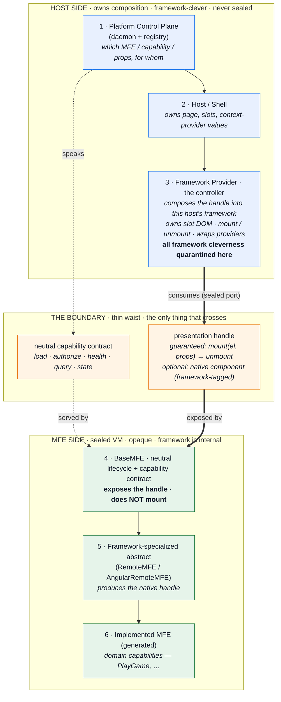

# ADR-056: MFE Presentation Boundary and Host-Side Composition Providers (Polyglot VM Model)

## Context

The runtime composition path (ADR-055) mounts each client MFE by calling
`BaseMFE.render()` → `RemoteMFE.doRender()`, which performs a React 18
`createRoot()` into a host-supplied DOM node. This makes **every MFE its own
React root** and conflates two responsibilities that must be separated:
**lifecycle orchestration** (legitimately the platform's job) and **DOM
rendering** (which belongs to the host).

Separate React roots are separate reconcilers. The consequences, confirmed
with the development team:

- Host React context does not reach the MFE — `<IntlProvider>`,
  `<ThemeProvider>`, React Router, and auth contexts in the shell are
  invisible across the root boundary.
- Host error boundaries cannot catch MFE errors; `<Suspense>` and concurrent
  features do not span the boundary.
- Two reconcilers may write the same DOM subtree (a corruption hazard the
  current LayoutManager only avoids because slots are raw `document.createElement`
  nodes React does not own).

The team's proposed remedy was to give `BaseMFE` a React API (hook + wrapper
component) that runs the lifecycle through React primitives. The hook +
wrapper ergonomics are correct. But locating the React binding **at the
BaseMFE level** re-couples the neutral core to React and is the precise slide
back toward a single-framework "super-optimized React module federation"
monolith — abandoning polyglot-at-build-and-run (PDR-002), a core
differentiator.

The resolving principle: **an MFE is a sealed, framework-opaque virtual
machine, composed like a Helm chart.** Kubernetes never reaches inside a
container to optimize it; the container exposes a thin standard interface and
an outside controller knows how to schedule that workload. Framework
cleverness must live in a host-side controller (a *provider*), behind a thin
waist — never woven into the unit every MFE inherits.

### The boundary (the artifact this ADR exists to fix in stone)

**The relationship across the waist is "consumes a sealed port," not
"contains."** The Framework Provider sits on the host side and talks to the
MFE only through the handle. It never wraps or reaches through `BaseMFE` into
the implemented MFE. This is the difference between polyglot composition and a
re-coupled monolith, and it is the single most important sentence in this ADR.

### Helm/k8s mapping (the design test)

| Kubernetes | Platform | Test it implies |
|---|---|---|
| container image | the MFE (framework is internal) | the host must not need to know the MFE's framework to run it |
| liveness/readiness + lifecycle hooks | neutral capability contract | the control plane speaks only this |
| exposed port/protocol | presentation handle | the only presentation surface that crosses the waist |
| controller / operator | Framework Provider | all host-integration + framework optimization lives here |
| cluster | host shell | owns slots and provider *values* |
| configmap / values | session + props injection | data in, never code reaching in |
| control plane / scheduler | daemon + registry | decides placement; never reaches into the pod |

When a design choice is in doubt, ask: *would Kubernetes reach into the
container to do this?* If no, neither does our core.

## Decision

### Boundaries — normative definitions

Each numbered layer below is a boundary with a fixed responsibility and
explicit prohibitions. These are the contract this ADR ratifies.

**1. Platform Control Plane (daemon + registry).** Decides *which* MFE,
*which* capability, and *what* props for *which* session, and relays the
result (ADR-054/055). Speaks ONLY the neutral capability contract.
*Prohibited:* any framework awareness; any DOM or rendering concern.

**2. Host / Shell.** Provides the page, declares the slots/layout, and
supplies the **values** for context providers (locale, theme, auth, router
config). Generic and empty until the control plane signals (ADR-055).
*Prohibited:* importing or hard-referencing any specific MFE; owning MFE
internals.

**3. Framework Provider (host-side adaptor — the controller).** Knows how to
compose a presentation handle into *this host's* framework. Owns the slot DOM
element, the mount and unmount lifecycle, and the wrapping of the host's
context providers around the mounted MFE. This is the ONLY layer permitted to
contain framework-specific optimization, and that optimization may be
arbitrarily deep. Registered into the host's composition registry (the
generalized LayoutManager adaptor registry), keyed on
`hostFramework × handleKind`. *Prohibited:* leaking framework types across the
waist into the contract, core, or daemon; reaching through `BaseMFE` into the
implemented MFE.

**— THE BOUNDARY (thin waist) —** Exactly two things cross it:
- the **neutral capability contract** (load, authorize, health, query,
  describe, schema, emit, updateControlPlaneState); and
- the **presentation handle**: a guaranteed imperative
  `mount(element, props) → unmount`, and an OPTIONAL framework-native
  component tagged with its framework. The handle kind and framework are
  declared in the MFE's `describe()` / registration (extends `MfeRegistration`
  with `framework` and `handleKinds`).

**4. BaseMFE.** The neutral lifecycle orchestrator and capability contract.
EXPOSES the presentation handle; it does NOT mount anything. `render` as a
capability means "produce/declare the presentation handle," never "create a
React root." *Prohibited:* importing any UI framework; calling `createRoot`,
`ReactDOM`, `ApplicationRef`, or any DOM-mounting API.

**5. Framework-specialized abstract (RemoteMFE / AngularRemoteMFE).** Produces
the framework-native handle for a delivery mechanism (e.g. a React component
and/or an imperative mount fn that internally uses `createRoot`). The
imperative mount, when it uses a root, owns *only its own island* — never DOM
the host reconciles. *Prohibited:* assuming anything about the host framework.

**6. Implemented MFE (generated).** The domain capabilities (`PlayGame`, …).
Framework-idiomatic, fully isolated, unaware of how it is composed.

### Isolation vs integration — a declared, per-MFE choice

- **Every client MFE MUST expose the imperative `mount(el, props) → unmount`**
  — the guaranteed floor. It produces an isolated island (its own root for
  React; its own bootstrap for Angular). This path is *always* available and
  *always* polyglot: any host can mount any MFE. It is the isolation default.
- **An MFE MAY ALSO expose a framework-native component handle.** When the
  host framework matches, a Framework Provider may compose it in-tree (single
  root, host context flows). This is the integration path; it accepts
  framework-**singleton** coupling (host and MFE must agree on a framework
  major). The MFE author declares this choice in the manifest — isolation
  (independence) vs integration (shared context) — exactly as a container
  chooses whether to share a namespace.

### Scope of THIS ADR — the structural fix only

Authorized now (behavior-preserving relocation, no optimization):

1. Add the **presentation handle** to the neutral contract and extend
   `MfeRegistration` with `framework` and `handleKinds`.
2. **Relocate composition ownership out of `BaseMFE`/`RemoteMFE.doRender`**
   into a host-side Framework Provider. `doRender` stops being a DOM-mounting
   side effect; the MFE exposes the imperative handle, and the provider owns
   the element, the mount call, unmount, and cleanup.
3. **Generalize the LayoutManager adaptor registry** into the provider
   registry keyed on `hostFramework × handleKind`, with the **imperative-island
   provider as the universal default** (this preserves today's behavior).
4. Provide the **hook + wrapper** surfaces on the host provider
   (`useMfe(experienceId)`, `<MfeHost experienceId=… />`) — both thin shells
   over the same provider; neither touches the core.
5. **Enforce the boundary in CI**: a test asserting `packages/contracts`, the
   runtime core, and the daemon import zero UI-framework packages
   (`react`, `react-dom`, `@angular/*`, …).
6. **Migrate abc-kids React games + shell** to the handle/provider, still as
   imperative islands — a pure relocation, no visible behavior change.

Explicitly DEFERRED (non-goals here; a follow-up ADR when a concrete need lands):

- The **React in-tree declarative provider** (single root; host intl/theme/
  router/auth context, error boundaries, and Suspense spanning the boundary).
  It slots in behind this same boundary as a new provider strategy consuming
  the optional native-component handle — **no contract, core, or daemon change
  required.** Deferring it honors the directive not to invest in React depth
  before a real shared-context requirement justifies the singleton coupling.

### Invariants (the bright line)

- **Core and daemon carry zero framework surface**, enforced by the CI
  boundary test — the bright line is machine-checked, not aspirational.
- **New framework = new provider package** (ADR-036's framework-plugin posture
  extended from build time to runtime). Zero core change, ever.
- **Provider-internal optimization is unbounded but quarantined.**
  "Super-optimized React module federation" is permitted and encouraged —
  inside `@seans-mfe/framework-react`'s provider, where it cannot make the
  whole machine unreasonable.

## Consequences

**Positive.** The MFE stays an opaque, independently deployable VM; the
platform stays polyglot at build and run; framework optimization is available
without coupling; the react-intl/theme/context question has a principled home
(the provider wraps values the host injects); the boundary is enforced by CI;
and the optimized React path can be added later with no contract churn.

**Negative / costs.** The provider registry (`hostFramework × handleKind`) is
more moving parts than a single `contentType` map — the negotiation must stay
trivially simple or it becomes its own unreasonable machine. The integration
(native) path requires a shared framework singleton, a coupling the isolation
path avoids — mitigated by making it an explicit, declared per-MFE choice.
React MFEs expose two entry points (mount + component) — absorbed by codegen,
free to authors.

**Migration.** Relocation is behavior-preserving: abc-kids games and shell
keep rendering as imperative islands; only the *owner* of composition moves
from BaseMFE to the host provider. The generated `remote.tsx` gains an
exported imperative `mount` handle alongside the bootstrap.

## References

- ADR-036 (framework plugins — posture extended to runtime), ADR-041 (BaseMFE
  capability contract), ADR-042 (lifecycle state machine), ADR-054
  (control-plane protocol), ADR-055 (LayoutManager / daemon-driven composition)
- PDR-002 (language-/framework-neutral contract), PDR-005 (runtime
  composition), PDR-006 (ecosystem scaling thesis)
- Core trinity: ADR-054 (how MFEs talk) · ADR-055 (how they are placed) ·
  ADR-056 (how they plug in)
