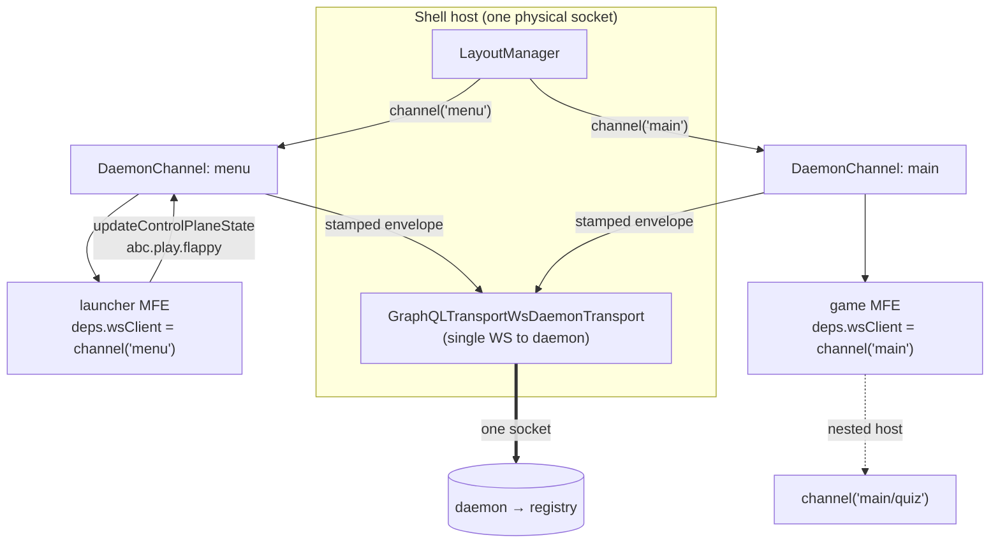

# ADR-057 — Virtualized daemon socket: per-slot control-plane channels over one host connection

- **Status:** Proposed
- **Date:** 2026-06-14
- **Relates to:** ADR-054 (control-plane message protocol), ADR-055 (LayoutManager / daemon-driven shells), ADR-056 (MFE presentation boundary), ADR-041 (BaseMFE capability contract)

## Context

A composed MFE needs to drive the control plane from inside the shell. The
canonical way is the **platform capability `updateControlPlaneState`** on
`BaseMFE` (ADR-041): it sends a `STATE_UPDATE` action up the daemon so the
registry re-evaluates routes and resolves a new experience. The launcher/home
experience depends on exactly this — clicking a game tile must emit
`abc.play.<game>` and let the registry swap the `main` slot.

Two problems block that today:

1. **No socket.** `updateControlPlaneState` guards on `deps.wsClient.connected`,
   but generated MFEs are constructed as `new Mfe(manifest)` with no deps. A
   game composed by the LayoutManager has no daemon connection, so the
   capability returns `"Daemon WebSocket not connected"`.

2. **The naïve fix multiplies sockets.** Giving every MFE its own
   `GraphQLWebSocketClient` means N sockets per shell, every remote must know
   the daemon URL, and nested composition (an MFE that itself hosts MFEs) has
   no coherent identity model.

The host already owns exactly one physical connection: the LayoutManager's
`GraphQLTransportWsDaemonTransport`. We want every composed MFE to use *that*
socket, while still being individually addressable.

## Decision

**The host owns one physical daemon socket and virtualizes it into per-slot
channels.** Each layout slot — and, recursively, each MFE composed within a
slot — receives a `DaemonChannel` that implements `DaemonWebSocketClient` and
multiplexes onto the single shared transport. The channel is injected as the
MFE's `deps.wsClient` via `BaseMFE.attachControlPlane(channel)`, so
`updateControlPlaneState` works unchanged.

A channel:

- reports `connected` from the host transport's status (no socket of its own);
- implements `mutation()` by decoding the `sendMessage` envelope, **stamping it
  with the channel id** (`metadata.channel`) for per-slot attribution, and
  routing it over the host transport's `send()`;
- can spawn a **child channel** (`channel.child(subId)`) whose id composes into
  a path (`"main"` → `"main/quiz"`), so nested hosts reason about their MFEs the
  same way the top host reasons about its slots.

`updateControlPlaneState` is also corrected to emit what the registry actually
matches on: `actionType: 'STATE_UPDATE'` **plus** `stateKey` (the `ActionRecord`
contract already documents `stateKey` as "set for updateControlPlaneState
signals"). Previously it set `actionType: stateKey` and left `stateKey`
undefined, so registry routes keyed on `when.stateKey` never fired.

## Boundaries (what crosses, what doesn't)

- **The channel is a port, not a connection.** MFEs depend on the
  `DaemonWebSocketClient` interface (ADR-054), never on the transport, the
  socket, or the daemon URL. The host is the only thing that knows there is one
  physical connection.
- **Identity is the host's, not the MFE's.** The channel id is assigned by the
  host (slot id / nested path), not chosen by the MFE. An MFE cannot spoof
  another slot's attribution.
- **Framework-neutral.** `DaemonChannel` imports no framework and no DOM; it
  rides the same neutral transport contract as the LayoutManager (ADR-056
  boundary test still passes).

## Consequences

- One socket per shell regardless of how many MFEs compose; `updateControlPlaneState`
  works for any composed MFE with no change to generated code.
- Control-plane signals are attributable to a slot (and nested path), which the
  daemon/host can use for routing, scoping, and debugging.
- Recursive composition has a single, uniform identity model.
- Trade-off: the channel is currently outbound-oriented (actions up). Inbound
  per-channel delivery (scoping which experiences reach which sub-host) is a
  follow-on; today inbound experiences are routed by the top LayoutManager via
  `experience.props.slot` (ADR-055), which is sufficient for the launcher.
