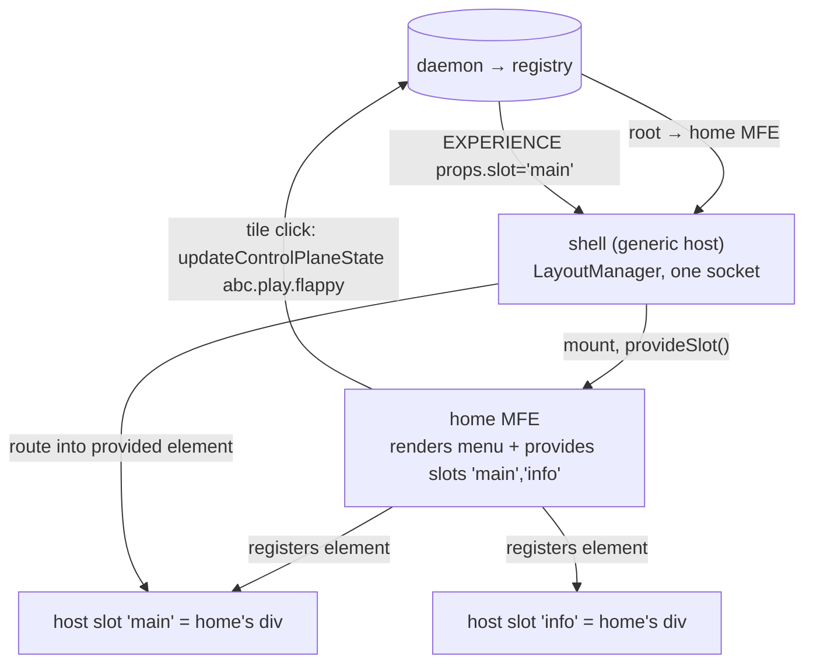

# ADR-058 — Slot-provider MFEs: MFEs contribute named slots to the host layout

- **Status:** Proposed
- **Date:** 2026-06-14
- **Relates to:** ADR-055 (LayoutManager / daemon-driven shells), ADR-056 (MFE presentation boundary), ADR-057 (virtualized daemon socket)

## Context

The shell is a 100% generic host (ADR-055): it owns one mount point and routes
each `EXPERIENCE` to a slot by `experience.props.slot`. Today the *layout* —
how many slots there are and where — is implicit in whoever sends experiences.

We want the layout itself to be **delivered via an MFE**: one MFE renders the
three regions (menu, main, info) and everything else (the launcher, the games)
composes into them. The shell must not learn the layout; the MFE provides it.

The naïve alternative — a nested LayoutManager inside the layout MFE, each with
its own daemon subscription — needs per-channel *inbound* delivery, which
ADR-057 explicitly deferred. That is more machinery than this requires.

## Decision

**An MFE may contribute named slots to the host LayoutManager.** When the host
mounts an MFE it passes a `provideSlot(slotId, element)` callback (alongside the
ADR-057 channel). The MFE renders its regions and registers each region's DOM
element as a host slot. The host keeps its single inbound subscription and
simply routes later experiences (`props.slot`) into the MFE-provided element
instead of a div it created.

Properties:

- **Host-owned inbound, MFE-owned slots.** One subscription, one socket
  (ADR-057). The MFE decides the layout; the host decides routing. No nested
  subscription, so ADR-057's deferred inbound-scoping is not needed yet.
- **Generic any-MFE capability.** `provideSlot` is offered to every mounted MFE;
  a "layout" MFE is just the first one that uses it. Slot provision is a
  capability of MFEs, not a special case in the shell.
- **Lifecycle.** A provided slot lives while the providing experience is
  mounted; clearing/replacing that experience releases the slots it provided so
  stale elements never receive routing.

## Boundaries

- `provideSlot` is a host-supplied callback handed to the MFE through its render
  inputs; the MFE never imports the LayoutManager or touches the socket.
- Slot ids are a flat namespace owned by the host. A providing MFE picks ids
  (`main`, `info`); collisions replace (last writer wins), matching how a single
  layout MFE owns its regions.
- Framework-neutral: the host stores the element structurally (`SlotElementLike`);
  the MFE passes whatever element its framework rendered.

## Consequences

- The layout is delivered as an MFE; the shell stays free of layout knowledge.
- Games/menu compose into MFE-provided regions with no shell or daemon change.
- Trade-off: this is single-level provision (host ↔ providing MFE). Deeply
  recursive layouts (an MFE inside a provided slot that itself provides slots)
  work for rendering, but routing those deeper experiences still flows through
  the one host until ADR-057 inbound channel scoping lands.
