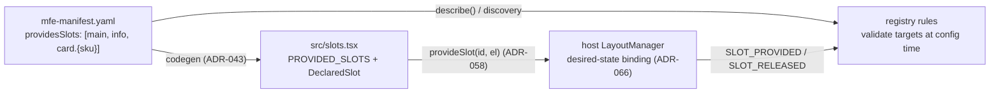

# ADR-067 — Manifest-declared slot contract: slots are declared in the DSL, code is generated from the declaration

- **Status:** Accepted
- **Date:** 2026-07-11
- **Relates to:** ADR-043 (manifest-driven codegen), ADR-057 (host-assigned channel paths), ADR-058 (slot-provider MFEs), ADR-066 (stable slot addressing / desired-state placement)
- **Tracked in:** #265

## Context

ADR-066 fixed slot *identity* (assigned names, never ordinals) and *binding*
(desired-state reconciliation). One seam remained open: slot ids lived only in
component source (`provideSlot('main', …)` in `GameMenu.tsx`). That leaves two
holes:

1. **No design-time discovery.** A registry rule author learns which slots
   exist by reading MFE source or folklore. Nothing validates a placement
   target before runtime — a typo'd or renamed id is discovered in production.
2. **No drift protection.** Any documented slot list is a promise the code can
   silently break; hand-maintained contracts diverge the first hurried sprint.

## Decision

**Slot identity moves into the DSL manifest, and the registration code is
generated from it — declaration and behavior share one source and cannot
disagree.**

1. **`providesSlots` manifest section** (`packages/dsl/src/schema.ts`):
   `[{ id, description? }]`. The schema enforces ADR-066's boundary at parse
   time: ids are dot-separated segments that are either literals containing a
   letter or `{param}` placeholders (keyed/repeated slots) — a purely numeric
   segment is rejected, so an ordinal-form address can never enter the
   contract. `/` is rejected because path composition is host-owned (ADR-057).
   Duplicate ids are rejected.
2. **Generated `src/slots.tsx`** (React template variant;
   `packages/codegen/templates/base-mfe/slots.tsx.ejs`): emits
   `PROVIDED_SLOTS` (the manifest mirrored into code), `isDeclaredSlotId()`
   (literal + keyed-pattern matching), and `DeclaredSlot` — a component that
   registers its element through the host's `provideSlot` render prop
   (ADR-058) and **throws on an undeclared id**. Registration via ref callback
   is remount-safe because the host re-binds rather than destroys (ADR-066).
3. **Always regenerated.** `slots.tsx` is emitted with `overwrite: true`,
   unlike user-owned entry points — it is contract, not scaffold. Changing a
   slot id therefore *requires* a manifest edit: a reviewable, semver-taggable
   contract diff instead of an incidental string change.
4. **Registry-side validation target.** The manifest (already served by
   `describe()` and the discovery endpoint) is what rule-authoring tooling
   validates placement targets against at config time, and what runtime
   `SLOT_PROVIDED` signals (ADR-066) are reconciled against as drift
   telemetry.

## Boundaries

- **Framework variants, not framework logic** (ADR-036 posture): this ADR
  ships the React variant; Angular gets its own template variant when needed.
  The contract (manifest section, id grammar) is framework-neutral.
- **Host-owned slots** (shell-configured regions, the `'main'` default) are
  not covered by any MFE manifest; the shell's own configuration is their
  declaration surface.
- **Keyed patterns validate shape, not members**: `card.{sku}` admits any
  single key segment at design time; which SKUs exist is runtime data.

## Consequences

- Rule authors get an enumerable, validatable slot vocabulary at design time;
  typos and renames fail at rule-save or CI, not in production.
- A rename becomes a two-sided, detectable event: manifest diff on the MFE
  side, target validation failure on the registry side.
- Generated MFEs cannot register undeclared ids — the ADR-066 "duplicate ids
  fail loudly" posture extends to "undeclared ids fail loudly."
- Trade-off: hand-written MFEs (not generated) can still call `provideSlot`
  with anything; for them the manifest section is convention plus runtime
  reconciliation telemetry, not a hard gate. The gate is as strong as the
  codegen adoption.
