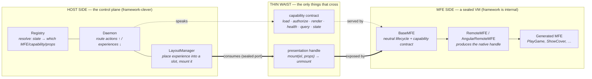
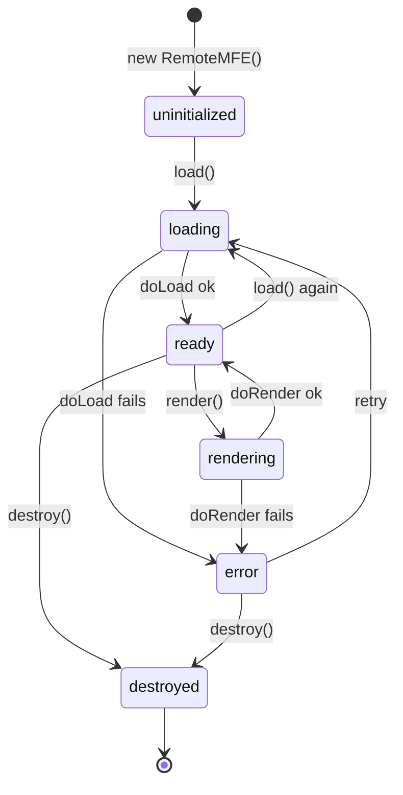
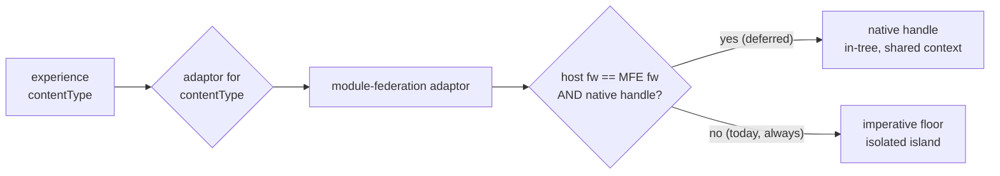

# Runtime Platform Architecture

> How a domain feature, built in any framework, becomes an independently
> deployable unit that a generic shell can compose at runtime.
>
> **New here?** Start with the [Contextualized VM Composition primer](./architecture-composition-primer.md)
> for the big idea and the diagrams; this document is the wire-level reference.

## The whole system in one picture

The runtime has **two halves joined by a thin waist**:

- **The MFE side** is a *sealed unit*. It is built in some framework (React,
  Angular, …), but from the outside that framework is invisible. It exposes a
  neutral **lifecycle** (load, render, health, …) and a **presentation handle**
  (`mount(element) → unmount`). Nothing else leaks out.
- **The host side** is the *control plane*: a **daemon** (router), a **registry**
  (resolver), and a **LayoutManager** (placement). It decides *which* MFE,
  *which* capability, and *what* props to render for *which* user — then places
  the result into a slot. It never reaches inside the MFE.



The design test (ADR-056): *would Kubernetes reach into a container to do this?*
If no, neither does the control plane. An MFE is a pod; the capability contract
is its readiness/liveness probe; the presentation handle is its exposed port; the
control plane is the scheduler. Framework cleverness is allowed — but only on the
host side, behind the waist.

The rest of this document walks the two halves and the waist between them:

1. **The MFE side** — the `BaseMFE` lifecycle every unit inherits.
2. **The control plane** — daemon, registry, LayoutManager, and the end-to-end
   composition flow (with ABC Kids).
3. **The thin waist** — the presentation handle, the imperative floor, and how
   framework handling stays quarantined.

---

## Part 1 — The MFE side: a sealed unit with a lifecycle

Every MFE — regardless of type (`remote`, `bff`, `tool`, `agent`) or framework —
extends the same abstract base, `BaseMFE`. The base owns the *shape*; a concrete
class owns the *how*.

| Layer | Abstract base | Concrete |
|---|---|---|
| MFE runtime | `BaseMFE` | `RemoteMFE` (React/MF), `AngularRemoteMFE` |

### The capability contract (the 10 neutral capabilities)

`BaseMFE` exposes exactly ten capabilities. The control plane speaks *only* these;
none of them mention a UI framework.

| Capability | Purpose |
|---|---|
| `load` | Atomic 3-phase load (fetch → mount → enable-render) — ADR-026 |
| `authorizeAccess` | Can this session use this capability? |
| `render` | Produce/declare the presentation handle (NOT "create a React root") |
| `refresh` | Re-render with new inputs |
| `health` | Liveness/readiness |
| `describe` | What the registry stores on registration (`MfeRegistration`) |
| `schema` | Capability input/output schema |
| `query` | Read domain data (often via the BFF) |
| `emit` | Emit a domain/telemetry event |
| `updateControlPlaneState` | Signal a state change up the control plane (ADR-057) |

Each capability runs through the same **template method**: `before` hooks →
`do*()` main → `after` hooks, with state-machine enforcement around it.

```typescript
abstract class BaseMFE {
  async load(context: Context): Promise<LoadResult> {
    this.transitionState('loading');
    await this.executeLifecycleHooks('before', 'load');
    const result = await this.doLoad(context);   // ← concrete class fills this in
    await this.executeLifecycleHooks('after', 'load');
    this.transitionState('ready');
    return result;
  }
  protected abstract doLoad(context: Context): Promise<LoadResult>;
}

class RemoteMFE extends BaseMFE {
  protected async doLoad(context: Context): Promise<LoadResult> {
    /* Module Federation: fetch remoteEntry, init shared scope, discover modules */
  }
}
```

### The lifecycle state machine



```typescript
const VALID_TRANSITIONS: Record<MFEState, MFEState[]> = {
  uninitialized: ['loading'],
  loading:       ['ready', 'error'],
  ready:         ['loading', 'rendering', 'destroyed'],
  rendering:     ['ready', 'error'],
  error:         ['loading', 'destroyed'],
  destroyed:     [],
};
```

### Context: the single source of truth

One `Context` object flows through every phase of every capability. Handlers read
from and write to it; nothing mutates state outside it. This is what makes the
lifecycle observable and unit-testable.

```typescript
interface Context {
  user?: UserContext;          // populated by the auth handler
  jwt?: string;
  requestId: string;           // trace id
  timestamp: Date;
  inputs?: Record<string, unknown>;
  outputs?: Record<string, unknown>;
  phase?: 'before' | 'main' | 'after' | 'error';
  capability?: string;
  error?: Error;
  emit?(event: TelemetryEvent): Promise<void>;
  // … telemetry / validation / cache / rateLimit handler data
}
```

### Platform handlers (cross-cutting concerns)

Reusable concerns plug into the `before`/`main`/`after`/`error` phases via
dependency injection. They are configured by the manifest (ADR-040) and run in a
retry-aware chain.

| Handler | Phases | On failure |
|---|---|---|
| `auth` | before | hard stop (no retry) |
| `validation` | before | hard stop |
| `rate-limiting` | before | hard stop, retry after reset |
| `telemetry` | all | continue (never blocks) |
| `caching` | before, after | continue |
| `error-handling` | error | retry w/ exponential backoff (max 3) |

```typescript
const mfe = new RemoteMFE(manifest, {
  platformHandlers: { auth: validateJWT, telemetry: trackEvent },
  customHandlers:   { 'PlayGame.validate': async (ctx) => { /* domain rule */ } },
  telemetry, stateValidator, lifecycleExecutor, errorHandler,
});
```

That is the whole MFE side: a sealed unit, a neutral contract, an enforced
lifecycle. **It does not know it is being composed.**

---

## Part 2 — The control plane: daemon, registry, LayoutManager

A generic shell owns *where* (slots) and *how* (adaptors). The control plane owns
*what renders for whom*. Three roles:

- **Registry** — resolves a state change to a `Resolution { mfe, capability, props }`.
  It can answer differently per user / per application, because every action
  carries a `SessionContext`. (Lives in a daemon implementation repo.)
- **Daemon** — the router. Receives actions going up, asks the registry, invokes
  the resolved MFE, relays the `RenderedExperience` going down. Defines no
  component types (ADR-054).
- **LayoutManager** (`src/runtime/layout-manager.ts`) — the host-side placement
  engine. Subscribes to the daemon, routes each experience to a slot
  (`props.slot`, default `main`), and mounts it via the adaptor for its
  `contentType`.

`BaseControlPlane` (ADR-059) is the abstract base that bundles daemon + registry +
LayoutManager into one swappable unit (Node daemon, Rust daemon, in-process mock).
The host writes three lines:

```typescript
const cp = new NodeControlPlane({
  container: document.getElementById('app'),
  session:   { sessionId, user, jwt },
  daemonUrl: 'ws://localhost:3004/graphql',   // 3001-3003 belong to MFEs (ADR-055)
});
await cp.start();   // creates + wires the LayoutManager internally
await cp.stop();
```

### The message protocol (ADR-054)

One typed wire contract, codified in `@seans-mfe/contracts/messages`:

- **Up (`ACTION`)** — `ActionRecord { componentId, actionType, data, stateKey?,
  context: SessionContext }`.
- **Down (`COMPONENT`)** — `RenderedExperience { mfe, capability, output,
  contentType, props }`. `contentType` is an **open string**; `module-federation`,
  `text/html`, and `application/json` are the built-ins.

> Wire note: on the daemon's `messages` subscription the downward payload is
> wrapped one level — `COMPONENT_UPDATE` carries `{ type: 'EXPERIENCE' |
> 'RESOLUTION_ERROR', data: RenderedExperience }` (`DaemonEnvelope`). The `type`
> is an envelope tag, not a revived component type (ADR-054 "Wire envelope vs
> logical message").

### End-to-end: composing ABC Kids

The ABC Kids shell (`examples/abc-kids/shell/src/App.tsx`) is the reference host.
It imports a `LayoutManager`, declares `hostFramework: 'react'`, and renders an
empty `layout-host` div. **It imports zero games.** It stays empty until the
control plane signals.

```mermaid
sequenceDiagram
    participant U as User
    participant Shell as Shell + LayoutManager
    participant D as Daemon
    participant R as Registry
    participant Flappy as flappy MFE (:3001)

    Note over Shell: empty host; one WS to the daemon
    R-->>D: resolve(root, session) → home experience
    D-->>Shell: COMPONENT_UPDATE (EXPERIENCE, slot 'main')
    Shell->>Shell: mount launcher into slot 'main'

    U->>Shell: tap "Flappy" tile
    Shell->>D: ACTION updateControlPlaneState (stateKey 'abc.play.flappy')
    D->>R: forward action + session
    R-->>D: Resolution { mfe: 'abc-kids-flappy', capability: 'PlayGame', props }
    D-->>Shell: COMPONENT_UPDATE (module-federation experience, slot 'main')
    Shell->>Flappy: load remoteEntry.js, mount(slotEl, {capability:'PlayGame'})
    Flappy-->>U: the game renders in the slot
```

The registry chose the game; the shell only provided the slot and the mount.
Swapping `main` from the launcher to Flappy is a control-plane decision, not shell
code. A different user, or a different `application`, could resolve a different MFE
for the same tap.

### One socket, many slots (ADR-057)

Composed MFEs still need to drive the control plane (e.g. the launcher emitting
`abc.play.flappy`). The host owns **one** physical daemon socket and virtualizes
it: each slot gets a `DaemonChannel` (implements `DaemonWebSocketClient`),
injected as the MFE's `deps.wsClient` via `attachControlPlane()`. Outbound
envelopes are stamped with the slot id; nested hosts compose ids into a path
(`main` → `main/quiz`). So `updateControlPlaneState` works for any composed MFE
with no extra connection and no daemon URL in the MFE.

### MFE-provided layout (ADR-058)

The layout itself can be an MFE. When the host mounts an MFE it passes a
`provideSlot(slotId, element)` callback alongside the channel. A "home" MFE renders
its regions (menu, main, info) and registers each as a host slot; the host keeps
its single subscription and routes later experiences into those elements. Slot
provision is a capability offered to *every* MFE — the layout MFE is just the
first to use it.

---

## Part 3 — The thin waist: presentation, framework handling, the imperative floor

`render` as a capability means **"produce/declare the presentation handle,"** never
"create a React root." Exactly two things cross the waist (ADR-056):

1. the **neutral capability contract** (Part 1), and
2. the **presentation handle**.

### The imperative floor (guaranteed)

Every client MFE MUST expose the imperative handle — the universal port:

```typescript
interface ImperativeMountHandle {
  kind: 'imperative-dom';
  framework?: string;                 // metadata only; the host never needs it
  mount: (element, options?) => unmount;
}
```

The host hands it an element; the MFE mounts an **isolated island** (its own React
root, its own Angular bootstrap) and returns its teardown. This path is *always*
available and *always* polyglot — any host can mount any MFE. It is the default,
and it is what the ABC Kids games use today. `createImperativeHandle()`
(`src/runtime/imperative-handle.ts`) wraps an MFE's neutral lifecycle as this
handle without importing any framework; the actual `createRoot` happens inside
`RemoteMFE.doRender`, behind the port.

### The native handle (optional, deferred)

An MFE MAY *also* expose a framework-native component handle. When the host
framework matches, a provider could compose it **in-tree** (single root, shared
context — intl, theme, router, auth — error boundaries spanning the boundary).
This is the integration path; it accepts framework-singleton coupling and is a
**declared per-MFE choice** (isolation vs integration), exactly like a container
choosing whether to share a namespace.

The in-tree React provider is **deferred** (ADR-056) until a concrete shared-context
need justifies the coupling. It slots in behind the same waist with no change to
the contract, the core, or the daemon.

### Framework handling: negotiation, quarantined



The LayoutManager's adaptor registry is keyed on `contentType`. `hostFramework`
(e.g. `'react'` from the ABC Kids shell) is **threaded** to the adaptor for
ADR-056 negotiation, but because the native path is deferred, every experience
composes via the imperative floor regardless — `hostFramework` is carried, not yet
acted on. When the native provider lands, the registry re-keys onto
`hostFramework × handleKind` additively.

The bright line is **machine-checked**: `src/runtime/__tests__/boundary.test.ts`
asserts that `packages/contracts` and the neutral runtime core (`base-mfe`,
`layout-manager`, `base-control-plane`, `daemon-channel`, `imperative-handle`,
`contracts`) import **zero** UI-framework packages. Only the framework-specialized
abstracts (`RemoteMFE`, `AngularRemoteMFE`, layer 5) may import React/Angular —
because they are the ones producing the native handle. *New framework = new
provider/abstract package, zero core change.*

---

## Where things live

```
src/runtime/
├── base-mfe.ts            # abstract base — the 10 capabilities + lifecycle
├── remote-mfe.ts          # React / Module Federation concrete (layer 5)
├── angular-remote-mfe.ts  # Angular concrete (layer 5)
├── context.ts             # Context interface & factory
├── layout-manager.ts      # daemon-driven slot composition (ADR-055)
├── base-control-plane.ts  # abstract control plane (ADR-059)
├── daemon-channel.ts      # virtualized per-slot socket (ADR-057)
├── imperative-handle.ts   # the MFE side of the presentation boundary (ADR-056)
├── contracts.ts           # inlined mirror of @seans-mfe/contracts (self-contained)
├── handlers/              # auth, telemetry, validation, error-handling, caching, rate-limiting
└── __tests__/             # incl. boundary.test.ts (the machine-checked bright line)

packages/contracts/src/
├── messages.ts            # control-plane wire protocol (ADR-054)
└── presentation.ts        # presentation handle types + selectHandle (ADR-056)

examples/abc-kids/
├── shell/                 # generic LayoutManager host (imports no games)
└── flappy, hockey, …      # remote MFEs (type: remote, framework: react)
```

---

## Key design principles

1. **Sealed unit, neutral contract.** An MFE is a framework-opaque VM. The control
   plane speaks only the 10 capabilities + the presentation handle.
2. **Composition is the control plane's job.** The shell owns slots and adaptors;
   the registry owns what renders for whom.
3. **The imperative floor is universal.** Every MFE mounts as an isolated island
   anywhere; native in-tree composition is an optional, declared upgrade.
4. **Framework cleverness is quarantined.** Allowed, but only behind the waist, in
   providers/abstracts — enforced by the boundary test, not by convention.
5. **One socket, uniform identity.** Slots and nested hosts share one connection
   via `DaemonChannel`; identity is the host's, never spoofable by an MFE.
6. **Abstract base owns the shape, concrete owns the how** — `BaseMFE`,
   `BaseCommand`, `BaseFrameworkPlugin`, and now `BaseControlPlane`.

---

## Related ADRs

**The MFE side**
- ADR-041 — BaseMFE capability contract (abstract base)
- ADR-042 — MFE lifecycle state machine
- ADR-025 — Platform handler interface & execution model
- ADR-026 — Load capability atomic operation
- ADR-040 — Manifest-declared handler sources

**Runtime composition (the control plane + waist)**
- ADR-054 — Control-plane message protocol (`@seans-mfe/contracts/messages`)
- ADR-055 — LayoutManager — daemon-driven slot composition
- ADR-056 — MFE presentation boundary (polyglot VM; imperative floor + native handle)
- ADR-057 — Virtualized daemon socket (`DaemonChannel`)
- ADR-058 — Slot-provider MFEs
- ADR-059 — `BaseControlPlane` abstract base

**Product framing**
- PDR-002 — Language-/framework-neutral platform contract
- PDR-005 — Runtime composition · PDR-006 — Ecosystem scaling thesis

---

## Navigation

**← [System Architecture](./architecture-current-state.md)** ·
**[ADR index](./spec.md#adr-index)** ·
**↑ [Documentation Index](./README.md)**

**Status:** Runtime composition — 054/055/057/058 implemented; 056/059 accepted
(see [`spec.md#adr-index`](./spec.md#adr-index) for canonical status).
