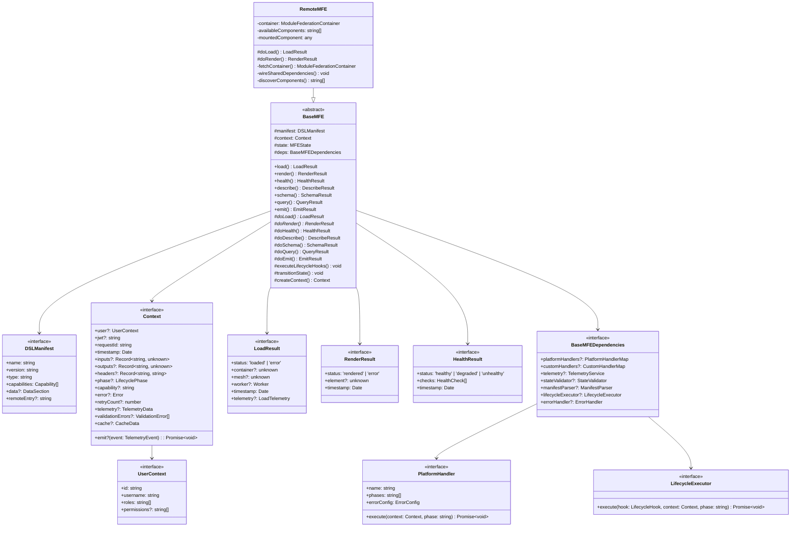
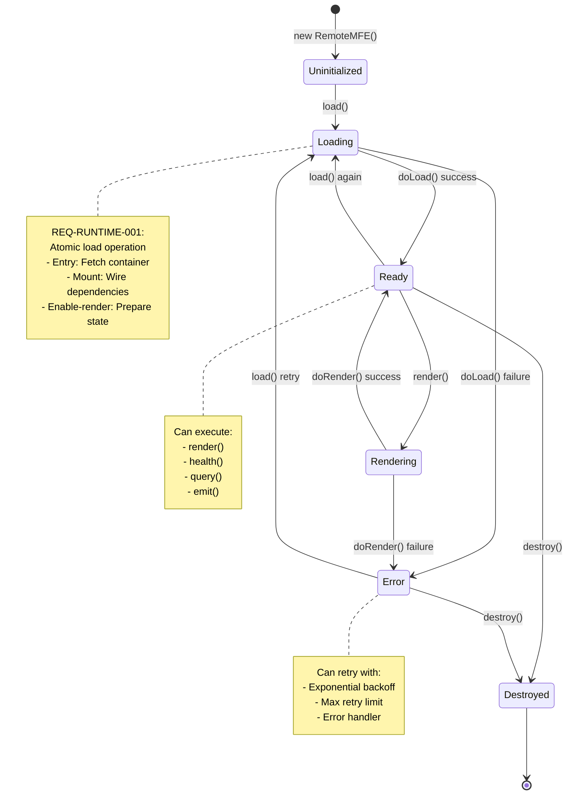
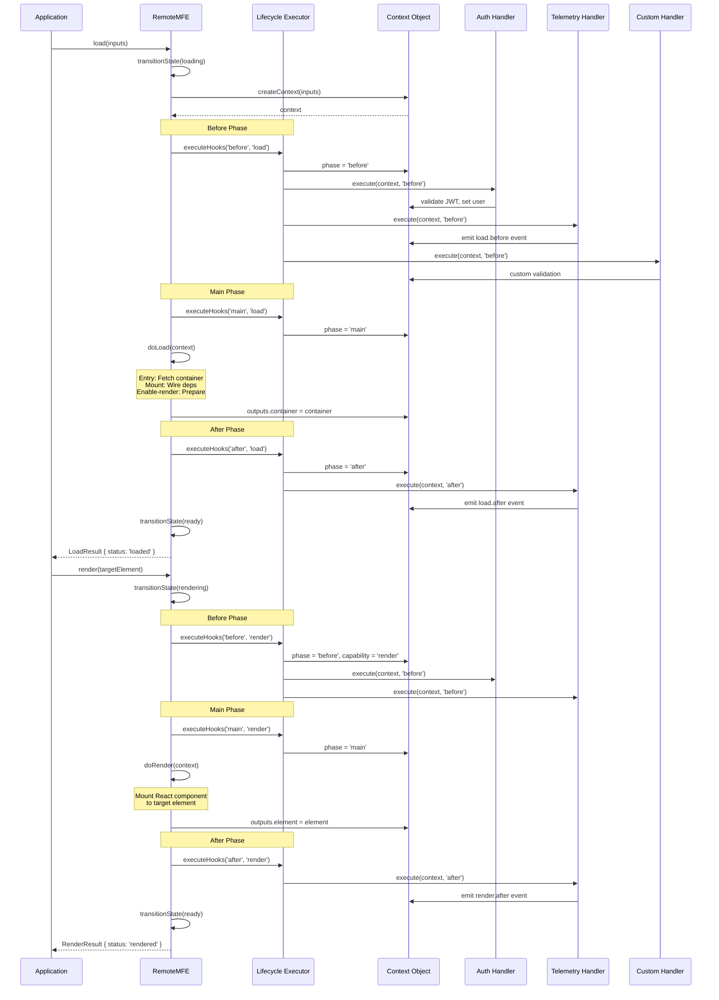
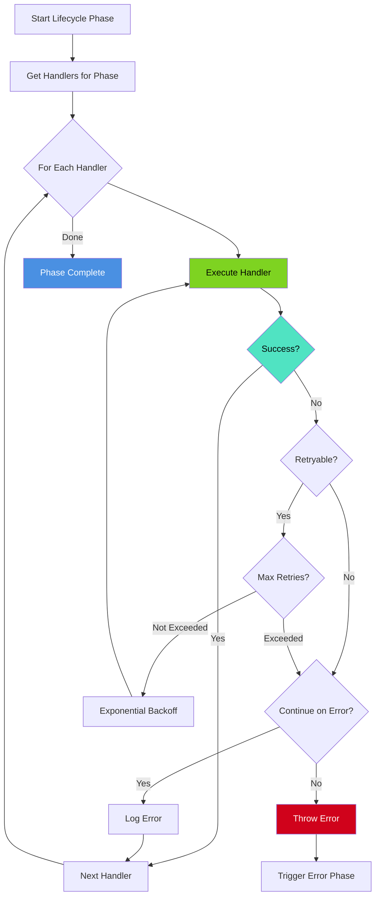
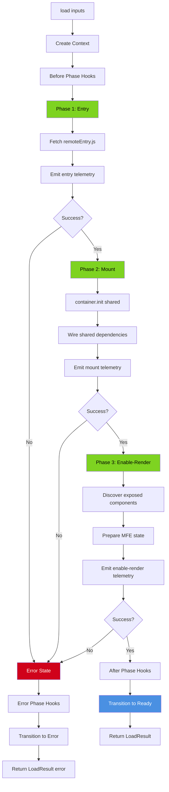
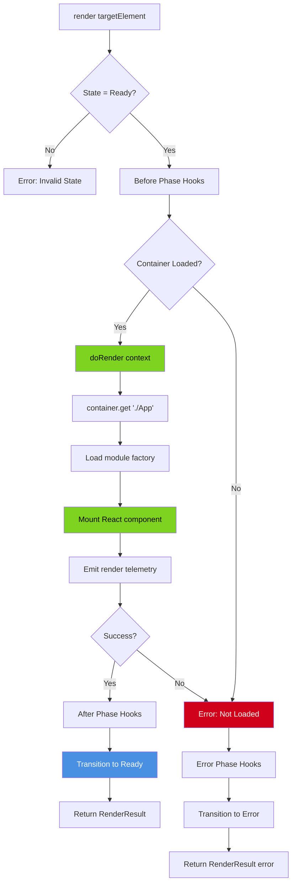

# Runtime Platform Architecture

## Subsystem Overview

```mermaid
graph TB
    subgraph "Runtime Platform Subsystem"
        subgraph "Public API Layer"
            BaseMFE["BaseMFE<br/>(Abstract Class)"]
            RemoteMFE["RemoteMFE<br/>(Concrete Impl)"]
            ContextAPI["Context API<br/>(Interface & Factory)"]
            Exports["Package Exports<br/>index.ts"]
        end

        subgraph "Core Execution Engine"
            StateMachine["State Machine<br/>(FSM Validator)"]
            LifecycleEngine["Lifecycle Engine<br/>(Phase Orchestrator)"]
            HookExecutor["Hook Executor<br/>(Handler Chain)"]
            ContextManager["Context Manager<br/>(State Flow)"]
        end

        subgraph "Platform Handlers (6)"
            AuthH["auth.ts<br/>JWT Validation"]
            TelemetryH["telemetry.ts<br/>Event Tracking"]
            ValidationH["validation.ts<br/>Input Validation"]
            ErrorH["error-handling.ts<br/>Retry Logic"]
            CacheH["caching.ts<br/>Response Cache"]
            RateLimitH["rate-limiting.ts<br/>Throttling"]
        end

        subgraph "Type System"
            Interfaces["Interfaces<br/>(LoadResult, RenderResult, etc.)"]
            ContextTypes["Context Types<br/>(UserContext, TelemetryEvent)"]
            DependencyTypes["Dependency Injection<br/>(BaseMFEDependencies)"]
        end

        subgraph "External Dependencies"
            DSL["DSL Manifest<br/>(../dsl/schema)"]
            JWT["jsonwebtoken<br/>(Node.js only)"]
            ModFed["Module Federation<br/>(Runtime API)"]
        end
    end

    subgraph "Generated MFE"
        AppCode["Application Code"]
        FeatureComponents["Feature Components"]
        CustomHandlers["Custom Handlers"]
    end

    %% Public API relationships
    Exports --> BaseMFE
    Exports --> RemoteMFE
    Exports --> ContextAPI
    BaseMFE --> RemoteMFE

    %% Core Engine relationships
    BaseMFE --> StateMachine
    BaseMFE --> LifecycleEngine
    BaseMFE --> ContextManager
    LifecycleEngine --> HookExecutor
    ContextManager --> ContextAPI

    %% Handler relationships
    HookExecutor --> AuthH
    HookExecutor --> TelemetryH
    HookExecutor --> ValidationH
    HookExecutor --> ErrorH
    HookExecutor --> CacheH
    HookExecutor --> RateLimitH

    %% Type system relationships
    BaseMFE --> Interfaces
    ContextAPI --> ContextTypes
    BaseMFE --> DependencyTypes

    %% External dependencies
    BaseMFE --> DSL
    AuthH --> JWT
    RemoteMFE --> ModFed

    %% Generated MFE usage
    AppCode --> RemoteMFE
    AppCode --> ContextAPI
    FeatureComponents --> RemoteMFE
    CustomHandlers --> HookExecutor

    style BaseMFE fill:#BD10E0,color:#fff
    style RemoteMFE fill:#9013FE,color:#fff
    style ContextAPI fill:#F5A623,color:#000
    style StateMachine fill:#7ED321,color:#000
    style LifecycleEngine fill:#7ED321,color:#000
    style HookExecutor fill:#7ED321,color:#000
    style AuthH fill:#50E3C2,color:#000
    style TelemetryH fill:#50E3C2,color:#000
    style ValidationH fill:#50E3C2,color:#000
    style ErrorH fill:#50E3C2,color:#000
    style CacheH fill:#50E3C2,color:#000
    style RateLimitH fill:#50E3C2,color:#000
    style DSL fill:#4A90E2,color:#fff
    style AppCode fill:#F8E71C,color:#000
```



**Legend:**

- 🟣 **Purple**: Core abstract/concrete classes
- 🟠 **Orange**: Context & state management
- 🟢 **Green**: Execution engines
- 🔵 **Cyan**: Platform handlers
- 🔷 **Blue**: External dependencies
- 🟡 **Yellow**: Generated application code

---

## Overview

The Runtime Platform provides the execution environment for all MFE types (remote, bff, tool, agent). It implements the core lifecycle, context management, and platform handler system that enables consistent, observable, and secure MFE operation.

**Core Principles:**

- **Universal Base Class**: `BaseMFE` works for all MFE types
- **Shared Context**: Context flows through all phases and capabilities
- **Platform Handlers**: Reusable cross-cutting concerns (auth, telemetry, validation)
- **State Machine**: Enforced lifecycle state transitions
- **Dependency Injection**: All dependencies injectable for testing
- **Type Safety**: Full TypeScript strict mode compliance

**Key Requirements:**

- REQ-RUNTIME-001: Load capability (atomic operation)
- REQ-RUNTIME-002: Shared context across all phases
- REQ-RUNTIME-004: Render capability
- REQ-RUNTIME-005: Platform handler registry
- REQ-RUNTIME-006: Authentication handler
- REQ-RUNTIME-012: Telemetry emission at all checkpoints

**Related ADRs:**

- ADR-036: Lifecycle hook execution semantics
- ADR-047: BaseMFE abstract base (not type hierarchy)
- ADR-059: Platform handler interface & execution model
- ADR-060: Load capability atomic operation design

---

## System Architecture

```mermaid
graph TB
    subgraph "Runtime Package (@seans-mfe-tool/runtime)"
        BaseMFE["BaseMFE<br/>(Abstract Base Class)"]
        RemoteMFE["RemoteMFE<br/>(Module Federation)"]
        Context["Context<br/>(Shared State)"]

        subgraph "Platform Handlers"
            Auth["Auth Handler<br/>(JWT Validation)"]
            Telemetry["Telemetry Handler<br/>(Event Tracking)"]
            Validation["Validation Handler<br/>(Input Validation)"]
            ErrorHandler["Error Handler<br/>(Retry Logic)"]
            Caching["Caching Handler<br/>(Response Cache)"]
            RateLimit["Rate Limiting Handler<br/>(Throttling)"]
        end

        subgraph "Lifecycle System"
            LifecycleExec["Lifecycle Executor<br/>(Hook Orchestration)"]
            StateValidator["State Validator<br/>(FSM Enforcement)"]
        end

        subgraph "Support Services"
            TelemetryService["Telemetry Service<br/>(Event Emission)"]
            ManifestParser["Manifest Parser<br/>(DSL Parsing)"]
        end
    end

    subgraph "DSL System"
        DSLManifest["DSL Manifest<br/>(mfe-manifest.yaml)"]
        Schema["Schema Types<br/>(Capabilities, Hooks)"]
    end

    subgraph "Generated MFE"
        ConcreteImpl["Concrete MFE<br/>(extends RemoteMFE)"]
        Features["Feature Components<br/>(React/UI)"]
        CustomHandlers["Custom Handlers<br/>(Domain Logic)"]
    end

    %% Relationships
    BaseMFE --> Context
    BaseMFE --> LifecycleExec
    BaseMFE --> StateValidator
    BaseMFE --> TelemetryService
    BaseMFE --> ManifestParser

    RemoteMFE --|extends| BaseMFE
    ConcreteImpl --|extends| RemoteMFE

    LifecycleExec --> Auth
    LifecycleExec --> Telemetry
    LifecycleExec --> Validation
    LifecycleExec --> ErrorHandler
    LifecycleExec --> Caching
    LifecycleExec --> RateLimit
    LifecycleExec --> CustomHandlers

    Context -.->|flows through| Auth
    Context -.->|flows through| Validation
    Context -.->|flows through| ErrorHandler

    DSLManifest --> ManifestParser
    Schema --> BaseMFE

    ConcreteImpl --> Features
    ConcreteImpl --> CustomHandlers

    style BaseMFE fill:#BD10E0,color:#fff
    style RemoteMFE fill:#9013FE,color:#fff
    style Context fill:#F5A623,color:#000
    style Auth fill:#50E3C2,color:#000
    style Telemetry fill:#50E3C2,color:#000
    style LifecycleExec fill:#7ED321,color:#000
    style DSLManifest fill:#4A90E2,color:#fff
```

---

## Class Hierarchy & Type System



---

## State Machine



### Valid State Transitions

```typescript
const VALID_TRANSITIONS: Record<MFEState, MFEState[]> = {
  uninitialized: ['loading'],
  loading: ['ready', 'error'],
  ready: ['loading', 'rendering', 'destroyed'],
  rendering: ['ready', 'error'],
  error: ['loading', 'destroyed'],
  destroyed: [],
};
```

---

## Lifecycle & Context Flow



---

## Context Schema & Data Flow

### Context Structure

```typescript
interface Context {
  // === User & Authentication ===
  user?: UserContext; // Populated by auth handler
  jwt?: string; // JWT token from request
  requestId: string; // Unique trace ID
  timestamp: Date; // Request timestamp

  // === Capability I/O ===
  inputs?: Record<string, unknown>; // Capability inputs
  outputs?: Record<string, unknown>; // Capability outputs

  // === HTTP/Request Metadata ===
  headers?: Record<string, string>; // HTTP headers
  query?: Record<string, string>; // Query parameters

  // === Lifecycle Tracking ===
  phase?: 'before' | 'main' | 'after' | 'error';
  capability?: 'load' | 'render' | 'query' | 'emit' | string;

  // === Error Context ===
  error?: Error; // Error that triggered error phase
  retryCount?: number; // Retry attempt number

  // === Handler Data ===
  telemetry?: {
    startTime?: number;
    endTime?: number;
    duration?: number;
    events: TelemetryEvent[];
  };

  validationErrors?: Array<{
    field: string;
    message: string;
    code: string;
  }>;

  cache?: {
    key: string;
    hit: boolean;
    ttl?: number;
  };

  rateLimit?: {
    limit: number;
    remaining: number;
    reset: Date;
  };

  // === Emit Method ===
  emit?(event: TelemetryEvent): Promise<void>;
}
```

### Context Flow Diagram

```mermaid
graph LR
    subgraph "Context Creation"
        Input[Capability Inputs] --> Factory[Context Factory]
        Request[HTTP Request] --> Factory
        Factory --> Context[Context Object]
    end

    subgraph "Before Phase"
        Context --> Auth[Auth Handler]
        Auth --> |set user| Context2[Context + user]
        Context2 --> Telemetry1[Telemetry Handler]
        Telemetry1 --> |emit event| Context3[Context + telemetry]
        Context3 --> Validation[Validation Handler]
        Validation --> |add errors| Context4[Context + validation]
    end

    subgraph "Main Phase"
        Context4 --> DoCapability[doLoad/doRender/etc]
        DoCapability --> |set outputs| Context5[Context + outputs]
    end

    subgraph "After Phase"
        Context5 --> Telemetry2[Telemetry Handler]
        Telemetry2 --> |emit metrics| Context6[Context + metrics]
        Context6 --> Cache[Caching Handler]
        Cache --> |cache result| Context7[Context + cache]
    end

    subgraph "Result"
        Context7 --> Result[LoadResult/RenderResult]
    end

    style Context fill:#F5A623,color:#000
    style Context2 fill:#F5A623,color:#000
    style Context3 fill:#F5A623,color:#000
    style Context4 fill:#F5A623,color:#000
    style Context5 fill:#F5A623,color:#000
    style Context6 fill:#F5A623,color:#000
    style Context7 fill:#F5A623,color:#000
    style Auth fill:#50E3C2,color:#000
    style Validation fill:#50E3C2,color:#000
```

---

## Platform Handlers Architecture

### Handler Interface

```typescript
interface PlatformHandler {
  name: string; // Handler identifier
  phases: string[]; // Which phases to run in
  errorConfig: {
    continueOnError: boolean; // Continue if handler fails
    retryable: boolean; // Can retry on error
    maxRetries?: number; // Max retry attempts
  };
  execute(context: Context, phase: string): Promise<void>;
}
```

### Handler Execution Flow



### Built-in Platform Handlers

#### 1. Auth Handler (`auth.ts`)

**Purpose**: JWT validation and user context population

**Configuration**:

```typescript
{
  name: 'auth',
  phases: ['before'],
  errorConfig: {
    continueOnError: false,  // Auth failure = hard stop
    retryable: false
  }
}
```

**Logic**:

```typescript
async function validateJWT(context: Context): Promise<void> {
  const token = context.jwt;
  const secret = process.env.JWT_SECRET;

  if (!token) throw new Error('JWT token required');
  if (!secret) throw new Error('JWT secret missing');

  try {
    const decoded = jwt.verify(token, secret, { algorithms: ['HS256'] });
    context.user = decoded; // Populate user context

    await context.emit?.({
      eventType: 'info',
      eventData: { source: 'platform.validateJWT', user: decoded },
      severity: 'info',
    });
  } catch (error) {
    await context.emit?.({
      eventType: 'error',
      eventData: { source: 'platform.validateJWT', error: error.message },
      severity: 'error',
    });
    throw new Error('Invalid JWT token: ' + error.message);
  }
}
```

#### 2. Telemetry Handler (`telemetry.ts`)

**Purpose**: Event tracking at all checkpoints

**Configuration**:

```typescript
{
  name: 'telemetry',
  phases: ['before', 'main', 'after', 'error'],
  errorConfig: {
    continueOnError: true,   // Telemetry failure shouldn't block
    retryable: false
  }
}
```

**Emission Points** (REQ-RUNTIME-012):

- Capability start (before phase)
- Handler execution (each handler)
- Capability checkpoints (entry, mount, enable-render)
- Capability completion (after phase)
- Errors (error phase)

#### 3. Validation Handler (`validation.ts`)

**Purpose**: Input validation against schemas

**Configuration**:

```typescript
{
  name: 'validation',
  phases: ['before'],
  errorConfig: {
    continueOnError: false,  // Invalid input = hard stop
    retryable: false
  }
}
```

#### 4. Error Handling Handler (`error-handling.ts`)

**Purpose**: Retry logic with exponential backoff

**Configuration**:

```typescript
{
  name: 'error-handling',
  phases: ['error'],
  errorConfig: {
    continueOnError: false,
    retryable: true,
    maxRetries: 3
  }
}
```

**Retry Strategy**:

```typescript
const backoffMs = Math.min(
  1000 * Math.pow(2, context.retryCount || 0),
  30000 // Max 30 seconds
);
```

#### 5. Caching Handler (`caching.ts`)

**Purpose**: Response caching

**Configuration**:

```typescript
{
  name: 'caching',
  phases: ['before', 'after'],
  errorConfig: {
    continueOnError: true,   // Cache miss/failure shouldn't block
    retryable: false
  }
}
```

#### 6. Rate Limiting Handler (`rate-limiting.ts`)

**Purpose**: Request throttling

**Configuration**:

```typescript
{
  name: 'rate-limiting',
  phases: ['before'],
  errorConfig: {
    continueOnError: false,  // Rate limit = hard stop
    retryable: true,         // Can retry after reset
    maxRetries: 3
  }
}
```

---

## Load Capability: Atomic Operation Design

**REQ-RUNTIME-001 & ADR-060**: Load is an atomic operation with three phases



### LoadResult Schema

```typescript
interface LoadResult {
  status: 'loaded' | 'error';
  container?: ModuleFederationContainer;
  mesh?: GraphQLMesh;
  worker?: Worker;
  timestamp: Date;
  telemetry?: {
    entry: {
      start: Date;
      duration: number;
    };
    mount: {
      start: Date;
      duration: number;
    };
    enableRender: {
      start: Date;
      duration: number;
    };
  };
  error?: {
    message: string;
    phase: 'entry' | 'mount' | 'enable-render';
    stack?: string;
  };
}
```

---

## Render Capability



---

## Dependency Injection

```mermaid
graph TB
    subgraph "Application Code"
        App[Application]
        Config[Dependency Config]
    end

    subgraph "Runtime Package"
        BaseMFE[BaseMFE]
        RemoteMFE[RemoteMFE]
    end

    subgraph "Injected Dependencies"
        PlatformHandlers[Platform Handlers<br/>auth, telemetry, etc.]
        CustomHandlers[Custom Handlers<br/>domain logic]
        TelemetryService[Telemetry Service<br/>event emission]
        StateValidator[State Validator<br/>FSM enforcement]
        LifecycleExec[Lifecycle Executor<br/>hook orchestration]
        ErrorHandler[Error Handler<br/>retry logic]
    end

    App --> Config
    Config --> |inject| RemoteMFE

    RemoteMFE --|uses| PlatformHandlers
    RemoteMFE --|uses| CustomHandlers
    RemoteMFE --|uses| TelemetryService
    RemoteMFE --|uses| StateValidator
    RemoteMFE --|uses| LifecycleExec
    RemoteMFE --|uses| ErrorHandler

    BaseMFE -.->|defines interface| RemoteMFE

    style Config fill:#F5A623,color:#000
    style RemoteMFE fill:#BD10E0,color:#fff
    style PlatformHandlers fill:#50E3C2,color:#000
```

### Example: Dependency Injection Usage

```typescript
// Create platform handlers
const platformHandlers: PlatformHandlerMap = {
  auth: async (context) => validateJWT(context),
  telemetry: async (context) => trackEvent(context),
  validation: async (context) => validateInputs(context),
};

// Create custom handlers
const customHandlers: CustomHandlerMap = {
  'DataAnalysis.validate': async (context) => {
    // Custom validation for DataAnalysis capability
    if (!context.inputs?.file) {
      throw new Error('File input required');
    }
  },
};

// Create telemetry service
const telemetry: TelemetryService = {
  emit: (event) => {
    console.log('[Telemetry]', event);
    // Send to observability platform
  },
};

// Inject dependencies
const mfe = new RemoteMFE(manifest, {
  platformHandlers,
  customHandlers,
  telemetry,
  stateValidator: new FSMValidator(),
  lifecycleExecutor: new LifecycleExecutorImpl(),
  errorHandler: new RetryErrorHandler(),
});

// Use MFE
const loadResult = await mfe.load({ remoteEntry: 'http://localhost:3001/remoteEntry.js' });
const renderResult = await mfe.render(document.getElementById('root'));
```

---

## Testing Strategy

### Unit Testing BaseMFE

```typescript
describe('BaseMFE', () => {
  it('should enforce state transitions', async () => {
    const mfe = new RemoteMFE(manifest, deps);

    expect(mfe.getState()).toBe('uninitialized');

    await mfe.load(inputs);
    expect(mfe.getState()).toBe('ready');

    // Invalid transition
    expect(() => mfe.transitionState('destroyed')).toThrow();
  });

  it('should execute lifecycle hooks in order', async () => {
    const executionOrder: string[] = [];

    const deps = {
      platformHandlers: {
        auth: async () => executionOrder.push('auth'),
        telemetry: async () => executionOrder.push('telemetry'),
      },
    };

    const mfe = new RemoteMFE(manifest, deps);
    await mfe.load(inputs);

    expect(executionOrder).toEqual(['auth', 'telemetry']);
  });
});
```

### Integration Testing RemoteMFE

```typescript
describe('RemoteMFE Load', () => {
  it('should complete atomic load operation', async () => {
    const mfe = new RemoteMFE(manifest, deps);
    const result = await mfe.load({ remoteEntry: 'http://localhost:3001/remoteEntry.js' });

    expect(result.status).toBe('loaded');
    expect(result.container).toBeDefined();
    expect(result.telemetry?.entry.duration).toBeGreaterThan(0);
    expect(result.telemetry?.mount.duration).toBeGreaterThan(0);
    expect(result.telemetry?.enableRender.duration).toBeGreaterThan(0);
  });
});
```

### Mocking Dependencies

```typescript
const mockTelemetry: TelemetryService = {
  emit: jest.fn(),
};

const mockLifecycleExecutor: LifecycleExecutor = {
  execute: jest.fn().mockResolvedValue(undefined),
};

const deps: BaseMFEDependencies = {
  telemetry: mockTelemetry,
  lifecycleExecutor: mockLifecycleExecutor,
};
```

---

## File Structure

```
src/runtime/
├── base-mfe.ts              # Abstract base class
├── remote-mfe.ts            # Module Federation implementation
├── context.ts               # Context interface & factory
├── index.ts                 # Public exports
├── handlers/
│   ├── auth.ts             # JWT validation
│   ├── telemetry.ts        # Event tracking
│   ├── validation.ts       # Input validation
│   ├── error-handling.ts   # Retry logic
│   ├── caching.ts          # Response caching
│   ├── rate-limiting.ts    # Request throttling
│   └── index.ts            # Handler exports
└── __tests__/
    ├── base-mfe.test.ts
    ├── remote-mfe.test.ts
    ├── context.test.ts
    └── handlers/
        ├── auth.test.ts
        ├── telemetry.test.ts
        └── ...
```

---

## Package Distribution

```
dist/runtime/
├── index.js                 # Main entry (BaseMFE, RemoteMFE, Context)
├── index.d.ts               # TypeScript definitions
├── base-mfe.js
├── base-mfe.d.ts
├── remote-mfe.js
├── remote-mfe.d.ts
├── context.js
├── context.d.ts
└── handlers/
    ├── index.js            # Handler entry (NOT in main export)
    ├── auth.js
    ├── telemetry.js
    └── ...
```

**Important**: Handlers are in separate entry point to avoid bundling `jsonwebtoken` in browser bundles.

### Usage in Generated MFE

```typescript
// Import runtime classes
import { RemoteMFE } from '@seans-mfe-tool/runtime';

// Import handlers separately (Node.js only)
import { validateJWT } from '@seans-mfe-tool/runtime/handlers';

// Create MFE instance
const mfe = new RemoteMFE(manifest, {
  platformHandlers: {
    auth: validateJWT,
  },
});
```

---

## Key Design Principles

### 1. Template Method Pattern

Abstract `BaseMFE` defines skeleton, concrete implementations override `do*` methods:

```typescript
abstract class BaseMFE {
  async load(inputs: Record<string, unknown>): Promise<LoadResult> {
    this.transitionState('loading');
    await this.executeLifecycleHooks('before', 'load');
    const result = await this.doLoad(this.context); // Template method
    await this.executeLifecycleHooks('after', 'load');
    this.transitionState('ready');
    return result;
  }

  protected abstract doLoad(context: Context): Promise<LoadResult>;
}

class RemoteMFE extends BaseMFE {
  protected async doLoad(context: Context): Promise<LoadResult> {
    // Module Federation specific implementation
  }
}
```

### 2. Context as Single Source of Truth

All state flows through context object:

- Handlers read from and write to context
- No side effects outside context
- Enables testing with mock context
- Enables tracing across phases

### 3. Fail-Fast with Explicit Error Handling

- Invalid state transitions throw immediately
- Auth failures stop execution
- Validation errors prevent main phase
- Error phase triggered for recoverable errors

### 4. Observable by Default

- Telemetry at every checkpoint
- Context tracks all mutations
- State machine transitions logged
- Handler execution tracked

### 5. Type-Safe Throughout

- Full TypeScript strict mode
- No `any` types
- Explicit interfaces for all contracts
- Discriminated unions for results

---

## Performance Considerations

### Load Operation Timing

Target metrics (REQ-RUNTIME-001):

- **Entry phase**: < 500ms (network dependent)
- **Mount phase**: < 200ms (container init + shared deps)
- **Enable-render phase**: < 100ms (component discovery)
- **Total load**: < 1000ms

### Handler Execution Budget

Each handler should complete in < 50ms:

- Auth validation: < 10ms (in-memory JWT verification)
- Telemetry emission: < 5ms (async fire-and-forget)
- Validation: < 20ms (schema validation)
- Caching: < 10ms (in-memory lookup)

### Context Size

Keep context lean:

- Avoid storing large objects in context
- Use references/IDs instead of full objects
- Clear outputs after consumption
- Limit telemetry event history

---

## Security Considerations

### JWT Validation

- **Algorithm whitelist**: Only HS256/RS256
- **Secret management**: Environment variables only
- **Token expiration**: Always validate `exp` claim
- **Signature verification**: Required, never skip

### Input Validation

- **Schema validation**: All inputs validated before main phase
- **Type checking**: Runtime type validation via JSON Schema
- **Sanitization**: User inputs sanitized before processing

### Error Messages

- **No secret leakage**: Never expose secrets in error messages
- **Sanitized stack traces**: Remove sensitive paths in production
- **Generic errors**: User-facing errors should be generic

---

## Related Documentation

### Architecture Documents

- **[← Back to System Architecture Overview](./architecture-current-state.md)**
- [Code Generation Architecture](./architecture-codegen.md) _(Coming Soon)_
- [DSL Architecture](./architecture-dsl.md) _(Coming Soon)_
- [BFF Architecture](./architecture-bff.md) _(Coming Soon)_
- [API Generator Architecture](./architecture-api-generator.md) _(Coming Soon)_

### Requirements & Specifications

- **[Runtime Requirements](./runtime-requirements.md)** - REQ-RUNTIME-001 through 012 (all requirements this subsystem implements)
- [Acceptance Criteria - Runtime Load/Render](./acceptance-criteria/runtime-load-render.feature) - Gherkin scenarios
- [Acceptance Criteria - Platform Handlers](./acceptance-criteria/platform-handlers.feature) - Handler execution scenarios

### Architecture Decision Records

- **ADR-036**: Lifecycle hook execution semantics
- **ADR-047**: BaseMFE abstract base (not type hierarchy)
- **ADR-059**: Platform handler interface & execution model
- **ADR-060**: Load capability atomic operation design
- **ADR-061**: Error boundary & fallback UI strategy

### Implementation Status

- 🟡 **In Progress** - Core implementation in GitHub Issues #47-59
- Track progress: [GitHub Project - Runtime Platform](https://github.com/falese/seans-mfe-tool/issues?q=is%3Aissue+label%3Aruntime-platform+is%3Aopen)

---

## Navigation

**← [Back to System Architecture](./architecture-current-state.md)**  
**→ [Next: Code Generation Architecture](./architecture-codegen.md)** _(Coming Soon)_  
**↑ [Documentation Index](./README.md)**

---

**Document Version**: 1.0.0  
**Last Updated**: December 11, 2025  
**Status**: Implementation in Progress (Issues #47-59)
