# seans-mfe-tool — Platform Architecture White Paper

> Version: 1.0 · Date: 2026-06-14 · Status: Current

---

## Table of Contents

1. [Executive Summary](#1-executive-summary)
2. [The Problem Space](#2-the-problem-space)
3. [Platform Architecture Overview](#3-platform-architecture-overview)
4. [The Abstract Base Pattern](#4-the-abstract-base-pattern)
5. [The DSL and Codegen Pipeline](#5-the-dsl-and-codegen-pipeline)
6. [The MFE Runtime Lifecycle](#6-the-mfe-runtime-lifecycle)
7. [The Control Plane](#7-the-control-plane)
8. [Polyglot Composition Model](#8-polyglot-composition-model)
9. [The Type System as a Platform Pillar](#9-the-type-system-as-a-platform-pillar)
10. [The Framework Plugin System](#10-the-framework-plugin-system)
11. [Deployment Architecture](#11-deployment-architecture)
12. [Extension Points and the Marketplace Vision](#12-extension-points-and-the-marketplace-vision)
13. [Architecture Decision Summary](#13-architecture-decision-summary)

---

## 1. Executive Summary

**seans-mfe-tool** is a platform for delivering domain features as independently deployable units in any framework, language, or federation pattern.

The fundamental insight the platform is built on: the unit of composition in a modern frontend should be a **domain capability** — not a page, not a micro-frontend, not a component. A domain team defines what their domain can _do_ (e.g. `PlayGame`, `ShowCover`, `ProcessCheckout`). The platform handles how it gets built, deployed, and composed in a host shell — regardless of the framework the team chose.

**Three sentences that describe the whole platform:**

- A developer writes a YAML manifest that declares their domain's capabilities. The CLI generates the entire project — bundler config, runtime lifecycle wiring, GraphQL BFF, Docker setup — targeting whatever framework and delivery mechanism the team uses.
- At runtime, a control plane (daemon + registry) receives actions from the shell, resolves them to capabilities, and drives a LayoutManager that mounts the right MFE into the right slot — without the shell knowing anything about the MFE's framework.

**What this platform is not:** a Module Federation wrapper, a monorepo tool, or a component library. Federation is one of several supported delivery mechanisms, not the purpose.

---

## 2. The Problem Space

### 2.1 The fragmentation problem

Distributed frontend teams face a consistent set of problems when building independently deployable UI:

| Problem | Conventional approach | What goes wrong |
|---|---|---|
| Team autonomy | Each team picks their own framework | React and Angular MFEs can't compose |
| Shell integration | Hand-wire Module Federation | Shell couples to every MFE's build config |
| Consistent lifecycle | Informal contracts ("just call `init()`") | No shared health, teardown, or error model |
| Capability discovery | Hardcoded routes and import paths | Adding a capability requires shell changes |
| Deployment isolation | Per-MFE Dockerfiles written from scratch | No standard for artifact paths, base images, or BFF wiring |

### 2.2 The capability vs page distinction

Traditional micro-frontends treat the page as the unit of composition. A team owns `/checkout` and ships it as a remote. This creates coupling at the route level — the shell must know about every route every team owns.

The platform inverts this. A team owns **domain capabilities**:

```
PlayGame(gameId: ID!) → renders the game player
ShowCover(gameId: ID!) → renders the box art
```

The shell publishes **actions** (`"user wants to play a game"`). The control plane resolves actions to capabilities. The shell never knows which team owns the capability or which framework it was built with.

### 2.3 Why existing solutions fall short

| Solution | What it solves | What it misses |
|---|---|---|
| Module Federation alone | Shared code splitting | No lifecycle contract, no polyglot story |
| Single-SPA | Multi-framework mounting | No code generation, no type system, no daemon |
| Turborepo / Nx | Build orchestration | No runtime composition model |
| Web Components | Polyglot boundary | No capability registry, no action → resolution flow |

---

## 3. Platform Architecture Overview

The platform is structured in five layers. Each layer has a clean contract with the layers above and below it.

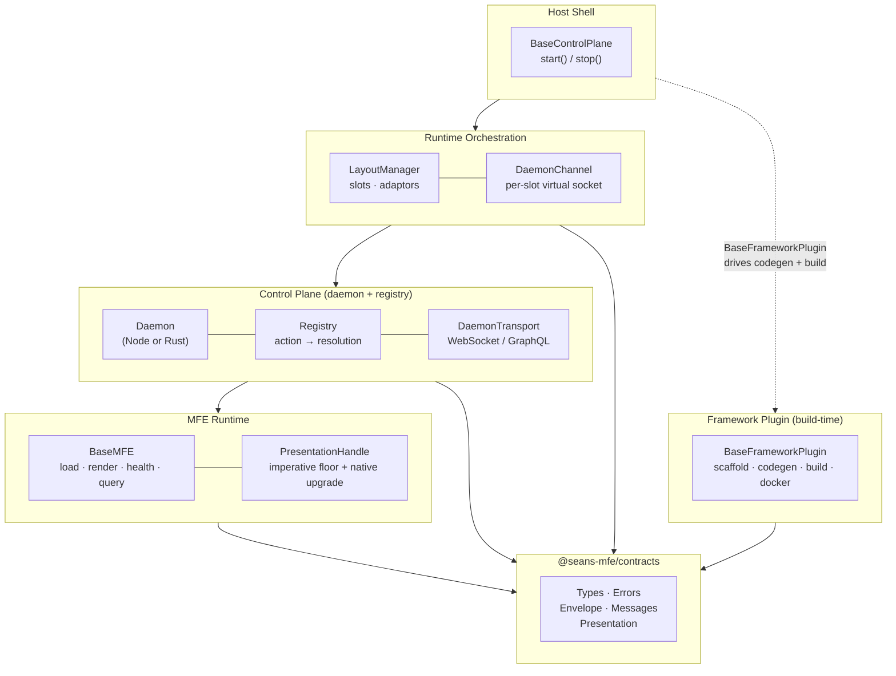
```mermaid
flowchart TB
    subgraph HOST["Host Shell"]
        direction LR
        CP["BaseControlPlane\nstart() / stop()"]
    end

    subgraph ORCHESTRATION["Runtime Orchestration"]
        direction LR
        LM["LayoutManager\nslots · adaptors"]
        DC["DaemonChannel\nper-slot virtual socket"]
        LM --- DC
    end

    subgraph CONTROLPLANE["Control Plane (daemon + registry)"]
        direction LR
        D["Daemon\n(Node or Rust)"]
        R["Registry\naction → resolution"]
        T["DaemonTransport\nWebSocket / GraphQL"]
        D --- R
        R --- T
    end

    subgraph MFE["MFE Runtime"]
        direction LR
        BMFE["BaseMFE\nload · render · health · query"]
        PH["PresentationHandle\nimperative floor + native upgrade"]
        BMFE --- PH
    end

    subgraph CONTRACTS["@seans-mfe/contracts"]
        direction LR
        TYPES["Types · Errors\nEnvelope · Messages\nPresentation"]
    end

    HOST --> ORCHESTRATION
    ORCHESTRATION --> CONTROLPLANE
    CONTROLPLANE --> MFE
    MFE --> CONTRACTS
    ORCHESTRATION --> CONTRACTS
    CONTROLPLANE --> CONTRACTS

    subgraph PLUGIN["Framework Plugin (build-time)"]
        FP["BaseFrameworkPlugin\nscaffold · codegen · build · docker"]
    end

    HOST -.->|"BaseFrameworkPlugin\ndrives codegen + build"| PLUGIN
    PLUGIN --> CONTRACTS
```

### Layer responsibilities

| Layer | Package / Module | Responsibility |
|---|---|---|
| Host shell | `src/runtime/base-control-plane.ts` | Single entry point; owns daemon + LayoutManager lifecycle |
| Runtime orchestration | `src/runtime/layout-manager.ts` | Daemon-driven slot composition; mounts MFEs via adaptors |
| Control plane | `Falese/daemon` · Rust daemon | Daemon process + capability registry; resolves actions → experiences |
| MFE runtime | `src/runtime/base-mfe.ts` | Lifecycle contract every MFE implements (load/render/health) |
| Contracts | `packages/contracts/` | Shared type vocabulary across all layers |
| Framework plugin | `packages/framework-react/` · `packages/framework-angular/` | Build-time codegen + dev server + Docker strategy |

---

## 4. The Abstract Base Pattern

Every major extension point in the platform follows the same pattern: **an abstract base owns the lifecycle shape; the concrete implementation owns the how**. This decouples the orchestration layer from implementation details and enables any layer to be swapped, tested in isolation, and extended without core changes.

### 4.1 Class hierarchy

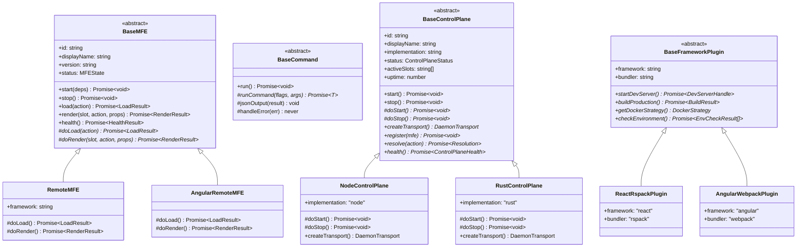
```mermaid
classDiagram
    class BaseMFE {
        <<abstract>>
        +id: string
        +displayName: string
        +version: string
        +status: MFEState
        +start(deps) Promise~void~
        +stop() Promise~void~
        +load(action) Promise~LoadResult~
        +render(slot, action, props) Promise~RenderResult~
        +health() Promise~HealthResult~
        #doLoad(action) Promise~LoadResult~*
        #doRender(slot, action, props) Promise~RenderResult~*
    }

    class RemoteMFE {
        +framework: string
        #doLoad() Promise~LoadResult~
        #doRender() Promise~RenderResult~
    }

    class AngularRemoteMFE {
        #doLoad() Promise~LoadResult~
        #doRender() Promise~RenderResult~
    }

    class BaseCommand {
        <<abstract>>
        +run() Promise~void~
        #runCommand(flags, args) Promise~T~*
        #jsonOutput(result) void
        #handleError(err) never
    }

    class BaseControlPlane {
        <<abstract>>
        +id: string
        +displayName: string
        +implementation: string
        +status: ControlPlaneStatus
        +start() Promise~void~
        +stop() Promise~void~
        +activeSlots: string[]
        +uptime: number
        #doStart() Promise~void~*
        #doStop() Promise~void~*
        +createTransport() DaemonTransport*
        +register(mfe) Promise~void~*
        +resolve(action) Promise~Resolution~*
        +health() Promise~ControlPlaneHealth~*
    }

    class NodeControlPlane {
        +implementation: "node"
        #doStart() Promise~void~
        #doStop() Promise~void~
        +createTransport() DaemonTransport
    }

    class RustControlPlane {
        +implementation: "rust"
        #doStart() Promise~void~
        #doStop() Promise~void~
        +createTransport() DaemonTransport
    }

    class BaseFrameworkPlugin {
        <<abstract>>
        +framework: string
        +bundler: string
        +startDevServer() Promise~DevServerHandle~*
        +buildProduction() Promise~BuildResult~*
        +getDockerStrategy() DockerStrategy*
        +checkEnvironment() Promise~EnvCheckResult[]~*
    }

    class ReactRspackPlugin {
        +framework: "react"
        +bundler: "rspack"
    }

    class AngularWebpackPlugin {
        +framework: "angular"
        +bundler: "webpack"
    }

    BaseMFE <|-- RemoteMFE
    BaseMFE <|-- AngularRemoteMFE
    BaseControlPlane <|-- NodeControlPlane
    BaseControlPlane <|-- RustControlPlane
    BaseFrameworkPlugin <|-- ReactRspackPlugin
    BaseFrameworkPlugin <|-- AngularWebpackPlugin
```

### 4.2 Pattern summary

| Abstract base | Owns | Concrete owns |
|---|---|---|
| `BaseMFE` | Lifecycle FSM, slot rendering, health reporting | How to load the remote module, how to render it |
| `BaseCommand` | `--json` envelope, exit codes, error classification | What the command does (`runCommand()`) |
| `BaseFrameworkPlugin` | Build/codegen/docker contract | rspack config, Angular builders, Vite config |
| `BaseControlPlane` | Daemon + LayoutManager wiring, status transitions | How to connect to the daemon (spawn vs WebSocket vs in-process) |

---

## 5. The DSL and Codegen Pipeline

### 5.1 The manifest

An MFE team writes one YAML file. The CLI reads it, validates it (Zod), and generates everything.


```mermaid
flowchart LR
    M["mfe-manifest.yaml\nname · type · framework\ncapabilities · endpoints\ndata · performance"]

    subgraph CLI["seans-mfe-tool remote:generate"]
        V["Validate\n(Zod schema)"]
        R["Resolve variant\nframework + bundler"]
        T["Select EJS templates\nsrc/codegen/templates/react-rspack/"]
        G["Render + write\nskip if unchanged"]
    end

    subgraph OUTPUT["Generated output"]
        BCONFIG["Bundler config\nrspack.config.ts / webpack.config.js"]
        BMFE_CODE["BaseMFE subclass\nload() · render() · health()"]
        BFF["GraphQL BFF\nresolvers + schema"]
        DOCKER["Dockerfile\nmulti-stage · framework-specific"]
        TYPES_OUT["TypeScript types\nfrom capability inputs/outputs"]
    end

    M --> CLI
    V --> R --> T --> G
    G --> OUTPUT
```

### 5.2 DSL type system

Capability inputs and outputs are typed in a DSL that maps cleanly to GraphQL and TypeScript:

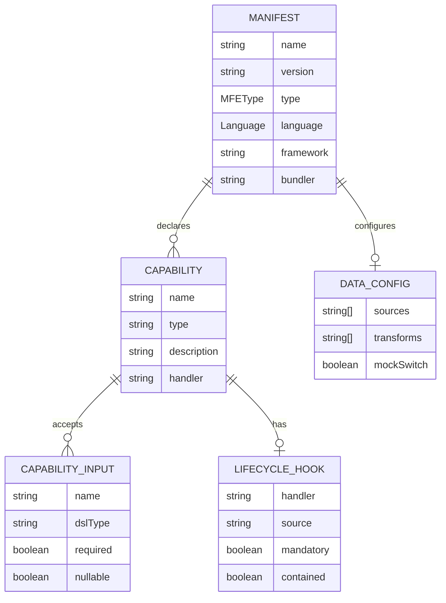
```mermaid
erDiagram
    MANIFEST {
        string name
        string version
        MFEType type
        Language language
        string framework
        string bundler
    }

    CAPABILITY {
        string name
        string type
        string description
        string handler
    }

    CAPABILITY_INPUT {
        string name
        string dslType
        boolean required
        boolean nullable
    }

    LIFECYCLE_HOOK {
        string handler
        string source
        boolean mandatory
        boolean contained
    }

    DATA_CONFIG {
        string[] sources
        string[] transforms
        boolean mockSwitch
    }

    MANIFEST ||--o{ CAPABILITY : "declares"
    CAPABILITY ||--o{ CAPABILITY_INPUT : "accepts"
    CAPABILITY ||--o| LIFECYCLE_HOOK : "has"
    MANIFEST ||--o| DATA_CONFIG : "configures"
```

### 5.3 DSL primitive types

| DSL type | TypeScript | GraphQL | Notes |
|---|---|---|---|
| `string` | `string \| null` | `String` | Nullable by default |
| `string!` | `string` | `String!` | Required |
| `id` | `string \| null` | `ID` | Opaque identifier |
| `id!` | `string` | `ID!` | Required opaque identifier |
| `jwt` | `string \| null` | `String` | Validated as JWT at ingress |
| `array<T!>!` | `T[]` | `[T!]!` | Required non-null array of non-null T |
| `element` | `HTMLElement \| null` | — | DOM-only; not exposed via GraphQL |

---

## 6. The MFE Runtime Lifecycle

### 6.1 State machine

Every MFE, regardless of framework, goes through the same state machine managed by `BaseMFE`:

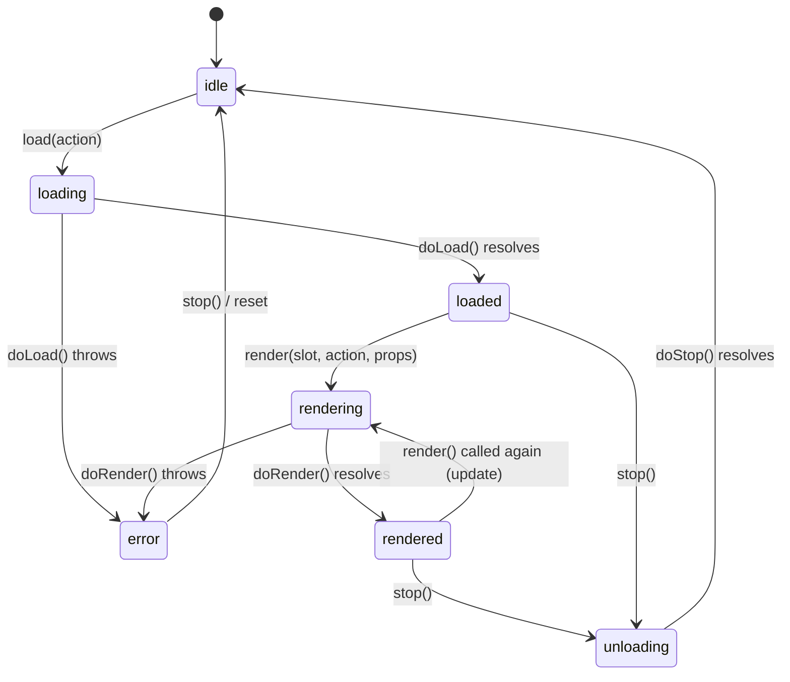
```mermaid
stateDiagram-v2
    [*] --> idle

    idle --> loading : load(action)
    loading --> loaded : doLoad() resolves
    loading --> error : doLoad() throws

    loaded --> rendering : render(slot, action, props)
    rendering --> rendered : doRender() resolves
    rendering --> error : doRender() throws

    rendered --> rendering : render() called again (update)
    rendered --> unloading : stop()
    loaded --> unloading : stop()

    unloading --> idle : doStop() resolves
    error --> idle : stop() / reset
```

### 6.2 Lifecycle method contract

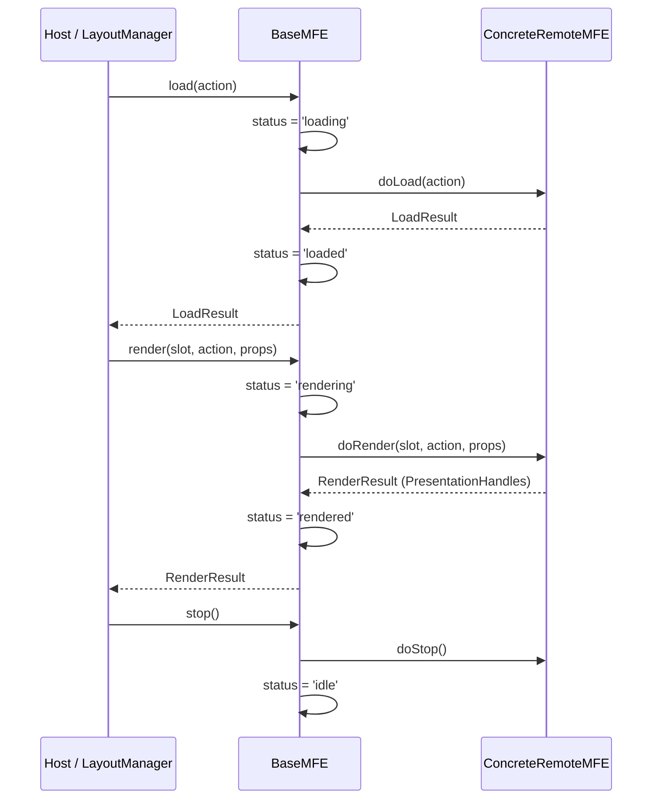
```mermaid
sequenceDiagram
    participant Host as Host / LayoutManager
    participant BM as BaseMFE
    participant Concrete as ConcreteRemoteMFE

    Host->>BM: load(action)
    BM->>BM: status = 'loading'
    BM->>Concrete: doLoad(action)
    Concrete-->>BM: LoadResult
    BM->>BM: status = 'loaded'
    BM-->>Host: LoadResult

    Host->>BM: render(slot, action, props)
    BM->>BM: status = 'rendering'
    BM->>Concrete: doRender(slot, action, props)
    Concrete-->>BM: RenderResult (PresentationHandles)
    BM->>BM: status = 'rendered'
    BM-->>Host: RenderResult

    Host->>BM: stop()
    BM->>Concrete: doStop()
    BM->>BM: status = 'idle'
```

### 6.3 Result types

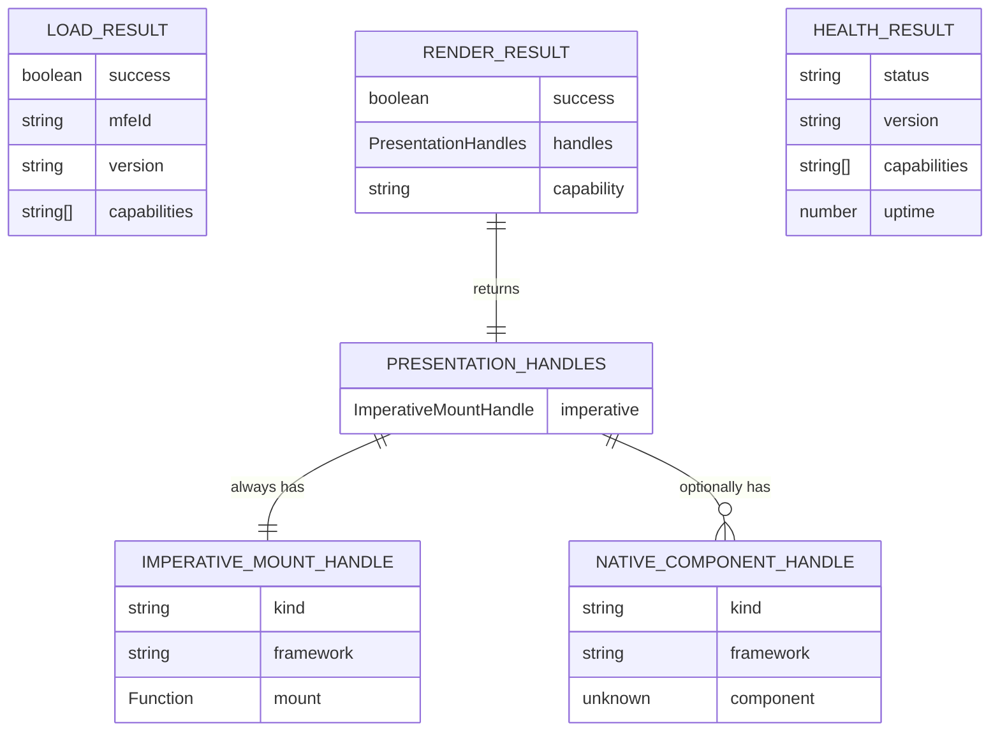
```mermaid
erDiagram
    LOAD_RESULT {
        boolean success
        string mfeId
        string version
        string[] capabilities
    }

    RENDER_RESULT {
        boolean success
        PresentationHandles handles
        string capability
    }

    PRESENTATION_HANDLES {
        ImperativeMountHandle imperative
    }

    IMPERATIVE_MOUNT_HANDLE {
        string kind
        string framework
        Function mount
    }

    NATIVE_COMPONENT_HANDLE {
        string kind
        string framework
        unknown component
    }

    HEALTH_RESULT {
        string status
        string version
        string[] capabilities
        number uptime
    }

    RENDER_RESULT ||--|| PRESENTATION_HANDLES : "returns"
    PRESENTATION_HANDLES ||--|| IMPERATIVE_MOUNT_HANDLE : "always has"
    PRESENTATION_HANDLES ||--o{ NATIVE_COMPONENT_HANDLE : "optionally has"
```

---

## 7. The Control Plane

### 7.1 What the control plane is

The control plane bundles four concerns into a single unit:

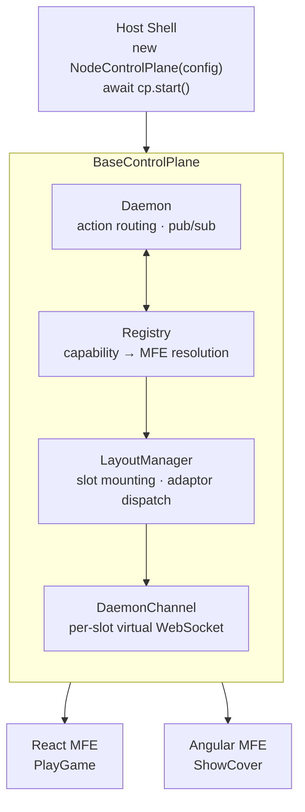
```mermaid
flowchart TB
    subgraph BCP["BaseControlPlane"]
        direction TB
        D["Daemon\naction routing · pub/sub"]
        R["Registry\ncapability → MFE resolution"]
        LM["LayoutManager\nslot mounting · adaptor dispatch"]
        DC["DaemonChannel\nper-slot virtual WebSocket"]

        D <--> R
        R --> LM
        LM --> DC
    end

    HOST["Host Shell\nnew NodeControlPlane(config)\nawait cp.start()"] --> BCP
    BCP --> MFE1["React MFE\nPlayGame"]
    BCP --> MFE2["Angular MFE\nShowCover"]
```

### 7.2 Startup sequence

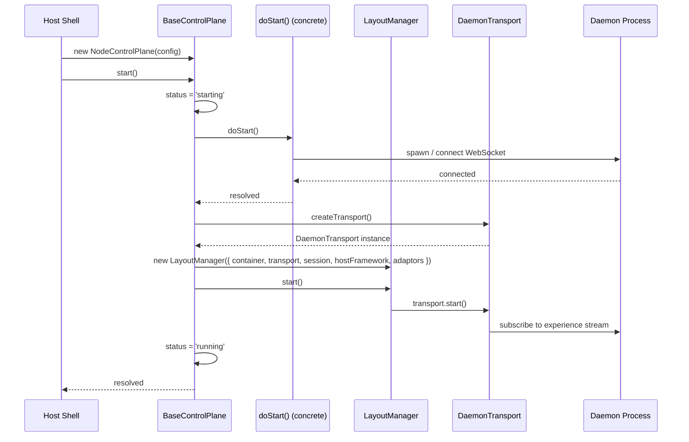
```mermaid
sequenceDiagram
    participant Host as Host Shell
    participant BCP as BaseControlPlane
    participant DS as doStart() (concrete)
    participant LM as LayoutManager
    participant T as DaemonTransport
    participant D as Daemon Process

    Host->>BCP: new NodeControlPlane(config)
    Host->>BCP: start()
    BCP->>BCP: status = 'starting'
    BCP->>DS: doStart()
    DS->>D: spawn / connect WebSocket
    D-->>DS: connected
    DS-->>BCP: resolved
    BCP->>T: createTransport()
    T-->>BCP: DaemonTransport instance
    BCP->>LM: new LayoutManager({ container, transport, session, hostFramework, adaptors })
    BCP->>LM: start()
    LM->>T: transport.start()
    T->>D: subscribe to experience stream
    BCP->>BCP: status = 'running'
    BCP-->>Host: resolved
```

### 7.3 Action → experience flow

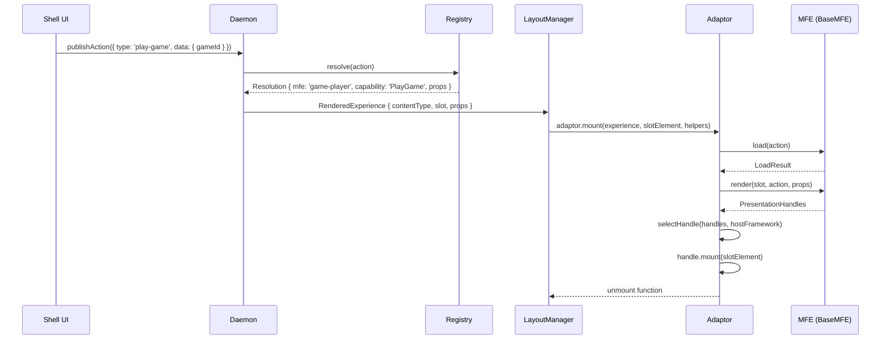
```mermaid
sequenceDiagram
    participant Shell as Shell UI
    participant D as Daemon
    participant R as Registry
    participant LM as LayoutManager
    participant A as Adaptor
    participant MFE as MFE (BaseMFE)

    Shell->>D: publishAction({ type: 'play-game', data: { gameId } })
    D->>R: resolve(action)
    R-->>D: Resolution { mfe: 'game-player', capability: 'PlayGame', props }
    D->>LM: RenderedExperience { contentType, slot, props }
    LM->>A: adaptor.mount(experience, slotElement, helpers)
    A->>MFE: load(action)
    MFE-->>A: LoadResult
    A->>MFE: render(slot, action, props)
    MFE-->>A: PresentationHandles
    A->>A: selectHandle(handles, hostFramework)
    A->>A: handle.mount(slotElement)
    A-->>LM: unmount function
```

### 7.4 Control plane type relationships

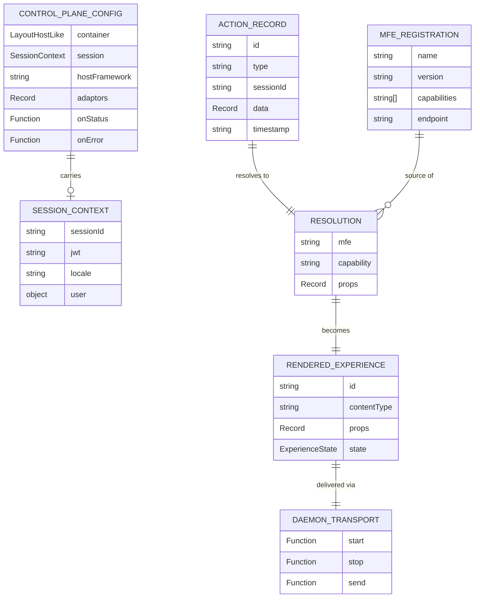
```mermaid
erDiagram
    CONTROL_PLANE_CONFIG {
        LayoutHostLike container
        SessionContext session
        string hostFramework
        Record adaptors
        Function onStatus
        Function onError
    }

    SESSION_CONTEXT {
        string sessionId
        string jwt
        string locale
        object user
    }

    ACTION_RECORD {
        string id
        string type
        string sessionId
        Record data
        string timestamp
    }

    RESOLUTION {
        string mfe
        string capability
        Record props
    }

    MFE_REGISTRATION {
        string name
        string version
        string[] capabilities
        string endpoint
    }

    RENDERED_EXPERIENCE {
        string id
        string contentType
        Record props
        ExperienceState state
    }

    DAEMON_TRANSPORT {
        Function start
        Function stop
        Function send
    }

    CONTROL_PLANE_CONFIG ||--o| SESSION_CONTEXT : "carries"
    ACTION_RECORD ||--|| RESOLUTION : "resolves to"
    MFE_REGISTRATION ||--o{ RESOLUTION : "source of"
    RESOLUTION ||--|| RENDERED_EXPERIENCE : "becomes"
    RENDERED_EXPERIENCE ||--|| DAEMON_TRANSPORT : "delivered via"
```

### 7.5 Status lifecycle

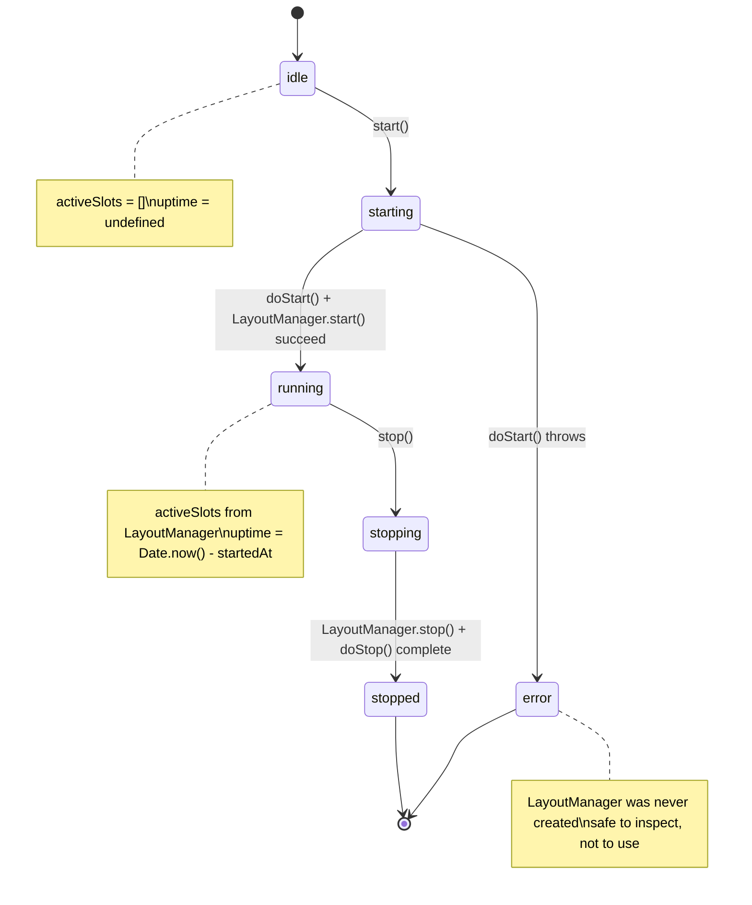
```mermaid
stateDiagram-v2
    [*] --> idle

    idle --> starting : start()
    starting --> running : doStart() + LayoutManager.start() succeed
    starting --> error : doStart() throws

    running --> stopping : stop()
    stopping --> stopped : LayoutManager.stop() + doStop() complete

    stopped --> [*]
    error --> [*]

    note right of idle : activeSlots = []\nuptime = undefined
    note right of running : activeSlots from LayoutManager\nuptime = Date.now() - startedAt
    note right of error : LayoutManager was never created\nsafe to inspect, not to use
```

---

## 8. Polyglot Composition Model

### 8.1 The two-tier presentation handle

Every MFE exposes exactly one `ImperativeMountHandle` — the guaranteed polyglot floor. Optionally it also exposes one or more `NativeComponentHandle` instances for framework-native in-tree composition.

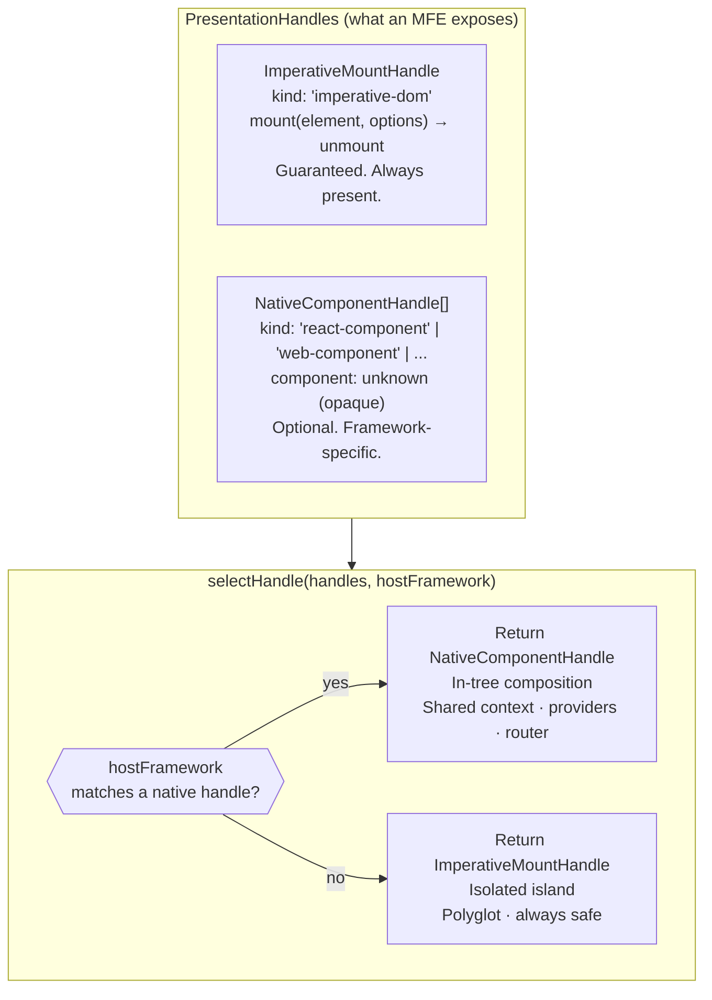
```mermaid
flowchart TB
    subgraph HANDLES["PresentationHandles (what an MFE exposes)"]
        IMP["ImperativeMountHandle\nkind: 'imperative-dom'\nmount(element, options) → unmount\nGuaranteed. Always present."]
        NATIVE["NativeComponentHandle[]\nkind: 'react-component' | 'web-component' | ...\ncomponent: unknown (opaque)\nOptional. Framework-specific."]
    end

    subgraph NEGOTIATION["selectHandle(handles, hostFramework)"]
        Q{{"hostFramework\nmatches a native handle?"}}
        YES["Return NativeComponentHandle\nIn-tree composition\nShared context · providers · router"]
        NO["Return ImperativeMountHandle\nIsolated island\nPolyglot · always safe"]
        Q -- yes --> YES
        Q -- no --> NO
    end

    HANDLES --> NEGOTIATION
```

### 8.2 Composition scenarios

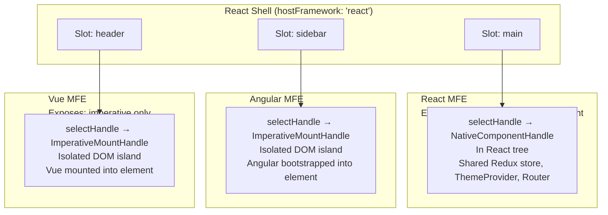
```mermaid
flowchart TB
    subgraph HOST_REACT["React Shell (hostFramework: 'react')"]
        SLOT1["Slot: main"]
        SLOT2["Slot: sidebar"]
        SLOT3["Slot: header"]
    end

    subgraph MFE_REACT["React MFE\nExposes: imperative + react-component"]
        PH_R["selectHandle → NativeComponentHandle\nIn React tree\nShared Redux store, ThemeProvider, Router"]
    end

    subgraph MFE_ANG["Angular MFE\nExposes: imperative only"]
        PH_A["selectHandle → ImperativeMountHandle\nIsolated DOM island\nAngular bootstrapped into element"]
    end

    subgraph MFE_VUE["Vue MFE\nExposes: imperative only"]
        PH_V["selectHandle → ImperativeMountHandle\nIsolated DOM island\nVue mounted into element"]
    end

    SLOT1 --> PH_R
    SLOT2 --> PH_A
    SLOT3 --> PH_V
```

### 8.3 Handle negotiation ERD

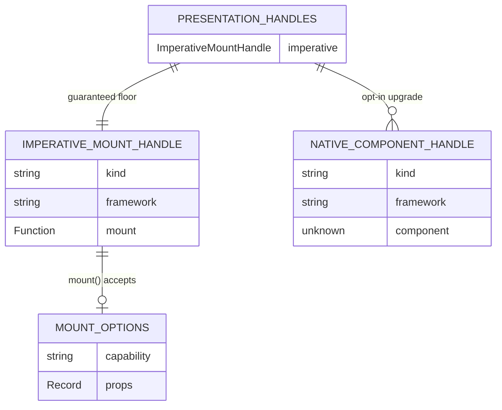
```mermaid
erDiagram
    PRESENTATION_HANDLES {
        ImperativeMountHandle imperative
    }

    IMPERATIVE_MOUNT_HANDLE {
        string kind
        string framework
        Function mount
    }

    NATIVE_COMPONENT_HANDLE {
        string kind
        string framework
        unknown component
    }

    MOUNT_OPTIONS {
        string capability
        Record props
    }

    PRESENTATION_HANDLES ||--|| IMPERATIVE_MOUNT_HANDLE : "guaranteed floor"
    PRESENTATION_HANDLES ||--o{ NATIVE_COMPONENT_HANDLE : "opt-in upgrade"
    IMPERATIVE_MOUNT_HANDLE ||--o| MOUNT_OPTIONS : "mount() accepts"
```

---

## 9. The Type System as a Platform Pillar

Types are not documentation attached to the platform — types **are** the platform. Every boundary, every wire protocol, every CLI output is captured as a versioned, validated, shared type.

### 9.1 The contracts package

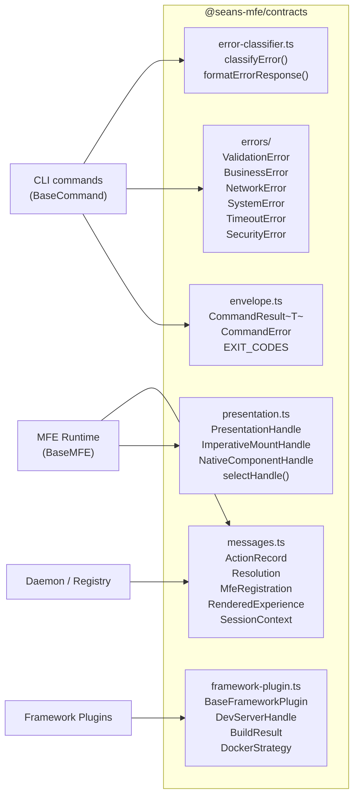
```mermaid
flowchart LR
    subgraph CONTRACTS["@seans-mfe/contracts"]
        ENV["envelope.ts\nCommandResult~T~\nCommandError\nEXIT_CODES"]
        ERR["errors/\nValidationError\nBusinessError\nNetworkError\nSystemError\nTimeoutError\nSecurityError"]
        MSG["messages.ts\nActionRecord\nResolution\nMfeRegistration\nRenderedExperience\nSessionContext"]
        PRES["presentation.ts\nPresentationHandle\nImperativeMountHandle\nNativeComponentHandle\nselectHandle()"]
        FP["framework-plugin.ts\nBaseFrameworkPlugin\nDevServerHandle\nBuildResult\nDockerStrategy"]
        EC["error-classifier.ts\nclassifyError()\nformatErrorResponse()"]
    end

    CLI["CLI commands\n(BaseCommand)"] --> ENV
    CLI --> ERR
    CLI --> EC
    DAEMON["Daemon / Registry"] --> MSG
    RUNTIME["MFE Runtime\n(BaseMFE)"] --> PRES
    RUNTIME --> MSG
    BUILD["Framework Plugins"] --> FP
```

### 9.2 CLI envelope contract

Every command run with `--json` emits exactly one newline-terminated JSON line on stdout:

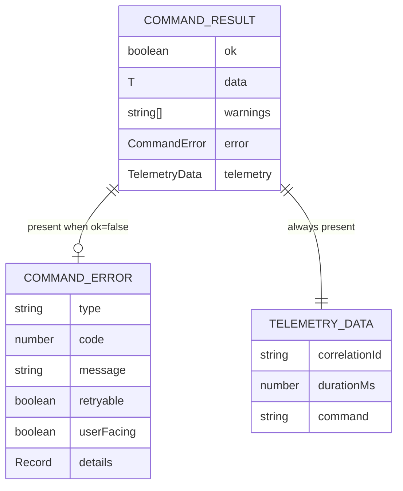
```mermaid
erDiagram
    COMMAND_RESULT {
        boolean ok
        T data
        string[] warnings
        CommandError error
        TelemetryData telemetry
    }

    COMMAND_ERROR {
        string type
        number code
        string message
        boolean retryable
        boolean userFacing
        Record details
    }

    TELEMETRY_DATA {
        string correlationId
        number durationMs
        string command
    }

    COMMAND_RESULT ||--o| COMMAND_ERROR : "present when ok=false"
    COMMAND_RESULT ||--|| TELEMETRY_DATA : "always present"
```

### 9.3 Error hierarchy and exit codes

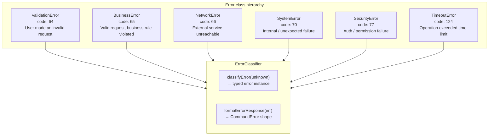
```mermaid
flowchart TB
    subgraph ERRORS["Error class hierarchy"]
        VE["ValidationError\ncode: 64\nUser made an invalid request"]
        BE["BusinessError\ncode: 65\nValid request, business rule violated"]
        NE["NetworkError\ncode: 66\nExternal service unreachable"]
        SE["SystemError\ncode: 70\nInternal / unexpected failure"]
        SYS["SecurityError\ncode: 77\nAuth / permission failure"]
        TE["TimeoutError\ncode: 124\nOperation exceeded time limit"]
    end

    subgraph CLASSIFIER["ErrorClassifier"]
        C["classifyError(unknown)\n→ typed error instance"]
        F["formatErrorResponse(err)\n→ CommandError shape"]
    end

    VE & BE & NE & SE & SYS & TE --> CLASSIFIER
```

---

## 10. The Framework Plugin System

### 10.1 Why plugins, not hardcoded variants

Adding Angular support to a hardcoded system means changing the CLI core. Adding Angular support to the plugin system means publishing `@seans-mfe/framework-angular`. The CLI core never changes.

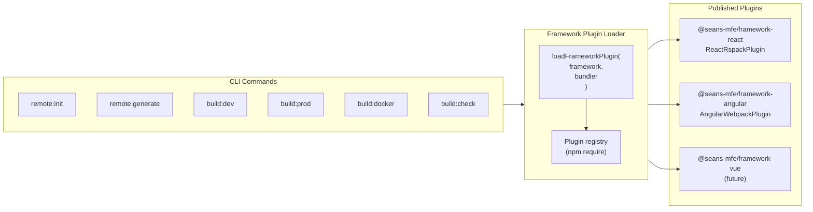
```mermaid
flowchart LR
    subgraph LOADER["Framework Plugin Loader"]
        L["loadFrameworkPlugin(\n  framework,\n  bundler\n)"]
        REG["Plugin registry\n(npm require)"]
        L --> REG
    end

    subgraph COMMANDS["CLI Commands"]
        INIT["remote:init"]
        GEN["remote:generate"]
        DEV["build:dev"]
        PROD["build:prod"]
        DOCKER["build:docker"]
        CHECK["build:check"]
    end

    subgraph PLUGINS["Published Plugins"]
        REACT["@seans-mfe/framework-react\nReactRspackPlugin"]
        ANG["@seans-mfe/framework-angular\nAngularWebpackPlugin"]
        FUTURE["@seans-mfe/framework-vue\n(future)"]
    end

    COMMANDS --> LOADER
    LOADER --> REACT
    LOADER --> ANG
    LOADER --> FUTURE
```

### 10.2 BaseFrameworkPlugin interface

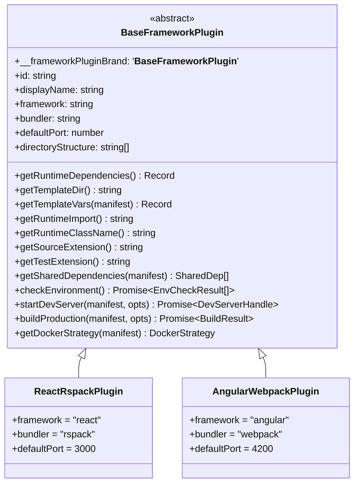
```mermaid
classDiagram
    class BaseFrameworkPlugin {
        <<abstract>>
        +__frameworkPluginBrand: '__BaseFrameworkPlugin__'
        +id: string
        +displayName: string
        +framework: string
        +bundler: string
        +defaultPort: number
        +directoryStructure: string[]
        +getRuntimeDependencies() Record
        +getTemplateDir() string
        +getTemplateVars(manifest) Record
        +getRuntimeImport() string
        +getRuntimeClassName() string
        +getSourceExtension() string
        +getTestExtension() string
        +getSharedDependencies(manifest) SharedDep[]
        +checkEnvironment() Promise~EnvCheckResult[]~
        +startDevServer(manifest, opts) Promise~DevServerHandle~
        +buildProduction(manifest, opts) Promise~BuildResult~
        +getDockerStrategy(manifest) DockerStrategy
    }

    class ReactRspackPlugin {
        +framework = "react"
        +bundler = "rspack"
        +defaultPort = 3000
    }

    class AngularWebpackPlugin {
        +framework = "angular"
        +bundler = "webpack"
        +defaultPort = 4200
    }

    BaseFrameworkPlugin <|-- ReactRspackPlugin
    BaseFrameworkPlugin <|-- AngularWebpackPlugin
```

---

## 11. Deployment Architecture

### 11.1 Docker strategy

```mermaid
flowchart TB
    subgraph CLI_IMAGE["seans-mfe-tool-cli Docker image"]
        DIST["dist/ (compiled CLI)"]
        TMPL["src/codegen/templates/"]
        RUNTIME["dist/runtime/ (BaseMFE, LayoutManager, etc.)"]
    end

    subgraph MFE_SCAFFOLD["MFE project (after remote:generate)"]
        MANIFEST["mfe-manifest.yaml"]
        GEN_CODE["Generated source\n(BaseMFE subclass, BFF, bundler config)"]
        DOCKERFILE["Dockerfile (generated)\nmulti-stage per DockerStrategy"]
    end

    subgraph MFE_IMAGE["MFE Docker image (built by Dockerfile)"]
        BUILD_STAGE["Build stage\n(node:20-alpine)\nnpm ci + bundler build"]
        RUNTIME_STAGE["Runtime stage\n(nginx:alpine)\nstatic artifacts only"]
    end

    CLI_IMAGE -->|"remote:generate\nstages templates + runtime"| MFE_SCAFFOLD
    MFE_SCAFFOLD -->|"docker build"| MFE_IMAGE
```

### 11.2 Build pipeline (Turbo)

```mermaid
flowchart LR
    subgraph TURBO["turbo run docker:build:examples"]
        CLI_BUILD["npm run build\n(tsc → dist/)"]
        CLI_DOCKER["npm run docker:build:cli\n(bakes dist/ into CLI image)"]
        GEN["remote:generate\n(per MFE, via CLI image)"]
        MFE_DOCKER["docker build\n(per MFE image)"]
    end

    CLI_BUILD --> CLI_DOCKER --> GEN --> MFE_DOCKER

    note["Turbo caches each step by inputs.\nSkips unchanged stages automatically."]
```

---

## 12. Extension Points and the Marketplace Vision

### 12.1 Where the platform is open

```mermaid
flowchart TB
    subgraph OPEN["Open extension points"]
        FW["Framework plugins\n@seans-mfe/framework-*\nExtend BaseFrameworkPlugin"]
        CP_IMPL["Control plane implementations\nNodeControlPlane · RustControlPlane\nExtend BaseControlPlane"]
        ADAPT["Custom adaptors\nControlPlaneConfig.adaptors\nMerged over built-in defaults"]
        CAP["Domain capability packages\n@acme/capabilities-commerce\nPublish MFEs as npm packages"]
    end

    subgraph CLOSED["Closed / stable core"]
        CONTRACTS["@seans-mfe/contracts\nShared type vocabulary"]
        LIFECYCLE["BaseMFE lifecycle FSM\nFixed state transitions"]
        ENVELOPE["CLI --json envelope\nCommandResult shape"]
        NEG["selectHandle() negotiation\nPure · deterministic"]
    end

    OPEN -.->|"depends on"| CLOSED
```

### 12.2 The three-act marketplace roadmap

```mermaid
flowchart LR
    A1["Act 1 — Now\nTeams generate + deploy\ndomain-capability MFEs\nin their own repos"]
    A2["Act 2 — Near\nTeams publish\n@acme/capabilities-commerce\nShell operators install + compose"]
    A3["Act 3 — Long\nCommunity registry\nInstall PlayGame, Checkout\nlike a component library"]

    A1 --> A2 --> A3
```

### 12.3 Publishing a capability package

The long-term model is that a domain team publishes their MFE as an npm package that includes the built artifacts, the `mfe-manifest.yaml`, and the `MfeRegistration` descriptor. A shell operator installs the package and registers it with the control plane:

```typescript
import { GamePlayerMFE } from '@acme/capabilities-gaming';

await controlPlane.register(GamePlayerMFE.registration);
// daemon now knows how to resolve PlayGame, ShowCover actions
```

---

## 13. Architecture Decision Summary

All architectural decisions are recorded in `docs/architecture-decisions/`. Key decisions that define the platform:

| ADR | Decision | Impact |
|---|---|---|
| ADR-006 | DSL is the single source of truth for types | All types flow from manifest → generated code |
| ADR-018 | `--json` emits exactly one `CommandResult<T>` line | Machine-readable CLI output is a first-class contract |
| ADR-028 | `BaseMFE` lifecycle FSM with valid transitions | Every MFE shares the same state model |
| ADR-030 | Error classification with typed error classes + exit codes | Errors are structured, not stringly typed |
| ADR-034 | Framework-agnostic codegen — framework/bundler are manifest fields | Adding a framework = adding a template variant |
| ADR-036 | Open-string `framework`/`bundler` fields (not enums) | Unknown frameworks warn but don't fail |
| ADR-054 | Control-plane message protocol in `@seans-mfe/contracts` | Daemon and shell share a typed wire contract |
| ADR-055 | LayoutManager — daemon-driven slot composition | Shell stays empty; daemon drives what renders |
| ADR-056 | Presentation handle thin waist (imperative floor + native upgrade) | Polyglot composition without framework coupling |
| ADR-057 | DaemonChannel — per-slot virtual WebSocket over one connection | MFEs get isolated control-plane channels without multiplying connections |
| ADR-058 | Slot-provider MFEs — MFEs that provide slots for other MFEs | Recursive composition; MFEs can act as shells |
| ADR-059 | `BaseControlPlane` — abstract base bundling daemon + registry + LayoutManager | Host API reduced to three lines; all four base classes now present |

---

## Appendix: Where Things Live

| Concept | Path |
|---|---|
| `BaseMFE` | `src/runtime/base-mfe.ts` |
| `BaseControlPlane` | `src/runtime/base-control-plane.ts` |
| `LayoutManager` | `src/runtime/layout-manager.ts` |
| `DaemonChannel` | `src/runtime/daemon-channel.ts` |
| `BaseCommand` | `packages/oclif-base/src/BaseCommand.ts` |
| `BaseFrameworkPlugin` | `packages/contracts/src/framework-plugin.ts` |
| Contracts (all shared types) | `packages/contracts/src/` |
| Error classes | `packages/contracts/src/errors/` |
| DSL schema (Zod) | `src/dsl/schema.ts` |
| DSL type parser | `src/dsl/type-system.ts` |
| Codegen templates | `src/codegen/templates/` |
| React plugin | `packages/framework-react/src/plugin.ts` |
| Angular plugin | `packages/framework-angular/src/plugin.ts` |
| ADRs | `docs/architecture-decisions/` |
| Schema sub-docs | `docs/schemas/` |
| This document | `docs/architecture-whitepaper.md` |
