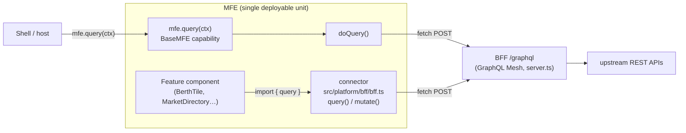

# The Query Capability

How an MFE reads data from its BFF — the platform capability, the generated
connector, and how the endpoint resolves when the MFE is composed into a shell
on another origin.

**Governing decisions:** ADR-053 (RemoteMFE `doQuery`), ADR-012 (GraphQL Mesh BFF
layer), ADR-046 (environment configuration), ADR-052 (BFF demo-mode mock switch).
The cross-origin endpoint fix is #278.

---

## TL;DR

- Every MFE with a `data:` section gets a **per-MFE GraphQL BFF** (Mesh) served
  from the same origin as its `remoteEntry.js` (`server.ts` hosts both).
- Two ways to read from it:
  1. **`mfe.query(context)`** — the BaseMFE *platform capability* (ADR-053). Goes
     through the lifecycle state machine and `doQuery()`. Used when a **host/shell**
     drives a query on a remote it has mounted.
  2. **`import { query } from './platform/bff/bff'`** — the generated **connector**,
     called directly from **feature/component code** inside the MFE.
- Both `POST` a GraphQL document to the BFF's `/graphql`. The connector bakes the
  **absolute** endpoint from the manifest (`endpoint` + `data.serve.endpoint`) so it
  keeps working after the MFE is composed cross-origin (#278).
- **Framework support of `mfe.query()`:** React remotes ✅ (inherit the default
  `doQuery`), Angular remotes ❌ (their `doQuery` throws — Angular components use the
  connector directly). See the [support matrix](#framework-support-matrix).

---

## Two layers, one BFF



Both paths end at the same `POST <endpoint>/graphql`. The capability path adds the
lifecycle gate and `Context` plumbing (JWT, headers, request id); the connector path
is a plain typed `fetch` helper for use inside the MFE's own UI code.

---

## 1. The platform capability — `mfe.query()`

Declared on `BaseMFE` (`packages/runtime/src/base-mfe.ts`):

```ts
public async query(context: Context): Promise<QueryResult> {
  return this.executeCapability('query', (ctx) => this.doQuery(ctx), context);
}
```

`executeCapability` runs the ADR-042 lifecycle gate (the MFE must be past `load`),
records telemetry, and dispatches to `doQuery()`.

### Inputs and result

`context.inputs` is a `QueryInput` (`packages/runtime/src/context.ts`):

| field | type | meaning |
|---|---|---|
| `document` | `string` | GraphQL query document (**required**) |
| `variables` | `Record<string, unknown>?` | GraphQL variables |
| `bffUrl` | `string?` | Absolute BFF URL override — wins over every manifest/env default |

```ts
export interface QueryResult {
  data: unknown;
  errors?: Array<{ message: string; path?: string[] }>;
}
```

### Default `doQuery()` and URL resolution

The default implementation `fetch`es the BFF and resolves its URL in this priority
order (`base-mfe.ts`):

1. `context.inputs.bffUrl` — caller override (e.g. a shell passing the remote's
   absolute URL)
2. `deps.bffUrl` — constructor injection
3. `BFF_URL` env var — runtime configuration
4. `manifest.endpoint` + `manifest.data.serve.endpoint` — the self-describing manifest
5. `manifest.data.serve.endpoint` alone (relative)
6. `'/graphql'` fallback

It attaches `Authorization: Bearer <jwt>` when `context.jwt` is set, spreads
`context.headers`, and returns `{ data, errors }` (never throws on a non-2xx — it
returns an `errors` array).

> **Angular remotes don't support `mfe.query()`.** `AngularRemoteMFE.doQuery` throws
> `Query not supported for remote MFE type`. Angular MFEs read data through the
> connector (below) from inside their components instead.

### Overriding for typed queries

Concrete MFEs may override `doQuery` for operation-specific, typed queries:

```ts
protected async doQuery(context: Context): Promise<QueryResult> {
  const { document, variables } = context.inputs as QueryInput;
  const data = await bffQuery(document, variables, {
    ...(context.jwt ? { Authorization: `Bearer ${context.jwt}` } : {}),
  });
  return { data };
}
```

---

## 2. The generated connector — `src/platform/bff/bff.ts`

Generated for every MFE with a `data:` section (template:
`packages/bff-plugin/templates/bff.ts.ejs`). It's a plain typed GraphQL client:

```ts
import { query, mutate } from './bff';
const berths = await query<ListBerths>(LIST_BERTHS, { stationId });
```

`query<T>(document, variables?, headers?)` POSTs to `BFF_ENDPOINT` and throws on a
non-2xx or a GraphQL `errors[]` (unlike the capability path, which returns errors).
`mutate` is an alias.

### Endpoint is baked absolute (#278)

The connector's endpoint comes from `resolveBffEndpoint(manifest)`
(`packages/codegen/src/unified-generator.ts`):

```ts
const BFF_ENDPOINT =
  (process.env.BFF_URL || process.env.VITE_BFF_URL) ||
  'http://localhost:5002/graphql';   // ← new URL(data.serve.endpoint, manifest.endpoint)
```

An MFE with a BFF is a **single deployable unit**: `server.ts` serves both
`remoteEntry.js` and `/graphql` from the manifest's `endpoint` origin. Baking the
**absolute** URL is what keeps BFF calls working once the MFE is composed into a
shell on a different origin — a relative `/graphql` would resolve against the
*shell's* origin and 404. The relative path is used only as a fallback when the
manifest declares no `endpoint`.

Override at runtime with `BFF_URL` (Node) / `VITE_BFF_URL` (Vite) env vars.

---

## Framework support matrix

| Path | React remote | Angular remote |
|---|---|---|
| `mfe.query(ctx)` capability | ✅ inherits `BaseMFE.doQuery` (fetches the BFF) | ❌ `doQuery` throws "not supported" |
| `import { query } from './bff'` connector | ✅ | ✅ |

**Rule of thumb:** a **shell** driving a mounted remote uses `mfe.query()` (React
remotes only). **Feature/component code inside an MFE** — React or Angular — imports
the connector's `query()` directly.

---

## Mock switch interaction (ADR-052)

Requests carry an `x-bff-mode` header through `context.headers` (capability path) or
the `headers` argument (connector path). At the BFF, `mock-switch.js` reads it:
`x-bff-mode: mock` → fixtures, `x-bff-mode: live` → upstream, no header →
`DEMO_MODE === 'true'`. `mockSwitch.enabled: true` in the manifest only *wires* the
switch — it does not force mock mode. See ADR-052 for the full precedence.

---

## Who uses it today

| MFE | Framework | Path | Where |
|---|---|---|---|
| abc-kids shell → flappy | React | `mfe.query()` capability | `shell/src/components/GameLauncher.tsx` (pet-count badge via flappy's PetStore BFF) |
| meridian-docking-control | Angular | connector `query()` | `BerthTile`, `TrafficLog`, `DockingBoard` |
| meridian-life-support | Angular | connector `query()` | `AlertsFeed`, `ModuleStatus`, `TelemetryDashboard` |
| meridian-cargo-ops | Angular | connector `query()` | `CargoManifest`, `HazardSummary` |
| meridian-concourse | React | connector `query()` | `MarketDirectory` |
| meridian-crew-services | React | connector `query()` | `CrewRoster`, `PayStatus` |

`mfe.query()` is *available* on every generated MFE, but availability is not use —
the table above is the set that actually invokes a BFF query.

---

## Gotchas

- **Angular + `mfe.query()` throws.** Use the connector inside Angular components.
- **Relative `/graphql` only as a last resort.** If BFF calls 404 against the
  shell's origin, the manifest is missing `endpoint` (or a stale connector predates
  #278 — regenerate).
- **`DEMO_MODE` is never set by codegen.** BFFs default to *live*; mock mode needs
  `x-bff-mode: mock` per request or `DEMO_MODE=true` on the BFF process.
- **The capability path returns errors; the connector path throws.** Pick the error
  model you want.

---

## References

- ADR-053 — RemoteMFE `doQuery`
- ADR-012 — GraphQL Mesh BFF layer · `docs/architecture-bff.md`
- ADR-046 — environment configuration and secret validation
- ADR-052 — BFF demo-mode mock switch
- #278 — BFF client dials the manifest-derived absolute `/graphql`
