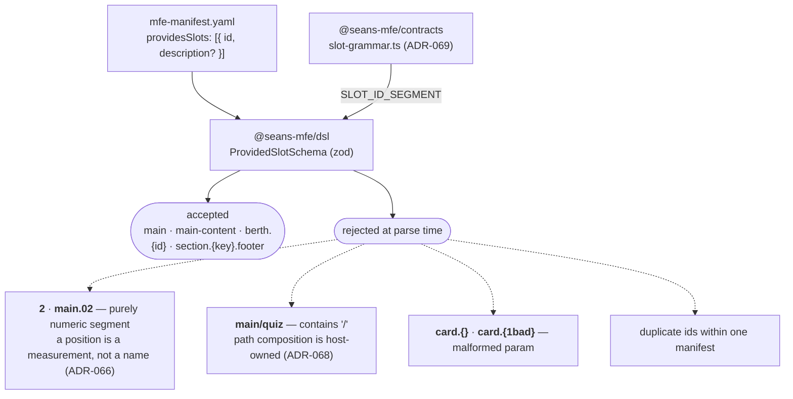
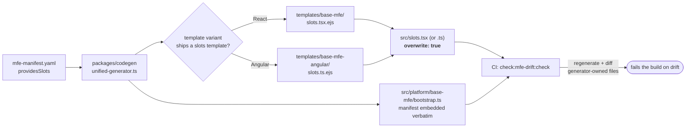
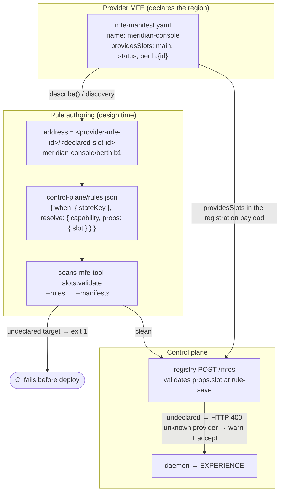
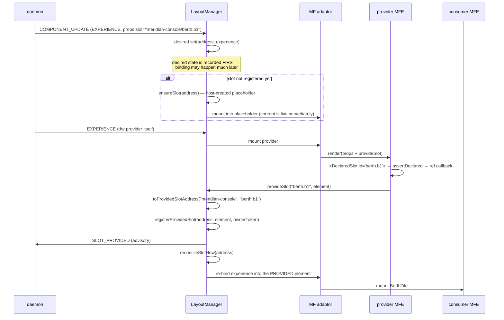
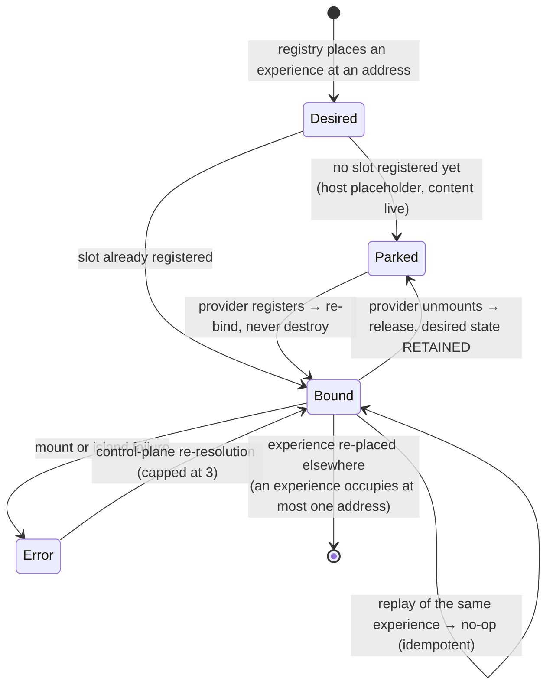

# Slot architecture — design time, build time, rule authoring, runtime

`docs/slot-contract.md` explains *what* the slot contract promises, in plain
language. This document shows *how the machinery fits together*, in five
diagrams, and documents the runtime behaviors that only exist in the code.

Governed by ADR-066 (stable addressing, desired-state placement), ADR-067
(manifest-declared contract), ADR-068 (provider-scoped addresses), ADR-069
(grammar single source), ADR-072 (the app-code API), ADR-073 (design-time
validation).

**The one-sentence model:** an MFE *declares* slot ids in its manifest, codegen
*generates* the registration component and a type for those ids, the registry
*places* experiences at `<provider-mfe-id>/<declared-slot-id>` addresses, and the
host *converges* on that desired state whenever the slots actually register.

---

## 1. Design time — what a slot id may be

A slot id is a name someone assigned, never a position something happened to
occupy. That single rule is what lets a backend target a slot before the client
has rendered anything.



Each dot-separated segment is either an **assigned-name literal**
(`[A-Za-z0-9_-]`, must contain at least one letter) or a **`{param}` placeholder**
naming the domain key of a repeated slot. One grammar module serves both the
design-time validator and the runtime matcher, so what can be declared and what
can match can never drift apart.

`{param}` validates *shape, not membership*: `berth.{id}` admits any single key
segment. Which berths exist is runtime data.

---

## 2. Build time — declaration becomes code



The generator never branches on framework name: it probes the variant's template
directory for a `slots.*.ejs`. A new framework adds slot support by shipping a
template (ADR-036), never by editing the generator.

`src/slots.tsx` emits three things:

| Export | Layer | Purpose |
| --- | --- | --- |
| `PROVIDED_SLOTS` | data | the manifest mirrored into code |
| `slotContract` | logic binding | `createSlotContract(PROVIDED_SLOTS)` — matching + the declare-before-register guard |
| `DeclaredSlotId` | **type** | a template-literal union — `'main' \| 'status' \| \`berth.${string}\`` |
| `DeclaredSlot` | sugar | the app-code registration component, `id` typed by `DeclaredSlotId` |

The file is regenerated with `overwrite: true` — it is contract, not scaffold.
Changing a slot id therefore *requires* a manifest edit, which is a reviewable,
semver-taggable diff rather than an incidental string change.

**`DeclaredSlotId` is what makes the manifest binding on app code.** Rename
`main` to `primary` in the manifest, regenerate, and every stale use site fails
`tsc`:

```
src/features/StationConsole/StationConsole.tsx(179,9):
  error TS2322: Type '"main"' is not assignable to type 'DeclaredSlotId'.
```

Before ADR-072 that rename compiled clean and broke only at runtime.

---

## 3. Rule authoring — how a registry rule fills a slot

This is the diagram to read if the question is *"how do we create a rule that
fills a slot?"* The address a rule targets is composed from two things the rule
author can know before anything runs: the **provider's stable MFE id** and one of
its **declared local slot ids**.



A concrete rule, from `examples/meridian-station/control-plane/rules.json`:

```json
{ "when":    { "stateKey": "meridian.berth.b1" },
  "resolve": { "capability": "BerthTile",
               "props": { "slot": "meridian-console/berth.b1", "berthId": "b1" } } }
```

Three properties worth stating plainly:

- **The rule author never sees the consumer's component tree.** They target a
  name the provider published. That is the whole point of assigned identity.
- **Keyed slots are enumerated one rule per key.** The registry does not expand
  `berth.{id}`; the pattern constrains what the *provider* may register, while
  each *placement* names one concrete address.
- **Host-owned addresses are unqualified.** `root` — and the LayoutManager's
  default `main` — belong to the shell, are declared in no MFE manifest, and are
  accepted without a contract to check against.

Where a bad target is now caught, in order: `slots:validate` in CI → the
registry's `POST /mfes` → `assertDeclared` in the browser. Before ADR-073 only
the last of those existed, and it only fired on the *provider* side.

---

## 4. Runtime — registration and binding



Two identities are in play and they are deliberately different:

- **`experience.mfe`** — the stable provider id. It composes the address, so a
  rule can name it a priori. An MFE cannot choose or spoof this prefix: local
  ids containing `/` are rejected at composition.
- **`experience.id`** — an ephemeral per-instance owner token. It guards release,
  so a stale provider teardown cannot delete a newer registration at the same
  address.

---

## 5. Runtime — desired-state convergence



The load-bearing property: **placement never fails for topology-timing reasons.**
The three orderings — experience first, slot first, re-provision after a remount
— all converge to the same DOM. Every mutation of one address rides a
per-address operation queue, so overlapping placements cannot interleave at
await points.

### Runtime behaviors that live only in the code

These are true of the implementation and are documented nowhere else:

| Behavior | Where | Why it matters |
| --- | --- | --- |
| `props.slot` defaults to the **unqualified** `'main'` | `layout-manager.ts:202` | This is a *host-owned* address, unrelated to any provider's declared `main`. A rule that omits `props.slot` lands in the shell's own region, not in a provider's. |
| `MAX_SLOT_ESCALATIONS = 3` | `layout-manager.ts` | Control-plane re-resolution after a slot error is capped, and the counter is re-armed on a healthy mount. A permanently broken experience stops asking. |
| Per-**remote-scope** mount mutex (`scopeMountQueues`) | `layout-adaptors.ts` | N keyed placements of one remote share a single MFE instance and would otherwise trip the ADR-042 lifecycle gate. Per-address queues cannot help — each keyed slot *is* its own address. |
| Self-provision inline release in `clearSlotNow` | `layout-manager.ts` | When an experience provides the address it occupies, release runs inline; enqueuing would run after the replacement bound and tear down the wrong island. |
| `assertDeclared` only ever sees the **local** id | `slot-contract.ts` | The qualified `mfe/id` address is composed afterwards. Nothing validates the *address* at runtime — that is what `slots:validate` and the registry check now cover. |
| A released provided slot **keeps** its desired entry | `layout-manager.ts` | So a provider remount re-binds the placement instead of losing it. |

---

## Where the gates are

| Stage | Gate | Catches |
| --- | --- | --- |
| Manifest parse | `ProvidedSlotSchema` (zod) | ordinal ids, `/`, malformed `{param}`, duplicates |
| Build | `check:mfe-drift:check` | hand-edited `slots.tsx` |
| Build | `build:schema:dsl:check` | a stale published manifest schema |
| Compile | `DeclaredSlotId` | app code using a slot the manifest no longer declares |
| Design time | `mfe:validate` (`slots-implemented` rule) | a declared slot no component ever registers |
| Design time | `slots:validate` | a rule targeting an address no provider declares |
| Rule save | registry `POST /mfes` | the same, for rules submitted at runtime |
| Render | `assertDeclared` | an undeclared local id, including from contract-bypassing callers |

## Where things live

| Concern | Path |
| --- | --- |
| Grammar (single source) | `packages/contracts/src/slot-grammar.ts` |
| Contract logic + address registry | `packages/contracts/src/slot-contract.ts` |
| Runtime re-export shim | `packages/runtime/src/slot-contract.ts` |
| Manifest schema | `packages/dsl/src/schema.ts` |
| Design-time checks | `packages/dsl/src/slot-validation.ts` |
| `DeclaredSlotId` derivation | `packages/codegen/src/slot-types.ts` |
| Generated templates | `packages/codegen/templates/base-mfe{,-angular}/slots.*.ejs` |
| Published sugar | `packages/framework-react/src/runtime/DeclaredSlot.tsx`, `packages/framework-angular/src/runtime/declared-slot.directive.ts` |
| Binding + convergence | `packages/runtime/src/layout-manager.ts` |
| Mount adaptors | `packages/runtime/src/layout-adaptors.ts` |
| CLI gates | `packages/codegen/src/validate.ts` (`slots-implemented` rule, run by `mfe:validate`), `src/commands/slots/validate.ts` |
| Reference provider | `examples/meridian-station/meridian-console` |
| Placement rules | `examples/*/control-plane/rules.json` |
