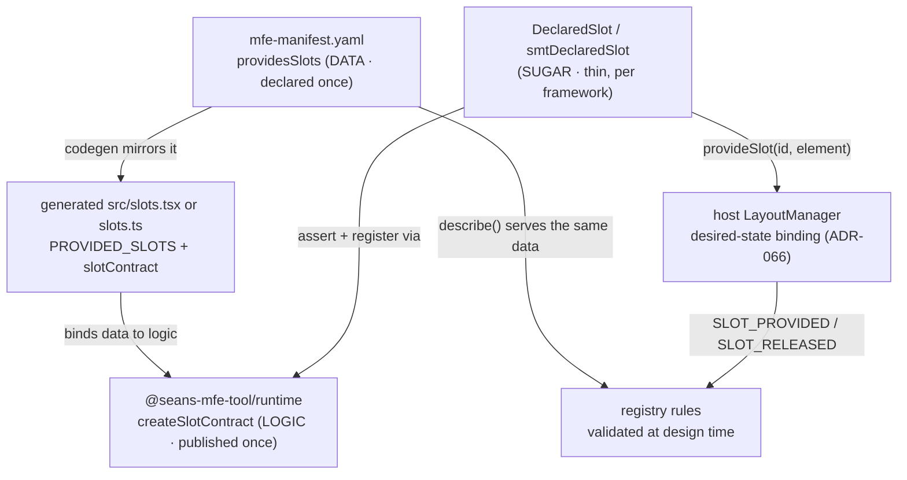

# The Slot Contract — how the backend places MFEs in any slot, always

*One unified, controlled system: the manifest declares slot names, code is
generated from the declaration, the runtime converges on the registry's
intent, and the registry validates against the same declaration. This
document explains the whole chain in plain language.*

Governing decisions: ADR-066 (addressing + binding), ADR-067 (manifest
contract + three-layer split), ADR-068 (provider scoping + lifecycle
ownership), ADR-069 (single-sourced grammar). Tracked in #265.

## The short version

If you only read one section, read this one.

1. **The problem.** The backend (registry/daemon) must be able to say "put
   this MFE in that region" *before* anything renders. That only works if
   regions have names that don't depend on what happened to render — so local
   slot ids are **names people assign** (`main`, `info`, `card.{sku}`),
   never positions the tree produces (`parent.2`). Positions renumber under
   feature flags, sorting, tabs, and lazy loading; names don't.
2. **The contract.** Every MFE declares the slots it provides in its
   **manifest** (`providesSlots`). The schema physically rejects positional
   ids. Because the declaration is data in the manifest, the registry can
   validate every placement rule against it *before* runtime, and a rename
   becomes a reviewable manifest diff instead of a silent string change.
3. **The address.** The host scopes each local declaration by its stable MFE
   id: `abc-kids-home/main`. Different MFEs can both declare `main` without
   sharing runtime state.
4. **The guarantee.** The client treats each placement as **desired state**
   and converges on it: if the target region doesn't exist yet, the
   placement waits and binds the moment the region registers; if the region
   remounts, the placement follows it; replays are no-ops. Ordering between
   "backend places" and "frontend renders" can never lose content.
5. **The construction — three layers, so it ports anywhere:**
   - **Data** (generated): your manifest's slot list, mirrored into a tiny
     generated file. Data is JSON-shaped — any language can read it.
   - **Logic** (published once): matching and the "declare it before you
     register it" guard live in `@seans-mfe-tool/runtime`, framework-free
     and DOM-free. One implementation, one place to fix.
   - **Sugar** (thin, per framework): React uses `DeclaredSlot`; Angular uses
     the standalone `[smtDeclaredSlot]` directive. Both wire the same contract
     to their framework's element lifecycle. A native shell implements only
     this small boundary; nothing else changes.
6. **What a dev actually does:** add an id to `providesSlots` in the
   manifest, regenerate, then use `<DeclaredSlot id="…">` in React or
   `[smtDeclaredSlot]="'…'"` in Angular.
   Everything else — validation, registration, convergence, telemetry — is
   platform machinery you never touch.

## The three layers at a glance

| Layer | What it is | Where it lives | Why it's a separate layer |
| --- | --- | --- | --- |
| **Data** | `PROVIDED_SLOTS` — the manifest's slot list mirrored into generated code and bound with `createSlotContract(PROVIDED_SLOTS)` | generated React `src/slots.tsx` or Angular `src/slots.ts` | Regenerated on every manifest change (`overwrite: true`), so code and manifest cannot drift; JSON-shaped, so any platform can consume the same declaration via `describe()` |
| **Logic** | Shared grammar plus `createSlotContract()` — literal + `{param}` matching, `assertDeclared()` (typed error), guarded `register()` | grammar: `packages/contracts/src/slot-grammar.ts`; contract: `packages/runtime/src/slot-contract.ts` | The DSL validator and runtime matcher consume one grammar (ADR-069); matching and registration stay framework- and DOM-free |
| **Sugar** | React `DeclaredSlot` or Angular `DeclaredSlotDirective` — assert, register on mount, release on unmount | `packages/framework-react/src/runtime/DeclaredSlot.tsx`; `packages/framework-angular/src/runtime/declared-slot.directive.ts`; generated pre-bound twins in `slots.tsx` / `slots.ts` | Irreducibly framework-specific, so it stays tiny and logic-free; a new framework adds only this layer (ADR-036 posture) |



## The whole model in one sentence

> **The registry says what goes at each named address; the frontend registers
> named regions and keeps making the registry's intent true.**

Everything below is a consequence of that sentence.

## Why not positions?

The tempting design is to let slots number themselves from their position in
the rendered tree (`parent.1`, `parent.2`, …). It fails, always, for one
reason with many faces: **the backend must target an address before the
client renders, but a position doesn't exist until after.** Conditional
rendering, feature flags, sorted lists, lazy loading, tabs that unmount, a
refactor that adds a wrapper div — each one renumbers positions, and every
registry rule silently points at the wrong region. A position is a
*measurement* of the client. An address in a server contract must be a
*name* someone assigned.

So in SMT, slot ids are names, written by people, with business meaning:
`main`, `info`, `card.{sku}`. Numbers can't even enter the contract — the
manifest schema rejects a purely numeric segment at parse time.

## The chain, end to end

**1. Declare (design time).** The MFE's manifest lists the slots it provides:

```yaml
# mfe-manifest.yaml
providesSlots:
  - id: main
    description: Primary content region
  - id: info
    description: Contextual info panel
  - id: card.{sku}
    description: One card per product — the SKU is the identity
```

`{sku}` is a *keyed pattern*: a slot rendered once per item takes its
identity from the item's own key, never from its position in the list.
Sorting and filtering change order; they don't change identity.

**2. Generate.** Codegen turns the declaration into `src/slots.tsx` for React
or `src/slots.ts` for Angular — **data plus thin framework binding**:
`PROVIDED_SLOTS` (the manifest mirrored into code) bound to
`createSlotContract()` from the runtime, plus `DeclaredSlot` or
`DeclaredSlotDirective`.
The matching and guard *logic* lives once in `@seans-mfe-tool/runtime`, so a
fix there never requires regenerating MFEs. The file is always regenerated —
it is contract, not scaffold — so the code can never claim a slot the
manifest doesn't declare:

React:

```tsx
<DeclaredSlot id="main" provideSlot={provideSlot}>
  <WelcomePane />
</DeclaredSlot>
```

Angular:

```html
<section [smtDeclaredSlot]="'main'" [provideSlot]="provideSlot">
  <app-welcome-pane />
</section>
```

The generated React component and Angular directive register their element
with the host on mount, release it with `null` on unmount/destroy, and
**throw on an undeclared id** — "declare it in the manifest first" is
enforced by generated code, not by code review.

**3. Register (runtime).** Registration rides `provideSlot`, the callback the
host hands every mounted MFE (ADR-058). The MFE registers its declared local
id (`main`); the host takes the stable provider identity from
`RenderedExperience.mfe` and stores the full address
`abc-kids-home/main` (ADR-068). The provider's `RenderedExperience.id` is a
separate internal owner token, so a stale callback cannot release a newer
registration at the same public address. Registration, replacement, and
release mutations are serialized per qualified address.

**4. Place.** The registry resolves *what* renders for whom and emits
experiences addressed to full provided-slot names
(`props.slot: 'abc-kids-home/main'`). Host-owned slots such as `root` remain
unqualified. The LayoutManager treats each placement as **desired state**:
what should be at this address, independent of what's currently mounted.

**5. Converge.** Binding is reconciled, not assumed:

- Placement arrives **before** the slot exists → it binds the moment the slot
  registers. Nothing is lost to timing.
- The slot **remounts** (tab switch, provider replaced, StrictMode) → the
  same placement re-binds into the new element.
- The same placement is **replayed** (reconnect, refresh) → no-op; already
  true.
- The same experience is **moved** to a new address → the old placement is
  cleared; an experience occupies at most one address, so a later
  re-provision of the old region cannot resurrect it (ADR-066).
- The slot's content **crashes** → scoped fallback in that region only, and
  the registry is asked to re-resolve (ADR-060).

**6. Observe.** The client announces `SLOT_PROVIDED` / `SLOT_RELEASED` up the
control plane. These signals are *advisory* — useful for topology-aware
rules, dashboards, and drift detection — but correctness never depends on
them: rules target names a priori, and convergence absorbs timing.

## What happens when a dev renames a slot?

Renaming `main-content` → `primary` is a **breaking change to a published
contract**, exactly like renaming a REST endpoint — no naming scheme makes it
safe. What this system changes is that a rename is *loud and traceable*
instead of silent:

- The rename is a **manifest diff** — visible in review, taggable as a
  breaking change, checkable in CI against live registry rules.
- At runtime, an old rule targeting `main-content` renders into a visible
  placeholder region (never into the *wrong* region), while `primary` sits
  empty — a diagnosable state, and the wire shows the mismatch: placements
  addressed to a name no `SLOT_PROVIDED` signal announced.
- Transition options, best first: don't rename (ids are contract); alias both
  ids to one element during a migration window; or update registry rules in
  the same release.

Compare positions: the equivalent event (renumbering) fills the **wrong
region silently** and nothing anywhere can detect it. Wrong-but-observable
versus wrong-but-invisible is the entire argument.

## What rule authors can know, and when

| When | What's available | Source |
| --- | --- | --- |
| Design time | Every slot id an MFE can provide, with descriptions; keyed patterns validate target *shape* | `providesSlots` in the manifest, served by `describe()` / discovery |
| Config time | "Does any installed MFE declare this target?" — typos and renames rejected at rule-save | Union of registered manifests |
| Runtime | Which slots this session actually has right now; drift between declared and provided | `SLOT_PROVIDED` / `SLOT_RELEASED` signals |

Design time answers *may this address exist*; runtime answers *does it exist
right now*; convergence makes the gap between them safe.

## Where everything lives

| Piece | Path |
| --- | --- |
| Shared slot grammar (ADR-069) | `packages/contracts/src/slot-grammar.ts` |
| Manifest schema (`providesSlots`) | `packages/dsl/src/schema.ts` |
| Contract logic (matching, guard) — framework-free, written once | `packages/runtime/src/slot-contract.ts` |
| React sugar for shells/hand-written MFEs (`DeclaredSlot`) | `packages/framework-react/src/runtime/DeclaredSlot.tsx` |
| Angular sugar for shells/hand-written MFEs (`DeclaredSlotDirective`) | `packages/framework-angular/src/runtime/declared-slot.directive.ts` |
| Generated React slot template | `packages/codegen/templates/base-mfe/slots.tsx.ejs` |
| Generated Angular slot template | `packages/codegen/templates/base-mfe-angular/slots.ts.ejs` |
| Generator wiring | `packages/codegen/src/unified-generator.ts` |
| Desired-state binding, topology signals | `packages/runtime/src/layout-manager.ts` |
| `provideSlot` render-prop plumbing | `packages/runtime/src/layout-adaptors.ts` |
| Behavior tests (ordering, re-bind, replay, signals) | `packages/runtime/src/__tests__/layout-desired-state.test.ts` |
| Contract tests (shared grammar, schema, codegen, framework sugar) | `packages/contracts/src/__tests__/slot-grammar.test.ts`, `packages/dsl/src/__tests__/schema.slots.test.ts`, `packages/codegen/src/__tests__/provided-slots.test.ts`, `packages/codegen/src/__tests__/angular-variant.test.ts` |
| Decisions | ADR-066, ADR-067, ADR-068, ADR-069 (and ADR-055/057/058/060 they build on) |

## The rules, if you remember nothing else

1. Slot ids are **names people assign**, never positions the tree produces.
2. A repeated slot takes its identity from **the data that repeats it**.
3. The **manifest declares** every local id; the host scopes it by MFE id, and
   the registry validates the resulting `mfe/id` address.
4. A runtime owner token prevents stale provider teardown from deleting a
   replacement at the same stable address.
5. Placement is **desired state**; the client converges, so ordering and
   remounts can't lose it.
6. A rename is a **contract change** — make it in the manifest, on purpose,
   with a migration plan.
7. **Data is generated, logic is published, sugar is thin.** If you find
   yourself writing slot logic in a component or a template, it belongs in
   `slot-contract.ts` instead.
